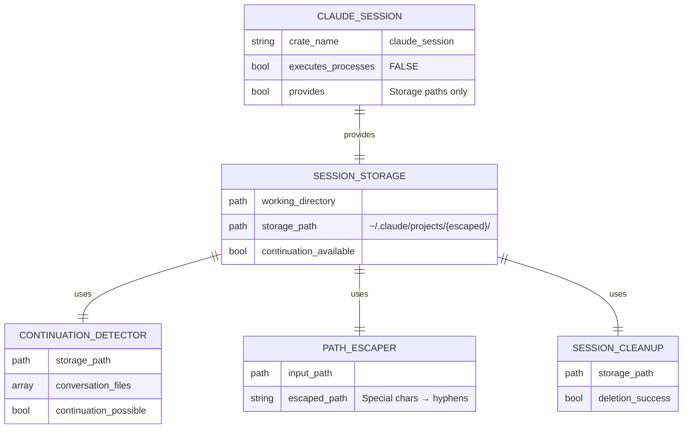

# spec

- **Version:** 0.1
- **Date:** 2025-12-04
- **Project Name:** claude_session - Claude Code Session Storage Management
- **Type:** Rust Library Crate

## Project Goal

Provide session storage path resolution and continuation detection for Claude Code conversations, enabling isolated and resumable AI-assisted development sessions.

## Problem Solved

Applications using Claude Code need to:
1. Resolve Claude Code session storage paths (`~/.claude/projects/`)
2. Detect existing conversations for automatic continuation
3. Isolate session storage per working directory
4. Handle session storage path escaping (special characters)
5. Manage session lifecycle (resume vs fresh strategies)

Without claude_session, applications must manually construct storage paths, handle path escaping inconsistencies, and implement continuation detection logic.

## Design Principles

### Single Responsibility: Session Storage ONLY

claude_session owns **session storage path management** exclusively. It does NOT execute Claude Code processes.

**Separation of Concerns:**
- **claude_session** (THIS crate): Session storage paths, continuation detection
- **claude_runner**: Claude Code process execution, Command::new("claude")

### Zero Dependencies

claude_session maintains zero external dependencies to minimize coupling and enable broad reuse.

## In Scope

**Session Storage Management:**
- Session storage path resolution (~/.claude/projects/)
- Path escaping for special characters (`/_.@#%& ` → `-`)
- Working directory to storage path transformation
- Continuation detection (conversation file existence)
- Session cleanup (fresh strategy support)

**Path Operations:**
- Construct escaped paths from working directory
- Check for existing Claude Code conversation files
- Validate session storage directory structure
- Handle edge cases (empty files, missing directories)

## Out of Scope

- **Claude Code process execution** → delegated to **claude_runner** crate
- Command-line argument building → claude_runner owns
- Process lifecycle management → claude_runner owns
- stdout/stderr capture → claude_runner owns
- Working directory management → caller provides, claude_runner uses
- Claude Code binary location → claude_runner resolves
- Exit code handling → claude_runner owns
- Builder pattern for ClaudeCommand → claude_runner provides

## Vocabulary

- **Session Storage:** Claude Code's conversation history directory (`~/.claude/projects/{escaped-path}/`)
- **Escaped Path:** Working directory path with special characters replaced by hyphens
- **Continuation:** Resuming existing conversation vs starting fresh
- **Conversation File:** JSON files in session storage containing conversation history
- **Fresh Strategy:** Deleting session storage to start new conversation
- **Resume Strategy:** Continuing existing conversation if present

## Functional Requirements

### FR-1: Session Storage Path Resolution
claude_session must construct session storage paths from working directories with proper escaping.

### FR-2: Continuation Detection
claude_session must detect existing Claude Code conversations by checking for non-empty conversation files.

### FR-3: Path Escaping
claude_session must escape special characters (`/_.@#%& `) to hyphens for filesystem compatibility.

### FR-4: Fresh Strategy Support
claude_session must support deleting session storage to enable fresh conversation starts.

### FR-5: Resume Strategy Support
claude_session must detect existing sessions and signal when continuation is possible.

## Non-Functional Requirements

### NFR-1: Zero Dependencies
claude_session must have zero external dependencies (only standard library).

### NFR-2: Fast Path Operations
Session storage path resolution and continuation detection must complete in <50ms.

### NFR-3: Cross-Platform Compatibility
Path operations must work on Linux, macOS, and Windows (though Claude Code may have platform restrictions).

### NFR-4: Clear Error Messages
All errors must provide actionable messages (e.g., "Session storage directory not accessible: ...").

### NFR-5: No Process Execution
claude_session MUST NOT execute any processes. std::process::Command import is a responsibility violation.

## System Architecture

### Responsibility Boundary

**CRITICAL:** claude_session owns session storage ONLY. Execution is delegated to claude_runner.

```
claude_runner → claude_session
  (execution)     (storage paths)

dream_agent → claude_runner + claude_session
              (execution)     (storage paths)
```

**Responsibility Rules:**
1. claude_session provides session storage paths ✅
2. claude_session detects continuation availability ✅
3. claude_runner executes Claude Code process ✅
4. claude_session MUST NOT import std::process::Command ❌
5. claude_runner owns Command::new("claude") ✅

### Component Roles

**SessionStorage (Main Component)**
- Resolve session storage path from working directory
- Escape path for filesystem compatibility
- Check for existing conversation files
- Validate session storage structure
- Return paths to caller (does NOT execute anything)

**ContinuationDetector**
- Scan session storage for conversation files
- Filter out empty files (0 bytes)
- Determine if continuation is possible
- Return boolean flag to caller

**PathEscaper**
- Replace special characters with hyphens
- Handle edge cases (leading/trailing separators)
- Ensure filesystem compatibility
- Maintain path uniqueness

**SessionCleanup**
- Delete session storage directory (fresh strategy)
- Handle partial deletion failures gracefully
- Validate deletion completed successfully
- Return result to caller

## Data Architecture



## External Dependencies

**NONE** - claude_session uses only Rust standard library (std::path, std::fs, std::env).

### Dependency Principles
1. **Zero external dependencies** - Only standard library
2. **No process execution** - std::process::Command forbidden
3. **Path operations only** - std::path::PathBuf, std::fs::read_dir
4. **Minimal API surface** - Single-purpose functions

## Limitations

**Session Storage Structure:**
- Assumes Claude Code uses `~/.claude/projects/` structure
- Path escaping may cause collisions (different paths → same escaped form)
- No versioning for session storage format changes
- Maximum path length: OS-dependent (typically 4096 bytes on Linux)

**Continuation Detection:**
- Only checks file existence, not conversation validity
- Empty files (0 bytes) ignored
- No validation of conversation file contents
- False positives possible if non-conversation files present

**Fresh Strategy:**
- Deletion is best-effort (partial deletion possible)
- No rollback if deletion fails midway
- Requires write permissions to ~/.claude/projects/

**Responsibility Boundaries:**
- Does NOT execute Claude Code (that's claude_runner's job)
- Does NOT build Command arguments (that's claude_runner's job)
- Does NOT manage working directory (caller's responsibility)

## User Stories

### US-1: Session Storage Path Resolution
**As a** developer using Claude Code programmatically,
**I want** to resolve session storage paths from working directories,
**So that** I can pass correct paths to claude_runner for execution.

**Acceptance:**
- Given working directory `/home/user/project/`, resolve to `~/.claude/projects/-home-user-project-/`
- Special characters escaped consistently
- Path resolution completes in <50ms

### US-2: Continuation Detection
**As a** developer managing Claude sessions,
**I want** to detect existing conversations automatically,
**So that** I can add `-c` flag to claude_runner for seamless continuation.

**Acceptance:**
- Returns true if conversation files exist and are non-empty
- Returns false if directory missing or all files empty
- Detection completes in <50ms

### US-3: Fresh Session Start
**As a** developer starting a new investigation,
**I want** to delete previous session storage cleanly,
**So that** Claude starts with no conversation history.

**Acceptance:**
- Deletes `~/.claude/projects/{escaped-path}/` directory completely
- Handles missing directory gracefully (success)
- Returns error if deletion fails with write permission issue

## Conformance Checklist

The project is considered complete when all items below are verified and marked ✅.

**Responsibility Requirements (CRITICAL):**

| Status | Requirement | Verification Method | Test Reference |
|--------|-------------|---------------------|----------------|
| ❌ | **RESP-1:** NO std::process::Command import | Verify no std::process in claude_session/src/ | Responsibility test |
| ❌ | **RESP-2:** NO process execution calls | Verify no Command::new() in source | Code inspection |
| ❌ | **RESP-3:** claude_runner handles execution | Verify claude_runner owns Command::new("claude") | Architecture audit |
| ❌ | **RESP-4:** Session storage paths only | Verify API only provides paths, not execution | API inspection |

**Functional Requirements:**

| Status | Requirement | Verification Method | Test Reference |
|--------|-------------|---------------------|----------------|
| ❌ | **FR-1:** Path resolution works | Test storage path construction from working dir | `tests/path_resolution.rs` |
| ❌ | **FR-2:** Continuation detection works | Test existing conversation detection | `tests/continuation_detection.rs` |
| ❌ | **FR-3:** Path escaping works | Test special character replacement | `tests/path_escaping.rs` |
| ❌ | **FR-4:** Fresh strategy supported | Test session storage deletion | `tests/fresh_strategy.rs` |
| ❌ | **FR-5:** Resume strategy supported | Test continuation availability detection | `tests/resume_strategy.rs` |

**Non-Functional Requirements:**

| Status | Requirement | Verification Method | Test Reference |
|--------|-------------|---------------------|----------------|
| ❌ | **NFR-1:** Zero dependencies | Verify Cargo.toml has no dependencies section | `claude_session/Cargo.toml` |
| ❌ | **NFR-2:** Fast path operations | Benchmark <50ms for path resolution + detection | Performance test |
| ❌ | **NFR-3:** Cross-platform compatibility | Test on Linux, macOS, Windows | CI matrix |
| ❌ | **NFR-4:** Clear error messages | Test error messages are actionable | Error handling tests |
| ❌ | **NFR-5:** No process execution | Verify no std::process::Command anywhere | Grep audit + test |

**Legend:**
- ✅ = Verified and passing
- ❌ = Not yet implemented or verified

## Appendix: Migration from Mixed Responsibilities

**Before:** claude_session handled BOTH session storage AND process execution
**After:** claude_session handles ONLY session storage, claude_runner handles execution

**Responsibilities Moved to claude_runner:**
- Command::new("claude") construction
- Process lifecycle management
- stdout/stderr capture
- Exit code handling
- Working directory configuration
- Command-line argument building
- Builder pattern (ClaudeCommand::new())

**Responsibilities Retained in claude_session:**
- Session storage path resolution
- Path escaping
- Continuation detection
- Session cleanup (fresh strategy)

**Verification:**
- Ensure NO std::process::Command import in claude_session
- Ensure claude_runner owns all Command::new("claude") calls
- Run responsibility tests to enforce boundary
