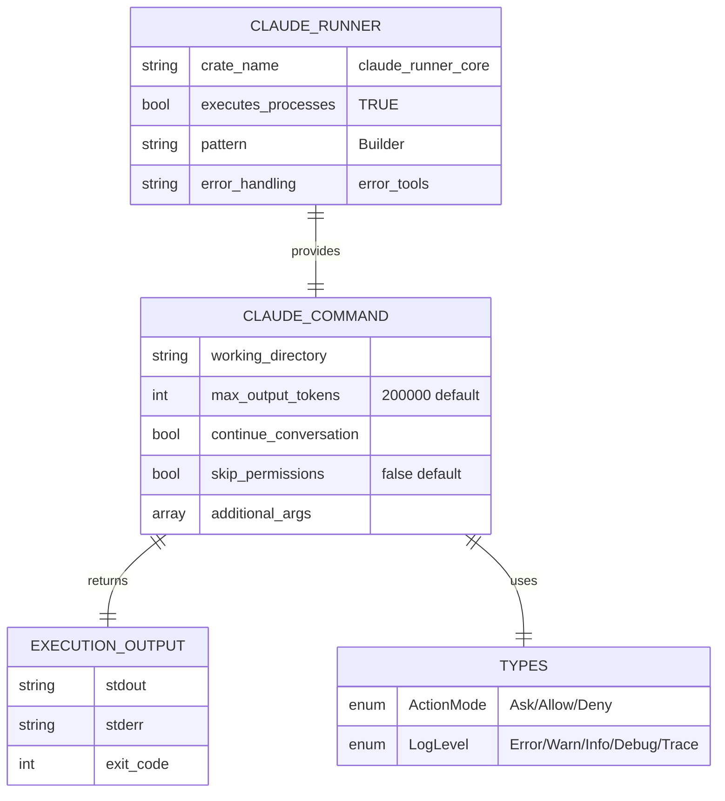

# spec

- **Version:** 0.1
- **Date:** 2025-12-04
- **Project Name:** claude_runner_core - Claude Code Process Execution
- **Type:** Rust Library Crate

## Workspace Affiliation

- **Workspace:** wtools (`~/pro/lib/wip_core/wtools/dev`)
- **Location within workspace:** `module/core/claude_runner_core`
- **Pattern:** Core utility crate — general-purpose, workspace-agnostic execution logic
- **Availability:** Path dependency during development; publishable to crates.io

## Project Goal

Provide a clean builder-pattern API for executing Claude Code CLI with proper configuration, including token limits, working directories, and continuation flags. Consolidate duplicate Command::new("claude") calls into single execution point.

## Problem Solved

Applications using Claude Code need to:
1. Execute Claude Code CLI with ~40 configuration parameters
2. Set explicit token limits (200K) to prevent "exceeded maximum" errors
3. Configure working directories, session storage, continuation flags
4. Build complex command-line arguments safely and consistently
5. Capture stdout/stderr from Claude Code process
6. Handle process lifecycle (spawn, wait, capture output)

Without claude_runner_core:
- **Duplication:** Multiple Command::new("claude") calls scattered across codebase (measured: 2x)
- **Token Limit Bug:** Default 32K tokens causes "exceeded maximum" errors
- **No Builder Pattern:** Direct struct construction hard to maintain with 40+ parameters
- **Mixed Responsibilities:** claude_session handled BOTH storage paths AND execution

## Design Principles

### Single Responsibility: Execution ONLY

claude_runner_core owns **Claude Code process execution** exclusively. It does NOT manage session storage paths.

**Separation of Concerns:**
- **claude_runner_core** (THIS crate): Process execution, Command::new("claude"), builder pattern
- **claude_session**: Session storage paths, continuation detection

### Builder Pattern Over Factories

claude_runner_core uses fluent builder API instead of deprecated factory methods.

**Old API (DEPRECATED):**
```text
ClaudeCommand::generate(/* 40 parameters */)  // Factory method
session.execute_interactive()                  // Mixed concerns
session.execute_non_interactive()              // Duplicate logic
```

**New API (THIS CRATE):**
```rust,no_run
# use claude_runner_core::ClaudeCommand;
# let dir = std::path::PathBuf::from("/tmp");
ClaudeCommand::new()
  .with_working_directory(dir)
  .with_max_output_tokens(200_000)
  .with_continue_conversation(true)
  .execute()?                                  // Single execution point
# ;
# Ok::<(), Box<dyn std::error::Error>>(())
```

### Minimal External Dependencies

claude_runner_core depends ONLY on error_tools for error handling. No other external dependencies.

## In Scope

**Claude Code Execution:**
- Command-line argument building via builder pattern
- Process spawning via std::process::Command
- stdout/stderr capture and parsing
- Exit code handling and error mapping
- Process lifecycle management (spawn, wait, kill)

**Builder API:**
- ClaudeCommand::new() as entry point
- 40+ with_*() methods for configuration
- Type-safe builder pattern (compile-time checks where possible)
- Fluent API for ergonomic construction
- execute() as terminal operation

**Token Limit Configuration:**
- Explicit max_output_tokens parameter
- Default to 200,000 tokens (NOT 32K system default)
- Bug fix: Prevent "exceeded maximum" errors

**Working Directory Management:**
- with_working_directory() configuration
- Pass to std::process::Command::current_dir()
- Support relative and absolute paths

**Continuation Support:**
- with_continue_conversation() flag
- Add `-c` to Claude Code CLI when true
- Integrate with claude_session continuation detection

## Out of Scope

- **Session storage path resolution** → delegated to **claude_session** crate
- **Continuation detection** → delegated to **claude_session** crate
- Context injection from wplan_daemon → dream_agent handles
- Parameter parsing from CLI → dream_agent handles
- Session lifecycle strategy (resume/fresh) → dream_agent handles
- Configuration loading → dream_agent/config_hierarchy handles
- IPC with wplan_daemon → dream_agent handles
- **Direct Rust import by dream_agent** → `dream_agent` (willbe) MUST NOT import this crate
  as a Rust dependency. `dream_agent` invokes the `claude_runner` binary as a subprocess.
  The process boundary (subprocess invocation) is the ONLY valid interface from willbe to
  this execution library. Importing `claude_runner_core` from willbe violates architectural
  isolation between the wtools and willbe repos.

## Consumers

- **`claude_runner_cli`** (wtools binary) — imports as Rust dep; translates CLI flags to builder calls ✅
- **`dream_agent`** (willbe) — invokes `claude_runner` binary as subprocess; NEVER imports this crate ✅
- **Other wtools crates** — may import as Rust dep for execution ✅
- **willbe crates** — FORBIDDEN from importing as Rust dep; use subprocess boundary ❌

## Vocabulary

- **Builder Pattern:** Fluent API with method chaining (ClaudeCommand::new().with_*().execute())
- **Execution Point:** Single location where Command::new("claude") is called
- **Token Limit:** max_output_tokens configuration (200K default)
- **Continuation:** `-c` flag for resuming existing conversation
- **Interactive Mode:** Claude Code takes over terminal (execute_interactive() method)
- **Non-Interactive Mode:** Claude Code output captured (execute() method)
- **Factory Method (DEPRECATED):** ClaudeCommand::generate() - DO NOT USE
- **ActionMode:** Type-safe enum for tool approval behavior (Ask/Allow/Deny)
- **LogLevel:** Type-safe enum for logging verbosity (Error/Warn/Info/Debug/Trace)
- **Bash Timeout:** Duration limit for bash command execution (default: 1 hour)
- **Verification Framework:** Six-layer pyramid (231 validations) proving migration completeness through objective metrics
- **Migration Metrics:** 8 measurable counts tracking old→new pattern shift (factory methods, public fields, string literals, wrong defaults, env automation, test coverage, type safety, builder methods)
- **Impossibility Verification:** Proof old factory pattern won't compile (34 checks)
- **Rollback Detection:** Proof migration cannot be reversed (27 checks proving rollback would fail)
- **Negative Criteria:** Forbidden patterns that must equal zero count (deprecated methods, public fields, string literals)
- **Shortcuts Detection:** Checks preventing fake completion through mocks, fakes, or disabled tests (48 validations)

## Functional Requirements

### FR-1: Builder Pattern Entry Point
claude_runner_core must provide ClaudeCommand::new() as the sole construction method. Factory methods (generate) are deprecated.

### FR-2: Fluent Builder API
claude_runner_core must provide with_*() methods for all Claude Code configuration parameters (40+ parameters).

### FR-3: Token Limit Configuration
claude_runner_core must provide with_max_output_tokens() method with 200,000 token default to fix token limit bug.

### FR-4: Working Directory Configuration
claude_runner_core must provide with_working_directory() method to set process working directory.

### FR-5: Continuation Flag Support
claude_runner_core must provide with_continue_conversation() method to add `-c` flag when true.

### FR-6: Single Execution Point
claude_runner_core must consolidate all Command::new("claude") calls into single execute() method. Duplication factor must equal 1.

### FR-7: Process Output Capture
claude_runner_core must capture and return stdout/stderr/exit_code from Claude Code process execution via `ExecutionOutput` struct.

### FR-8: Error Handling
claude_runner_core must use error_tools for error handling and provide clear error messages for common failures (Claude not in PATH, permission denied, exit codes).

### FR-9: Interactive Mode Support
claude_runner_core must provide execute_interactive() method that allows Claude Code to take over the terminal (TTY attached) without capturing output. Non-interactive execute() method captures output.

### FR-10: Bash Timeout Configuration
claude_runner_core must provide with_bash_timeout_ms() and with_bash_max_timeout_ms() methods with defaults of 3,600,000ms (1 hour) and 7,200,000ms (2 hours) respectively to prevent premature timeout failures in automation.

### FR-11: Auto-Continue Configuration
claude_runner_core must provide with_auto_continue() method with default of true to enable programmatic automation without manual prompts.

### FR-12: Telemetry Configuration
claude_runner_core must provide with_telemetry() method with default of false to disable telemetry collection in automation contexts.

### FR-13: Auto-Approve Tools Configuration
claude_runner_core must provide with_auto_approve_tools() method with default of false (opt-in only for security).

### FR-14: Action Mode Configuration
claude_runner_core must provide with_action_mode() method accepting ActionMode enum (Ask/Allow/Deny) with default of Ask.

### FR-15: Log Level Configuration
claude_runner_core must provide with_log_level() method accepting LogLevel enum with default of Info.

### FR-16: Temperature Configuration
claude_runner_core must provide with_temperature() method with default of 1.0 for model temperature control.

### FR-17: Sandbox Mode Configuration
claude_runner_core must provide with_sandbox_mode() method with default of true for security.

### FR-18: Session Directory Configuration
claude_runner_core must provide with_session_dir() method for explicit session storage override.

### FR-19: Top-P/Top-K Configuration
claude_runner_core must provide with_top_p() and with_top_k() methods for model sampling control.

### FR-20: Skip Permissions Configuration
claude_runner_core must provide with_skip_permissions() typed builder method to add `--dangerously-skip-permissions` flag. Default is false.

### FR-21: Command Inspection
claude_runner_core must provide describe() method returning human-readable command line string for dry-run and debug output.

**Escaping rules for message field in describe() output:**
- Double-quotes (`"`) are escaped to `\"` for shell correctness
- Backslashes (`\`) are escaped to `\\` BEFORE quote escaping (prevents `\"` producing malformed output)
- Single quotes, `$`, newlines, and other characters are NOT escaped (human-readable only, not shell-safe)
- Working directory in `cd` line is NOT quoted (human-readable only; actual execution uses `cmd.current_dir()` which is OS-safe)

**Known behavior:** Messages containing literal newlines embed the newline literally in describe() output. This is expected for a human-readable representation.

### FR-22: Environment Variable Inspection
claude_runner_core must provide describe_env() method returning NAME=VALUE lines for all configured environment variables.

**Float formatting:** `f64` values are formatted via Rust Display (`to_string()`). This produces `"1"` for `1.0` and `"0"` for `0.0` (integer representation, no decimal point for whole numbers). Both `describe_env()` and `build_command()` use the same formatting so they are consistent.

### FR-23: Structured Execution Output
claude_runner_core execute() must return ExecutionOutput struct with stdout, stderr, and exit_code fields instead of raw String.

## Non-Functional Requirements

### NFR-1: Minimal Dependencies
claude_runner_core must depend only on: error_tools (error handling), standard library. Total: 1 workspace dependency (wtools workspace), 0 external direct dependencies.

### NFR-2: Fast Execution Setup
Builder construction and Command setup must complete in <10ms (process execution time not included).

### NFR-3: Type Safety
Builder API should use type system to prevent invalid configurations (e.g., negative token limits).

### NFR-4: Clear API Documentation
All public methods must have doc comments with examples.

### NFR-5: No Deprecated API
Old factory methods (generate) must not exist in this crate. Valid execution methods are execute() for non-interactive mode and execute_interactive() for interactive mode.

### NFR-6: Comprehensive Verification Framework
claude_runner_core must provide six-layer verification pyramid proving migration completeness through objective, measurable evidence.

### NFR-7: Feature Compliance
claude_runner_core must declare `default`, `enabled`, and `full` features per wtools workspace standard:
- `default = ["enabled"]`
- `full = ["enabled"]`
- `enabled = ["dep:error_tools", "error_tools/enabled", "error_tools/error_untyped"]`

Rationale: wtools workspace declares error_tools with `default-features = false`. Without explicit `error_tools/error_untyped` propagation in the `enabled` feature, `error_tools::Result` and `error_tools::Error` (from anyhow) are unavailable, causing compile failure.

**Six Verification Layers:**
1. **Impossibility** (34 checks): Old factory pattern CANNOT compile/run
2. **Shortcuts** (48 checks): No test-passing shortcuts (mocks, fakes, disabled tests)
3. **Negative Criteria** (15 checks): Forbidden patterns count = 0
4. **Rollback Detection** (27 checks): Migration irreversible, rollback impossible
5. **Migration Metrics** (42 checks): Counts shifted old→new as specified
6. **Positive Tests** (65 tests): New builder pattern works correctly

**Total**: 231 automated validations

**Verification Commands**:
- Rust tests: `w3 .test l::3` (runs all verification tests)
- Full suite: Positive tests + verification tests

**Acceptance Criteria**:
- All 231 validations pass
- Verification tests runnable via standard test commands
- Migration metrics prove 0% old / 100% new ratio

## System Architecture

### Execution Flow

**POST-MIGRATION target (subprocess boundary):**

```text
dream_agent (willbe)
    → std::process::Command::new("claude_runner")   (subprocess invocation)
        → claude_runner_cli (arg parser, wtools binary)
            → ClaudeCommand::new()                  (builder entry)
                .with_working_directory()
                .with_skip_permissions()
                .with_continue_conversation()
                .execute()                           (SINGLE execution point)
                    ↓
                Command::new("claude")               (ONLY here, in command.rs)
                    ↓
                Claude Code Process
                    ↓
                ExecutionOutput { stdout, stderr, exit_code }
```

**PRE-MIGRATION (claude_runner_cli calls directly from dream_agent — being removed):**

```text
dream_agent → ClaudeCommand::new()          (Rust dep import — VIOLATION)
              .with_working_directory()
              .execute()
                  ↓
              Command::new("claude")
```

See `dream_agent/tests/responsibility_subprocess_invocation_test.rs` for migration enforcement tests.

### Responsibility Boundary

**CRITICAL:** claude_runner_core owns execution ONLY. Storage paths come from claude_session.

```text
claude_runner_cli → claude_runner_core (execution) + claude_session (storage paths)
                    ↓                             ↓
                    execute() method              resolve_storage_path()
                    ↓
                    Command::new("claude")        (ONLY in claude_runner_core)
```

**Responsibility Rules:**
1. claude_runner_core owns Command::new("claude") ✅
2. claude_runner_core owns process execution ✅
3. claude_session provides storage paths ✅
4. dream_agent orchestrates via subprocess (NOT Rust dep) ✅
5. NO Command::new("claude") outside claude_runner_core ✅
6. NO claude_runner_core import in dream_agent (willbe) ✅

### Component Roles

**ClaudeCommand (src/command.rs)**
- Entry point: `::new()` with tier-1 automation defaults
- Configuration: `with_*()` methods (move semantics, returns Self)
- Command building: `build_command()` constructs `std::process::Command`
- Execution: `execute()` returns `ExecutionOutput`, `execute_interactive()` returns `ExitStatus`
- Inspection: `describe()` for command line, `describe_env()` for environment variables
- Testing: `build_command_for_test()` exposes command for assertion
- Error handling: `error_tools::Error` via `.map_err()`

**Types (src/types.rs)**
- `ActionMode` enum: Ask, Allow, Deny (tool approval behavior)
- `LogLevel` enum: Error, Warn, Info, Debug, Trace (logging verbosity)
- `ExecutionOutput` struct: stdout, stderr, exit_code (structured process result)

## Data Architecture



## External Dependencies

### Dependency: error_tools

- **Purpose:** Workspace-standard error handling
- **API Type:** Rust library (feature-gated)
- **Access Method:** `error_tools = { workspace = true, optional = true }` in [dependencies];
  `enabled` feature MUST activate `"error_tools/enabled"` and `"error_tools/error_untyped"`.
  Rationale: wtools workspace declares error_tools with `default-features = false` — without
  explicit feature propagation, Result and Error types are unavailable.
- **Required Operations:**
  - `error_tools::Error` for error type
  - `error_tools::Result` for result alias
  - `Error::msg()` for constructing errors from strings
- **Scope:** Error handling ONLY
- **Risk Assessment:**
  - **Availability:** Compile-time dependency (workspace crate)
  - **Ownership:** Workspace shared dependency

### Dependency: std (standard library)

- **Purpose:** Process execution, I/O, path operations
- **API Type:** Rust standard library
- **Required Operations:**
  - std::process::Command for Claude Code execution
  - std::path::PathBuf for paths
  - std::io for output capture
- **Risk Assessment:**
  - **Availability:** Always available

### Dependency Principles
1. **Minimal dependencies** - Only error_tools + std
2. **No external crates** - Zero direct dependencies on crates.io
3. **Execution separation** - claude_runner_core executes, claude_session provides paths (via dream_agent)
4. **Single execution point** - Command::new("claude") ONLY in execute() method

## Limitations

**Claude Code Dependency:**
- Requires Claude Code binary in PATH
- No fallback to other AI providers
- Claude Code must support all flags and env vars used (-c, --dangerously-skip-permissions, CLAUDE_CODE_* env vars)

**Token Limit:**
- Maximum 200K tokens (Claude API limit)
- No automatic chunking for larger contexts
- Error if response exceeds token limit

**Process Management:**
- Synchronous execution only (blocks until completion)
- No streaming output support
- No process cancellation after spawn

**Builder Pattern:**
- No compile-time validation of required parameters
- execute() can fail if configuration invalid
- Relies on runtime validation

**Platform Support:**
- std::process::Command platform-dependent
- Working directory must exist at execution time
- Process signals may vary across OS

## User Stories

### US-1: Build Command with Token Limit
**As a** developer using Claude Code programmatically,
**I want** to set explicit token limits via builder pattern,
**So that** I prevent "exceeded maximum" errors.

**Acceptance:**
- ClaudeCommand::new().with_max_output_tokens(200_000).execute() sets token limit
- Default is 200K if not specified
- Command sets `CLAUDE_CODE_MAX_OUTPUT_TOKENS=200000` environment variable

### US-2: Single Execution Point
**As a** maintainer of the codebase,
**I want** all Command::new("claude") calls in one place,
**So that** I can update execution logic without hunting through code.

**Acceptance:**
- grep for Command::new.*claude finds exactly 1 occurrence
- That occurrence is in claude_runner_core/src/command.rs
- dream_agent uses builder pattern, never calls Command::new("claude") directly

### US-3: Fluent Builder API
**As a** developer configuring Claude Code,
**I want** to chain configuration methods fluently,
**So that** code is readable and maintainable.

**Acceptance:**
- Can chain: ClaudeCommand::new().with_a().with_b().with_c().execute()
- Each with_*() returns Self (move semantics) for chaining
- execute() is terminal operation returning Result

## Conformance Checklist

The project is considered complete when all items below are verified and marked ✅.

**Execution Requirements (CRITICAL):**

| Status | Requirement | Verification Method | Test Reference |
|--------|-------------|---------------------|----------------|
| ✅ | **EXEC-1:** Single Command::new("claude") | Verify exactly 1 occurrence in entire crate | `tests/responsibility_single_execution_point_test.rs` |
| ✅ | **EXEC-2:** Located in execute() method | Verify Command::new("claude") in execute() only | `src/command.rs` |
| ✅ | **EXEC-3:** NO Command::new("claude") in dream_agent | Verify dream_agent uses subprocess invocation, not builder | `dream_agent/tests/responsibility_subprocess_invocation_test.rs` |
| ✅ | **EXEC-4:** NO Command::new("claude") in claude_session | Verify claude_session has zero execution | `claude_session/tests/responsibility_no_process_execution_test.rs` |

**Functional Requirements:**

| Status | Requirement | Verification Method | Test Reference |
|--------|-------------|---------------------|----------------|
| ✅ | **FR-1:** Builder entry point exists | Verify ClaudeCommand::new() implemented | `tests/builder_methods_test.rs` |
| ✅ | **FR-2:** Fluent builder API | Test method chaining works | `tests/builder_methods_test.rs` |
| ✅ | **FR-3:** Token limit configuration | Test with_max_output_tokens() sets env var | `tests/default_values_test.rs` |
| ✅ | **FR-4:** Working directory config | Test with_working_directory() sets dir | `tests/builder_methods_test.rs` |
| ✅ | **FR-5:** Continuation flag support | Test with_continue_conversation() adds -c | `tests/builder_methods_test.rs` |
| ✅ | **FR-6:** Single execution point | Count Command::new("claude") = 1 | `tests/responsibility_single_execution_point_test.rs` |
| ✅ | **FR-7:** Output capture works | Test stdout/stderr captured via ExecutionOutput | `tests/execution_output_test.rs` |
| ✅ | **FR-8:** Error handling works | error_tools for clear error messages | `src/command.rs` |
| ✅ | **FR-9:** Interactive mode support | execute_interactive() allows TTY attachment | `tests/manual_execution_test.rs` |
| ✅ | **FR-10:** Bash timeout configuration | Test with_bash_timeout_ms() sets env vars | `tests/environment_variables_test.rs` |
| ✅ | **FR-11:** Auto-continue configuration | Test with_auto_continue() sets env var | `tests/environment_variables_test.rs` |
| ✅ | **FR-12:** Telemetry configuration | Test with_telemetry() sets env var | `tests/environment_variables_test.rs` |
| ✅ | **FR-13:** Auto-approve tools config | Test with_auto_approve_tools() sets env var | `tests/environment_variables_test.rs` |
| ✅ | **FR-14:** Action mode configuration | Test with_action_mode() sets env var | `tests/environment_variables_test.rs` |
| ✅ | **FR-15:** Log level configuration | Test with_log_level() sets env var | `tests/environment_variables_test.rs` |
| ✅ | **FR-16:** Temperature configuration | Test with_temperature() sets env var | `tests/environment_variables_test.rs` |
| ✅ | **FR-17:** Sandbox mode configuration | Test with_sandbox_mode() sets env var | `tests/environment_variables_test.rs` |
| ✅ | **FR-18:** Session directory configuration | Test with_session_dir() sets env var | `tests/environment_variables_test.rs` |
| ✅ | **FR-19:** Top-P/Top-K configuration | Test with_top_p() and with_top_k() set env vars | `tests/environment_variables_test.rs` |
| ✅ | **FR-20:** Skip permissions config | Test with_skip_permissions() adds flag | `tests/skip_permissions_test.rs` |
| ✅ | **FR-21:** Command inspection | Test describe() returns command line | `tests/describe_test.rs` |
| ✅ | **FR-22:** Env var inspection | Test describe_env() returns NAME=VALUE | `tests/describe_test.rs` |
| ✅ | **FR-23:** Structured output | Test ExecutionOutput has stdout/stderr/exit_code | `tests/execution_output_test.rs` |

**Non-Functional Requirements:**

| Status | Requirement | Verification Method | Test Reference |
|--------|-------------|---------------------|----------------|
| ✅ | **NFR-1:** Minimal dependencies | Verify only error_tools dependency | `Cargo.toml` |
| ✅ | **NFR-2:** Fast execution setup | Benchmark builder <10ms | Performance test |
| ✅ | **NFR-3:** Type safety | ActionMode, LogLevel enums; ExecutionOutput struct | `src/types.rs` |
| ✅ | **NFR-4:** Clear API docs | Doc comments with examples on all public items | Rustdoc check |
| ✅ | **NFR-5:** No deprecated API | Verify NO generate(), execute_non_interactive() | `tests/verification_negative_criteria_test.rs` |
| ✅ | **NFR-6:** Verification framework | All 231 validations pass | `w3 .test l::3` |

**Verification Requirements:**

| Status | Requirement | Verification Method | Test Reference |
|--------|-------------|---------------------|----------------|
| ✅ | **VER-1:** Six-layer pyramid passes | Run all verification tests | `tests/verification_*.rs` |
| ✅ | **VER-2:** Migration metrics 0%→100% | Check 8 metric ratios shifted | `tests/verification_migration_metrics_test.rs` |
| ✅ | **VER-3:** Old way impossible | Verify 34 impossibility checks | `tests/verification_impossibility_test.rs` |
| ✅ | **VER-4:** Rollback impossible | Verify 27 rollback checks | `tests/verification_rollback_test.rs` |
| ✅ | **VER-5:** No shortcuts taken | Verify 48 anti-shortcut checks | `tests/verification_shortcuts_test.rs` |
| ✅ | **VER-6:** Negative criteria | Verify 15 forbidden patterns = 0 | `tests/verification_negative_criteria_test.rs` |
| ✅ | **VER-7:** All 231 validations pass | Run full test suite | `w3 .test l::3` |

**Legend:**
- ✅ = Verified and passing

## Appendix: Migration from Duplicate Execution Points

**Before Migration:**
- Command::new("claude") appears 2x in codebase (claude_session)
- Duplication factor: 2x
- Token limit: Default 32K (causes errors)
- API: ClaudeCommand::generate() factory method
- Mixed concerns: claude_session handles storage + execution

**After Migration:**
- Command::new("claude") appears 1x in codebase (claude_runner_core::execute())
- Duplication factor: 1x
- Token limit: Explicit 200K (fixes bug)
- API: ClaudeCommand::new().with_*().execute() builder pattern
- Clean separation: claude_runner_core executes, claude_session provides paths

**Files:**
- claude_runner_core/Cargo.toml
- claude_runner_core/src/lib.rs
- claude_runner_core/src/command.rs (ClaudeCommand builder + execute() + Command::new("claude"))
- claude_runner_core/src/types.rs (ActionMode, LogLevel, ExecutionOutput)
- claude_runner_core/tests/ (20 test files — builder, verification, describe, skip_permissions, etc.)

**Verification:**
- grep -r "Command::new.*claude" entire workspace = exactly 1 match in claude_runner_core
- grep -r "ClaudeCommand::generate" = 0 matches (deprecated removed)
- grep -r "execute_non_interactive" = 0 matches (deprecated method)
- grep -r "execute_interactive" in src/ = matches found (valid method for TTY mode)
- Baseline: Old API usage = 16 occurrences → Target: 0 occurrences
- Baseline: Duplication = 2x → Target: 1x
- Baseline: Builder usage = 6 occurrences → Target: ≥15 occurrences
