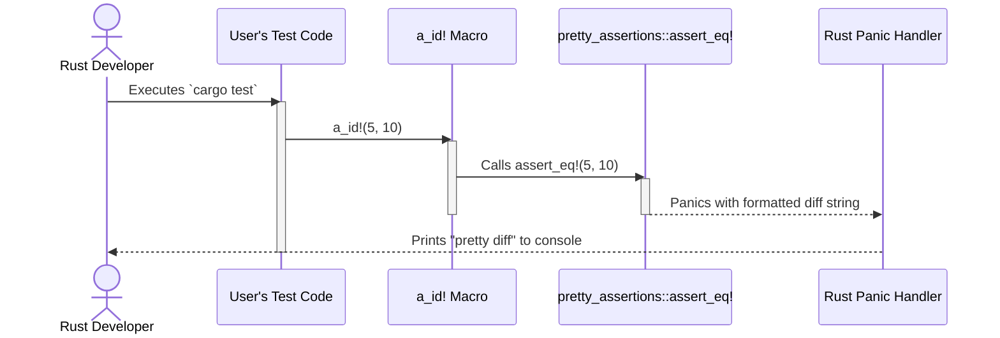

# spec

- **Name:** `diagnostics_tools` Crate
- **Version:** 1.0.0
- **Date:** 2025-07-26

### Part I: Public Contract (Mandatory Requirements)

#### 1. Goal

To provide a comprehensive, ergonomic, and unified suite of diagnostic assertion tools for the Rust ecosystem. The crate aims to enhance the development and debugging experience by offering both powerful compile-time checks and informative, "pretty" run-time assertions that go beyond the standard library's capabilities.

#### 2. Deliverables

Upon completion, the project will deliver the following:

1.  **Published Crate:** The `diagnostics_tools` crate, version `1.0.0`, published and available on `crates.io`.
2.  **Source Code Repository:** Full access to the final Git repository, including all source code, tests, and documentation.
3.  **Public Documentation:** Comprehensive documentation for the public API, automatically generated and hosted on `docs.rs`.

#### 3. Vision & Scope

##### 3.1. Vision

The `diagnostics_tools` crate will be the go-to assertion library for Rust developers who require more power and better ergonomics than the standard library provides. It will unify compile-time and run-time diagnostics under a single, consistent API, improving developer confidence and accelerating debugging. By providing clear, "pretty" diffs for run-time failures and robust static checks for memory layout and type constraints, it will help prevent entire classes of bugs, from simple logic errors to complex memory safety issues.

##### 3.2. In Scope

The following features and capabilities are explicitly in scope for version 1.0.0:

*   **Run-Time Assertions (RTA):** A family of macros for checking conditions at run-time, which panic with informative, colored diffs on failure.
*   **Compile-Time Assertions (CTA):** A family of macros for statically asserting conditions at compile-time, causing a compilation failure with a clear error message if the condition is not met.
*   **Debug-Only Assertions:** A complete set of `_dbg` suffixed variants for all run-time assertions that are only compiled in debug builds, ensuring zero performance cost in release builds.
*   **Memory Layout Assertions:** A specialized set of compile-time assertions to validate the size and alignment of types and memory regions.
*   **Granular Feature Gating:** The ability to enable or disable major assertion families (`rta`, `cta`, `layout`) via Cargo feature flags to minimize dependencies and compile times.
*   **`no_std` Compatibility:** Core assertion logic will be compatible with `no_std` environments, gated by a `no_std` feature flag.

##### 3.3. Out of Scope

The following are explicitly out of scope for this crate:

*   **Test Runner / Framework:** The crate provides assertion macros, but it is not a test runner. It is designed to be used *within* existing test frameworks like `cargo test`.
*   **General-Purpose Logging:** It is not a logging framework (like `log` or `tracing`).
*   **Benchmarking Utilities:** It will not provide tools for performance benchmarking.
*   **Formal Verification or Property-Based Testing:** It will not include advanced testing paradigms like those found in `proptest` or formal verifiers like `Kani`.

#### 4. Success Metrics

The success of the `diagnostics_tools` crate will be measured by the following criteria after the 1.0.0 release:

*   **Adoption:** Achieving over 10,000 downloads on `crates.io` within the first 6 months.
*   **Community Engagement:** Receiving at least 5 non-trivial community contributions (e.g., well-documented bug reports, feature requests, or pull requests) within the first year.
*   **Reliability:** Maintaining a panic-free record in the core assertion logic. Panics must only originate from intended assertion failures triggered by user code.

#### 5. Ubiquitous Language (Vocabulary)

*   **Assertion:** A check that a condition is true. A failed assertion results in a controlled, immediate termination of the program (a `panic`) or compilation (`compile_error!`).
*   **RTA (Run-Time Assertion):** An assertion checked when the program is executing. Example: `a_id!`.
*   **CTA (Compile-Time Assertion):** An assertion checked by the compiler before the program is run. Example: `cta_true!`.
*   **Layout Assertion:** A specialized CTA that checks memory properties like size and alignment. Example: `cta_type_same_size!`.
*   **Pretty Diff:** A user-friendly, typically colored, output format that visually highlights the difference between two values in a failed equality assertion.
*   **Feature Gate:** A Cargo feature flag (e.g., `diagnostics_runtime_assertions`) used to enable or disable a family of assertions and their associated dependencies.

#### 6. System Actors

*   **Rust Developer:** The primary user of the crate. They write code and use `diagnostics_tools` to enforce invariants, write tests, and debug issues in their own projects, which may range from command-line applications to embedded systems.

#### 7. User Stories

*   **US-1 (Diagnosing Test Failures):** As a Rust Developer, I want to assert that two complex structs are equal in my tests and see a clear, colored diff in the console when they are not, so that I can immediately spot the field that has the wrong value without manual inspection.
*   **US-2 (Ensuring Memory Safety):** As a Rust Developer writing `unsafe` code, I want to assert at compile-time that a generic type `T` has the exact same size and alignment as a `u64`, so that I can prevent buffer overflows and memory corruption when performing manual memory manipulation.
*   **US-3 (Zero-Cost Abstractions):** As a Rust Developer building a high-performance library, I want to add expensive validation checks that run during development and testing but are completely compiled out of release builds, so that I can ensure correctness without sacrificing production performance.
*   **US-4 (Embedded Development):** As a Rust Developer for bare-metal devices, I want to use basic compile-time assertions in my `no_std` environment, so that I can enforce type-level invariants without pulling in unnecessary dependencies.

#### 8. Functional Requirements (Core Macro Families)

##### 8.1. Run-Time Assertions (RTA)

*   **FR-1 (Equality Assertion):** The `a_id!(left, right, ...)` macro **must** assert that `left` and `right` are equal using the `PartialEq` trait.
    *   On failure, it **must** panic and display a "pretty diff" that clearly highlights the differences between the two values.
    *   It **must** accept an optional trailing format string and arguments for a custom panic message (e.g., `a_id!(a, b, "Custom message: {}", c)`).
*   **FR-2 (Inequality Assertion):** The `a_not_id!(left, right, ...)` macro **must** assert that `left` and `right` are not equal using the `PartialEq` trait.
    *   On failure, it **must** panic and display a message showing the value that was unexpectedly equal on both sides.
    *   It **must** accept an optional trailing format string and arguments for a custom panic message.
*   **FR-3 (True Assertion):** The `a_true!(expr, ...)` macro **must** assert that a boolean expression evaluates to `true`. It **must** behave identically to the standard library's `assert!`.
*   **FR-4 (False Assertion):** The `a_false!(expr, ...)` macro **must** assert that a boolean expression evaluates to `false`. It **must** behave identically to `assert!(!expr)`.
*   **FR-5 (Debug-Only Assertions):** For every RTA macro (e.g., `a_id`), there **must** be a corresponding `_dbg` suffixed version (e.g., `a_dbg_id!`).
    *   These `_dbg` macros **must** have the exact same behavior as their counterparts when compiled in a debug profile (`debug_assertions` is on).
    *   These `_dbg` macros **must** be compiled out completely and have zero run-time cost when compiled in a release profile (`debug_assertions` is off).

##### 8.2. Compile-Time Assertions (CTA)

*   **FR-6 (Compile-Time True Assertion):** The `cta_true!(condition, ...)` macro **must** assert that a meta condition is true at compile time.
    *   If the condition is false, it **must** produce a compile-time error.
    *   The error message **must** clearly state the condition that failed.
    *   It **must** accept an optional custom error message.
*   **FR-7 (Type Size Assertion):** The `cta_type_same_size!(T1, T2)` macro **must** assert that two types `T1` and `T2` have the same size in bytes, as reported by `core::mem::size_of`.
    *   On failure, it **must** produce a compile-time error.
*   **FR-8 (Type Alignment Assertion):** The `cta_type_same_align!(T1, T2)` macro **must** assert that two types `T1` and `T2` have the same memory alignment, as reported by `core::mem::align_of`.
    *   On failure, it **must** produce a compile-time error.
*   **FR-9 (Memory Size Assertion):** The `cta_mem_same_size!(v1, v2)` macro **must** assert that the memory occupied by two values `v1` and `v2` is identical in size.
    *   On failure, it **must** produce a compile-time error.

#### 9. Non-Functional Requirements

*   **NFR-1 (Performance):** All `_dbg` suffixed macros **must** have zero performance overhead in release builds. The expressions within them **must not** be evaluated.
*   **NFR-2 (Usability):** The macro names and arguments **must** be consistent across families (e.g., `a_id!`, `a_dbg_id!`). Panic messages for RTAs **must** be clear, informative, and easy to read in a standard terminal.
*   **NFR-3 (Compatibility):** The crate **must** be compatible with `no_std` environments when the `no_std` feature is enabled. The crate **must** compile and pass all tests on the latest stable Rust toolchain.
*   **NFR-4 (Documentation):** Every public macro **must** be documented with a clear explanation of its purpose and at least one working code example using `rustdoc` conventions.
*   **NFR-5 (Reliability):** The crate **must** have a comprehensive test suite that covers both the success and failure (panic/compile error) cases for every public macro.

#### 10. Public API & Feature Flags

##### 10.1. Public Macros

The primary way to use the crate is via the `diagnostics_tools::prelude::*` import. The following macros **must** be available through this prelude, controlled by their respective feature flags.

| Macro | Family | Feature Flag | Description |
| :--- | :--- | :--- | :--- |
| `a_id!` | RTA | `diagnostics_runtime_assertions` | Asserts two values are equal. |
| `a_not_id!` | RTA | `diagnostics_runtime_assertions` | Asserts two values are not equal. |
| `a_true!` | RTA | `diagnostics_runtime_assertions` | Asserts a boolean is true. |
| `a_false!` | RTA | `diagnostics_runtime_assertions` | Asserts a boolean is false. |
| `a_dbg_id!` | RTA | `diagnostics_runtime_assertions` | Debug-only version of `a_id!`. |
| `a_dbg_not_id!`| RTA | `diagnostics_runtime_assertions` | Debug-only version of `a_dbg_not_id!`. |
| `a_dbg_true!` | RTA | `diagnostics_runtime_assertions` | Debug-only version of `a_true!`. |
| `a_dbg_false!` | RTA | `diagnostics_runtime_assertions` | Debug-only version of `a_false!`. |
| `cta_true!` | CTA | `diagnostics_compiletime_assertions`| Asserts a meta condition at compile-time. |
| `cta_type_same_size!` | Layout | `diagnostics_memory_layout` | Asserts two types have the same size. |
| `cta_type_same_align!` | Layout | `diagnostics_memory_layout` | Asserts two types have the same alignment. |
| `cta_mem_same_size!` | Layout | `diagnostics_memory_layout` | Asserts two values occupy the same memory size. |

##### 10.2. Cargo Feature Flags

The crate's functionality **must** be controlled by the following feature flags:

| Feature | Description | Enables | Default |
| :--- | :--- | :--- | :--- |
| `default` | Enables the most common set of features for standard development. | `enabled`, `diagnostics_runtime_assertions`, `diagnostics_compiletime_assertions`, `diagnostics_memory_layout` | Yes |
| `full` | Enables all available features. | `enabled`, `diagnostics_runtime_assertions`, `diagnostics_compiletime_assertions`, `diagnostics_memory_layout` | No |
| `enabled` | A master switch to enable any functionality. | - | No |
| `diagnostics_runtime_assertions` | Enables all RTA macros and the `pretty_assertions` dependency. | `a_id!`, `a_not_id!`, etc. | Yes |
| `diagnostics_compiletime_assertions` | Enables core CTA macros. | `cta_true!` | Yes |
| `diagnostics_memory_layout` | Enables memory layout assertion macros. | `cta_type_same_size!`, etc. | Yes |
| `no_std` | Enables compatibility with `no_std` environments. | - | No |

### Part II: Internal Design (Design Recommendations)

*This part of the specification provides a recommended approach for implementation. The developer has the final authority to modify this design, provided the Public Contract defined in Part I is fulfilled.*

#### 11. Crate Module Structure

It is recommended that the crate's internal module structure mirrors the feature gating strategy for clarity and maintainability.

```
diagnostics_tools
├── src
│   ├── lib.rs              // Main entry point, feature gating, top-level module organization.
│   └── diag                // Top-level module for all diagnostic tools.
│       ├── mod.rs          // Declares and conditionally compiles sub-modules.
│       │
│       ├── rta.rs          // [Feature: diagnostics_runtime_assertions]
│       │                   // Implementation of all run-time assertion macros (a_id!, a_true!, etc.).
│       │                   // Contains the dependency on `pretty_assertions`.
│       │
│       ├── cta.rs          // [Feature: diagnostics_compiletime_assertions]
│       │                   // Implementation of general compile-time assertions (cta_true!).
│       │
│       └── layout.rs       // [Feature: diagnostics_memory_layout]
│                           // Implementation of memory layout assertions (cta_type_same_size!, etc.).
│
└── Cargo.toml              // Manifest with feature flag definitions.
```

This structure ensures that each feature-gated component is self-contained, making it easy to reason about the impact of enabling or disabling features.

#### 12. Architectural & Flow Diagrams

To clarify the system's structure and behavior, the following diagrams are recommended.

##### 12.1. Use Case Diagram

This diagram provides a high-level map of the crate's functional scope, showing the primary features available to the developer.

```mermaid
graph TD
    actor Dev as "Rust Developer"

    subgraph diagnostics_tools Crate
        Usecase1["Assert Equality (a_id!)"]
        Usecase2["Assert Conditions (a_true!)"]
        Usecase3["Assert at Compile-Time (cta_true!)"]
        Usecase4["Assert Memory Layout (cta_type_same_size!)"]
        Usecase5["Use Debug-Only Assertions (a_dbg_id!)"]
    end

    Dev --> Usecase1
    Dev --> Usecase2
    Dev --> Usecase3
    Dev --> Usecase4
    Dev --> Usecase5
```

##### 12.2. High-Level Architecture Diagram

This diagram illustrates the logical components of the crate and their relationship to the feature flags and external dependencies.

```mermaid
graph TD
    subgraph User's Crate
        UserCode[User Code e.g., `main.rs` or `tests.rs`]
    end

    subgraph diagnostics_tools Crate
        direction LR
        Prelude["prelude::*"] -- exposes --> RTA_Macros["a_id!, a_true!, ..."]
        Prelude -- exposes --> CTA_Macros["cta_true!, ..."]
        Prelude -- exposes --> Layout_Macros["cta_type_same_size!, ..."]

        subgraph Module: `diag::rta`
            direction TB
            RTA_Macros -- implemented in --> RTA_Impl
        end

        subgraph Module: `diag::cta`
            direction TB
            CTA_Macros -- implemented in --> CTA_Impl
        end

        subgraph Module: `diag::layout`
            direction TB
            Layout_Macros -- implemented in --> Layout_Impl
        end
    end

    subgraph External Dependencies
        PrettyAssertions["pretty_assertions"]
    end

    UserCode -- "use diagnostics_tools::prelude::*;" --> Prelude

    RTA_Impl -- "delegates to" --> PrettyAssertions

    FeatureRTA["Feature: `diagnostics_runtime_assertions`"] -- "enables" --> Module: `diag::rta`
    FeatureCTA["Feature: `diagnostics_compiletime_assertions`"] -- "enables" --> Module: `diag::cta`
    FeatureLayout["Feature: `diagnostics_memory_layout`"] -- "enables" --> Module: `diag::layout`

    style Module: `diag::rta` fill:#f9f,stroke:#333,stroke-width:2px
    style Module: `diag::cta` fill:#ccf,stroke:#333,stroke-width:2px
    style Module: `diag::layout` fill:#cfc,stroke:#333,stroke-width:2px
```

##### 12.3. Sequence Diagram: Failing `a_id!` Assertion

This diagram shows the sequence of events when a run-time equality assertion fails.



#### 13. Error Handling & Panic Behavior

*   **Run-Time Failures:** It is recommended that all run-time assertion macros delegate their core logic directly to the `pretty_assertions` crate. This ensures consistent, high-quality output for diffs without reinventing the logic. The macros should act as a thin, ergonomic wrapper.
*   **Compile-Time Failures:** All compile-time assertion failures **must** use the `core::compile_error!` macro. The error messages should be designed to be as informative as possible within the constraints of the macro system, clearly stating what was expected versus what was found.

### Part III: Project & Process Governance

#### 14. Open Questions

*   **Q1:** Should the `diagnostics_memory_layout` feature be merged into `diagnostics_compiletime_assertions`? Pro: Simplifies feature set. Con: Users may want CTAs without the more specialized layout assertions.
*   **Q2:** Is there a need for a `a_panic!` macro that asserts a code block panics, similar to `std::panic::catch_unwind` but in assertion form?
*   **Q3:** What is the MSRV (Minimum Supported Rust Version) policy? Should it be the latest stable, or track back a certain number of versions?

#### 15. Stakeholder Changelog

*This section is for non-technical stakeholders and provides a high-level summary of major changes between specification versions.*
*   **v1.0.0 (2025-07-26):** Initial specification created. Defines the full scope for the crate, including run-time, compile-time, and memory layout assertions.

#### 16. Core Principles of Development

##### 1. Single Source of Truth
The project's Git repository **must** be the absolute single source of truth for all project-related information. This includes specifications, documentation, source code, configuration files, and architectural diagrams.

##### 2. Documentation-First Development
All changes to the system's functionality or architecture **must** be documented in the relevant specification files *before* implementation begins. The workflow is:
1.  **Propose:** A change is proposed by creating a new branch and modifying the documentation.
2.  **Review:** The change is submitted as a Pull Request (PR) for team review.
3.  **Implement:** Implementation work starts only after the documentation PR is approved and merged.

##### 3. Review-Driven Change Control
All modifications to the repository, without exception, **must** go through a formal Pull Request review. Each PR **must** have a clear description of its purpose and be approved by at least one other designated reviewer before being merged.

##### 4. Radical Transparency and Auditability
The development process **must** be fully transparent and auditable. All significant decisions and discussions **must** be captured in writing within the relevant Pull Request or a linked issue tracker. The repository's history should provide a clear, chronological narrative of the project's evolution.

##### 5. Dependency Management
All external dependencies listed in `Cargo.toml` **must** use specific, compatible version ranges (e.g., `~1.4` or `1.4.0`) rather than wildcards (`*`). This mitigates the risk of breaking changes from upstream dependencies automatically disrupting the build.

### Appendix: Addendum

---

#### Purpose
This document is intended to be completed by the **Developer** during the implementation phase. It is used to capture the final, as-built details of the **Internal Design**, especially where the implementation differs from the initial `Design Recommendations` in `specification.md`.

#### Instructions for the Developer
As you build the system, please use this document to log your key implementation decisions, the final data models, environment variables, and other details. This creates a crucial record for future maintenance, debugging, and onboarding.

---

#### Conformance Checklist
*This checklist is the definitive list of acceptance criteria for the project. Before final delivery, each item must be verified as complete and marked with `✅`. Use the 'Verification Notes' column to link to evidence (e.g., test results, screen recordings).*

| Status | Requirement | Verification Notes |
| :--- | :--- | :--- |
| ❌ | **FR-1:** The `a_id!(left, right, ...)` macro **must** assert that `left` and `right` are equal using the `PartialEq` trait. | |
| ❌ | **FR-2:** The `a_not_id!(left, right, ...)` macro **must** assert that `left` and `right` are not equal using the `PartialEq` trait. | |
| ❌ | **FR-3:** The `a_true!(expr, ...)` macro **must** assert that a boolean expression evaluates to `true`. | |
| ❌ | **FR-4:** The `a_false!(expr, ...)` macro **must** assert that a boolean expression evaluates to `false`. | |
| ❌ | **FR-5:** For every RTA macro, there **must** be a corresponding `_dbg` suffixed version that is compiled out in release builds. | |
| ❌ | **FR-6:** The `cta_true!(condition, ...)` macro **must** assert that a meta condition is true at compile time. | |
| ❌ | **FR-7:** The `cta_type_same_size!(T1, T2)` macro **must** assert that two types `T1` and `T2` have the same size in bytes. | |
| ❌ | **FR-8:** The `cta_type_same_align!(T1, T2)` macro **must** assert that two types `T1` and `T2` have the same memory alignment. | |
| ❌ | **FR-9:** The `cta_mem_same_size!(v1, v2)` macro **must** assert that the memory occupied by two values `v1` and `v2` is identical in size. | |
| ❌ | **US-1:** As a Rust Developer, I want to see a clear, colored diff in the console when an equality test fails. | |
| ❌ | **US-2:** As a Rust Developer, I want to assert at compile-time that a generic type `T` has the same size and alignment as a `u64`. | |
| ❌ | **US-3:** As a Rust Developer, I want to add validation checks that are compiled out of release builds. | |
| ❌ | **US-4:** As a Rust Developer, I want to use basic compile-time assertions in my `no_std` environment. | |

#### Finalized Internal Design Decisions
*A space for the developer to document key implementation choices for the system's internal design, especially where they differ from the initial recommendations in `specification.md`.*

-   [Decision 1: Reason...]
-   [Decision 2: Reason...]

#### Finalized Internal Data Models
*The definitive, as-built schema for all databases, data structures, and objects used internally by the system.*

-   N/A (This crate does not define complex internal data models).

#### Environment Variables
*List all environment variables required to run the application. Include the variable name, a brief description of its purpose, and an example value (use placeholders for secrets).*

-   N/A (This crate does not require environment variables for its operation).

#### Finalized Library & Tool Versions
*List the critical libraries, frameworks, or tools used and their exact locked versions (e.g., from `package.json` or `requirements.txt`).*

-   `rustc`: `[Version]`
-   `pretty_assertions`: `~1.4.0`

#### Deployment Checklist
*A step-by-step guide for deploying the application from scratch. Include steps for setting up the environment, running migrations, and starting the services.*

1.  Run tests: `cargo test --all-features`
2.  Perform a dry run publish: `cargo publish --dry-run --allow-dirty`
3.  Publish to crates.io: `cargo publish`
