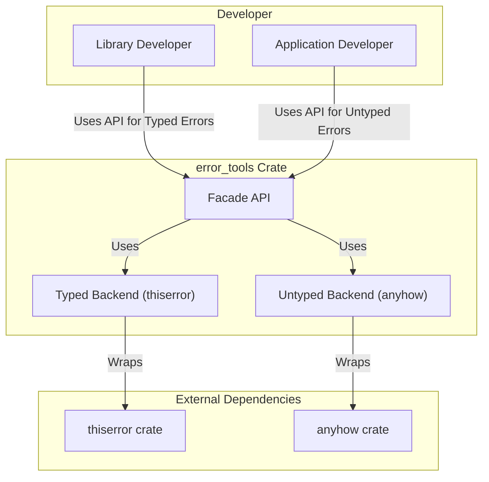
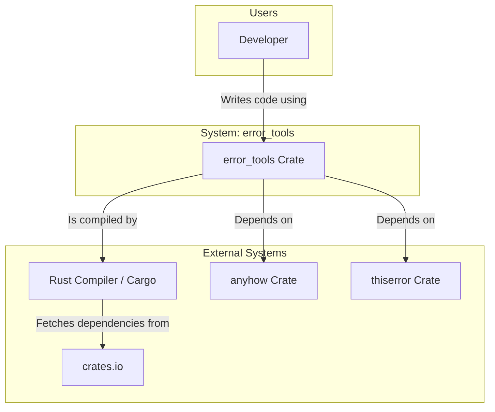

# spec

- **Name:** error_tools
- **Version:** 1.0.0
- **Date:** 2025-07-26
- **Status:** FINAL

### 1. Goal

To provide a single, canonical error-handling library for the `wTools` ecosystem that offers a flexible and unified interface over standard error-handling patterns. The crate must be robust, ergonomic, and fully compatible with both `std` and `no_std` environments, serving as a facade over the `anyhow` and `thiserror` crates.

### 2. Problem Solved

In a large software ecosystem like `wTools`, maintaining consistency is paramount. Without a standardized approach, individual crates may adopt disparate error-handling strategies (e.g., some using `anyhow` for applications, others using `thiserror` for libraries, and some using custom enums). This fragmentation leads to several problems:

*   **Integration Friction:** Combining crates with different error types requires significant boilerplate and conversion logic, increasing complexity and the likelihood of bugs.
*   **Cognitive Overhead:** Developers must learn and manage multiple error-handling idioms, slowing down development and onboarding.
*   **Inconsistent `no_std` Support:** Ensuring that various error-handling dependencies are correctly configured for `no_std` environments is a recurring and error-prone task.

`error_tools` solves these problems by providing a single, pre-configured, and opinionated error-handling solution. It establishes a canonical approach for the entire `wTools` ecosystem, reducing boilerplate, simplifying integration, and guaranteeing consistent `no_std` compatibility out of the box.

### 3. Ubiquitous Language (Vocabulary)

| Term | Definition |
| :--- | :--- |
| **Facade** | An architectural pattern where a single, simplified interface is provided to a more complex underlying system. `error_tools` is a facade over `anyhow` and `thiserror`. |
| **Typed Error** | An error type whose structure is known at compile time. Typically implemented as a custom `enum` or `struct` using the `thiserror` backend. Best suited for libraries. |
| **Untyped Error** | A dynamic, opaque error object that can encapsulate any error type that implements `std::error::Error`. Provided by the `anyhow` backend. Best suited for applications. |
| **`std`** | The Rust standard library, which assumes a host operating system is present. |
| **`no_std`** | A Rust compilation mode for bare-metal or embedded environments where the standard library is not available. |
| **`alloc`** | The Rust library that provides dynamic memory allocation (e.g., `Box`, `Vec`, `String`). It is available in `no_std` environments that have a configured heap allocator. |
| **`core`** | The most fundamental Rust library, containing primitives that are always available, even in `no_std` environments. |
| **Public Contract** | The public-facing API and features of the crate that users can rely on. Defined by **Mandatory Requirements**. |
| **Internal Design** | The internal implementation details of the crate, which can change without affecting users. Described by **Design Recommendations**. |
| **wTools** | The parent ecosystem of libraries for which this crate provides a core, foundational utility. |

### 4. Vision & Scope

#### 4.1. Vision

Our vision is for `error_tools` to be the invisible backbone of error handling within the `wTools` ecosystem. It should be so intuitive and seamless that developers can handle and propagate errors without thinking about the underlying implementation details. By providing a single, unified API, it will empower developers to build more robust and maintainable libraries and applications, whether they are targeting a full-featured OS or a resource-constrained embedded device.

#### 4.2. In Scope

The following features and characteristics are explicitly within the scope of this project:

*   **Unified Facade:** Providing a single crate (`error_tools`) that exposes error-handling functionality from both `anyhow` and `thiserror`.
*   **Typed Error Backend:** Exposing the `thiserror::Error` derive macro and related traits for creating library-friendly, typed errors.
*   **Untyped Error Backend:** Exposing the `anyhow::Error` type and related utilities (`format_err!`, `bail!`, `Context`) for application-level, flexible error handling.
*   **`no_std` Compatibility:** The crate must be fully functional in a `no_std` environment when the `alloc` crate is available. All features must be conditionally compiled to support this.
*   **Context-Adding Utility:** Providing the `ErrWith` trait as a helper to add contextual information to an existing error.
*   **Debug Assertions:** Providing a suite of zero-cost debug assertion macros (`debug_assert_id!`, `debug_assert_ni!`) that are active only in debug builds.
*   **Clear Module Structure:** Implementing the standard `wTools` module pattern (`own`, `orphan`, `exposed`, `prelude`) for a consistent developer experience.

#### 4.3. Out of Scope

The following are explicitly outside the scope of this project:

*   **Novel Error-Handling Logic:** The crate will not invent new error-handling primitives. It is strictly a facade and integration tool for existing, proven solutions (`anyhow`, `thiserror`).
*   **`no_std` without `alloc`:** The crate will not support `no_std` environments that do not have a heap allocator. This is a constraint inherited from its dependencies.
*   **Panic Handling:** The crate is concerned with recoverable errors via `Result`. It will not provide any mechanisms for handling or replacing Rust's `panic!` mechanism.
*   **General-Purpose Tooling:** The crate will not include utilities that are not directly related to error handling or debug assertions.

### 5. Success Metrics

The success of the `error_tools` crate will be measured by the following criteria:

| Metric | Target | Measurement Method |
| :--- | :--- | :--- |
| **`no_std` Compilation** | The crate must compile successfully on the `stable` Rust toolchain. | `cargo check --no-default-features --features "no_std, use_alloc, error_untyped, error_typed"` must pass. |
| **`std` Compilation** | The crate must compile successfully with default features. | `cargo check` must pass. |
| **API Completeness** | All intended public APIs from `anyhow` and `thiserror` are correctly exposed. | Manual audit against dependency documentation and a comprehensive test suite. |
| **Code Quality** | The crate must have zero warnings. | `cargo clippy --all-targets -- -D warnings` must pass. |
| **Ecosystem Adoption** | All other crates within the `wTools` ecosystem use `error_tools` as their sole error-handling dependency. | Auditing the `Cargo.toml` files of all `wTools` crates. |
| **Test Coverage** | All custom utilities (`ErrWith`, assertions) are fully tested. | Code coverage reports (e.g., via `grcov`). Target >90%. |

### 6. System Actors

| Actor | Category | Description |
| :--- | :--- | :--- |
| **Library Developer** | Human | A developer using `error_tools` to build other libraries, typically within the `wTools` ecosystem. They are the primary consumer of the **Typed Error** features. |
| **Application Developer** | Human | A developer using `wTools` crates to build a final, executable application. They are the primary consumer of the **Untyped Error** features for handling errors at the application boundary. |
| **Crate Maintainer** | Human | A developer responsible for maintaining, evolving, and ensuring the quality of the `error_tools` crate itself. |
| **`anyhow` Crate** | External System | A key external dependency that provides the backend for all **Untyped Error** functionality. |
| **`thiserror` Crate** | External System | A key external dependency that provides the backend for all **Typed Error** functionality. |
| **Rust Compiler (`rustc`)** | External System | The toolchain that compiles the crate, enforces `std`/`no_std` constraints, and runs tests. |

### 7. User Stories

#### 7.1. Library Developer Stories

*   **US-1:** As a **Library Developer**, I want to define custom, typed error enums for my library, so that consumers of my library can handle specific error conditions programmatically.
*   **US-2:** As a **Library Developer**, I want to implement the standard `Error` trait for my custom types with minimal boilerplate, so that my errors are compatible with the broader Rust ecosystem.
*   **US-3:** As a **Library Developer**, I want my crate to be fully `no_std` compatible, so that it can be used in embedded projects and other `wTools` libraries that require it.
*   **US-4:** As a **Library Developer**, I want to easily wrap an underlying error from a dependency into my own custom error type, so that I can provide a consistent error API.

#### 7.2. Application Developer Stories

*   **US-5:** As an **Application Developer**, I want to handle errors from multiple different libraries using a single, uniform `Result` type, so that I don't have to write complex error conversion logic.
*   **US-6:** As an **Application Developer**, I want to add contextual information (like "Failed to read configuration file") to an error as it propagates up the call stack, so that I can easily debug the root cause of a failure.
*   **US-7:** As an **Application Developer**, I want a simple way to create a new, ad-hoc error from a string, so that I can handle application-specific failure conditions without defining a custom error type.
*   **US-8:** As an **Application Developer**, I want to easily return an error from a function using a concise macro, so that my business logic remains clean and readable.

#### 7.3. Crate Maintainer Stories

*   **US-9:** As a **Crate Maintainer**, I want to run a single command to verify that the crate compiles and passes all tests in both `std` and `no_std` configurations, so that I can prevent regressions.
*   **US-10:** As a **Crate Maintainer**, I want the public API to be clearly documented with examples, so that developers can quickly understand how to use the crate effectively.

### 8. Functional Requirements

#### 8.1. Feature Flags

*   **FR-1:** The crate **must** provide a feature named `default` that enables the `enabled`, `error_typed`, and `error_untyped` features.
*   **FR-2:** The crate **must** provide a feature named `full` that enables `default`.
*   **FR-3:** The crate **must** provide a feature named `enabled` which acts as a master switch for the core functionality.
*   **FR-4:** The crate **must** provide a feature named `no_std`. When enabled, the crate **must not** link to the Rust standard library (`std`).
*   **FR-5:** The crate **must** provide a feature named `use_alloc` that enables the use of the `alloc` crate. This feature **must** be enabled by default when `no_std` is active.
*   **FR-6:** The crate **must** provide a feature named `error_typed`. When enabled, it **must** expose the typed error backend powered by `thiserror`.
*   **FR-7:** The crate **must** provide a feature named `error_untyped`. When enabled, it **must** expose the untyped error backend powered by `anyhow`.

#### 8.2. API Contracts

*   **FR-8 (Typed Errors):** When the `error_typed` feature is enabled, the crate **must** publicly re-export the `thiserror::Error` derive macro from its `typed` module.
*   **FR-9 (Untyped Errors):** When the `error_untyped` feature is enabled, the crate **must** publicly re-export the following items from its `untyped` module:
    *   `anyhow::Error`
    *   `anyhow::Result`
    *   `anyhow::Context` trait
    *   `anyhow::format_err!` macro
    *   `anyhow::bail!` macro (re-exported as `return_err!`)
*   **FR-10 (Context Trait):** The crate **must** provide a public trait `ErrWith<ReportErr, ReportOk, E>`. This trait **must** be implemented for `core::result::Result<ReportOk, IntoError>` and provide the following methods:
    *   `err_with<F>(self, f: F) -> core::result::Result<ReportOk, (ReportErr, E)>`
    *   `err_with_report(self, report: &ReportErr) -> core::result::Result<ReportOk, (ReportErr, E)>`
*   **FR-11 (Debug Assertions):** The crate **must** provide the following macros: `debug_assert_id!`, `debug_assert_identical!`, `debug_assert_ni!`, `debug_assert_not_identical!`. These macros **must** expand to `std::assert_eq!` or `std::assert_ne!` when compiled in a debug build (`debug_assertions` is true) and **must** compile to nothing in a release build.

### 9. Non-Functional Requirements

*   **NFR-1 (no_std Compatibility):** The crate **must** successfully compile and pass all its tests on the stable Rust toolchain using the target `thumbv7em-none-eabi` (or a similar bare-metal target) when the `no_std` and `use_alloc` features are enabled.
*   **NFR-2 (Zero-Cost Abstraction):** The facade **must** introduce no measurable performance overhead. A function call using `error_tools::untyped::Result` must have the same performance characteristics as a direct call using `anyhow::Result`.
*   **NFR-3 (API Documentation):** All public items (structs, traits, functions, macros) **must** have comprehensive doc comments (`///`). Examples **must** be provided for all major use cases.
*   **NFR-4 (Crate Documentation):** The crate-level documentation (`#![doc]`) **must** be generated from the `Readme.md` file to ensure consistency between the crate registry and the source repository.
*   **NFR-5 (Code Quality):** The entire codebase **must** pass `cargo clippy -- -D warnings` on the stable Rust toolchain without any errors or warnings.
*   **NFR-6 (Dependency Management):** All dependencies **must** be managed via the workspace `Cargo.toml`. Versions **must** be pinned to ensure reproducible builds.
*   **NFR-7 (Semantic Versioning):** The crate **must** adhere strictly to the Semantic Versioning 2.0.0 standard. Any breaking change to the public API **must** result in a new major version release.

### 10. External System Interfaces

*   **10.1. `anyhow` Crate Interface**
    *   **Dependency Type:** Untyped Error Backend
    *   **Public Contract:** `error_tools` **must** re-export specific, public-facing elements from the `anyhow` crate under its `untyped` module when the `error_untyped` feature is enabled. The versions used **must** be compatible with `no_std` and `alloc`.
    *   **Mandatory Re-exports:** `Error`, `Result`, `Context`, `format_err!`, `bail!`.
*   **10.2. `thiserror` Crate Interface**
    *   **Dependency Type:** Typed Error Backend
    *   **Public Contract:** `error_tools` **must** re-export the `Error` derive macro from the `thiserror` crate under its `typed` module when the `error_typed` feature is enabled. The versions used **must** be compatible with `no_std`.
    *   **Mandatory Re-exports:** `Error` (derive macro).

### Part II: Internal Design (Design Recommendations)

### 11. System Architecture

The `error_tools` crate **should** be implemented using a **Facade** architectural pattern. It acts as a single, simplifying interface that abstracts away the details of its underlying dependencies (`anyhow` and `thiserror`).

The core design principles are:
*   **Minimalism:** The crate should contain as little of its own logic as possible. Its primary role is to select, configure, and re-export functionality from its dependencies. The `ErrWith` trait and the debug assertions are the only notable exceptions.
*   **Conditional Compilation:** The entire architecture is driven by feature flags. `#[cfg]` attributes **should** be used extensively to include or exclude modules, dependencies, and even lines of code to ensure that only the requested functionality is compiled, and to strictly enforce `std`/`no_std` separation.
*   **Consistent Namespace:** The crate **should** adhere to the `wTools` standard module structure (`own`, `orphan`, `exposed`, `prelude`) to provide a familiar and predictable developer experience for users of the ecosystem.

### 12. Architectural & Flow Diagrams

#### 12.1. High-Level Architecture Diagram


#### 12.2. C4 System Context Diagram


#### 12.3. Use Case Diagram
```mermaid
rectangle "error_tools" {
  (Define Typed Error) as UC1
  (Propagate Untyped Error) as UC2
  (Add Context to Error) as UC3
  (Create Ad-hoc Error) as UC4
  (Use Debug Assertions) as UC5
}

actor "Library Developer" as LibDev
actor "Application Developer" as AppDev

LibDev --|> AppDev
LibDev -- UC1
AppDev -- UC2
AppDev -- UC3
AppDev -- UC4
AppDev -- UC5
```

### Part III: Project & Process Governance

### 13. Deliverables

Upon completion, the project **must** deliver the following artifacts:
*   The published `error_tools` crate on `crates.io`.
*   The full source code repository on GitHub, including all documentation and tests.
*   Comprehensive API documentation available on `docs.rs`.

### 14. Assumptions

*   The `anyhow` and `thiserror` crates will continue to be maintained and will provide stable `no_std` support.
*   Developers using this crate have a working knowledge of Rust's `Result` and `Error` handling concepts.
*   The `wTools` module structure is a desired and required pattern for this crate.

### 15. Open Questions

*   **Q1:** Should the `BasicError` struct (currently commented out) be revived as a simple, dependency-free error type for `no_std` environments that cannot use `alloc`?
    *   *Decision:* No, this is currently out of scope (see 4.3). The crate will require `alloc` for `no_std` functionality.
*   **Q2:** Are the re-exported macro names (`return_err!` for `bail!`) clear enough, or should they stick to the original names from `anyhow`?
    *   *Decision:* For now, we will maintain the aliased names for consistency with other `wTools` crates, but this is subject to developer feedback.

### 16. Core Principles of Development

#### 1. Single Source of Truth
The project's Git repository **must** be the absolute single source of truth for all project-related information. This includes specifications, documentation, source code, and configuration files.

#### 2. Documentation-First Development
All changes to the system's functionality or architecture **must** be documented in the relevant specification files *before* implementation begins.

#### 3. Review-Driven Change Control
All modifications to the repository, without exception, **must** go through a formal Pull Request review.

#### 4. Radical Transparency and Auditability
The development process **must** be fully transparent and auditable. All significant decisions and discussions **must** be captured in writing.

### 17. Stakeholder Changelog

- **2025-07-26:** Version 1.0.0 of the specification created and finalized.

### 18. Meta-Requirements

- This specification document **must** be stored as `spec.md` in the root of the `error_tools` crate directory.
- Any changes to this specification **must** be approved by the Crate Maintainer.

### Appendix: Addendum

---

#### Purpose
This document is intended to be completed by the **Developer** during the implementation phase. It is used to capture the final, as-built details of the **Internal Design**, especially where the implementation differs from the initial `Design Recommendations` in `specification.md`.

#### Instructions for the Developer
As you build the system, please use this document to log your key implementation decisions, the final data models, environment variables, and other details. This creates a crucial record for future maintenance, debugging, and onboarding.

---

#### Conformance Checklist
*This checklist is the definitive list of acceptance criteria for the project. Before final delivery, each item must be verified as complete and marked with `✅`. Use the 'Verification Notes' column to link to evidence (e.g., test results, screen recordings).*

| Status | Requirement | Verification Notes |
| :--- | :--- | :--- |
| ❌ | **FR-1:** The crate **must** provide a feature named `default` that enables the `enabled`, `error_typed`, and `error_untyped` features. | |
| ❌ | **FR-2:** The crate **must** provide a feature named `full` that enables `default`. | |
| ❌ | **FR-3:** The crate **must** provide a feature named `enabled` which acts as a master switch for the core functionality. | |
| ❌ | **FR-4:** The crate **must** provide a feature named `no_std`. When enabled, the crate **must not** link to the Rust standard library (`std`). | |
| ❌ | **FR-5:** The crate **must** provide a feature named `use_alloc` that enables the use of the `alloc` crate. This feature **must** be enabled by default when `no_std` is active. | |
| ❌ | **FR-6:** The crate **must** provide a feature named `error_typed`. When enabled, it **must** expose the typed error backend powered by `thiserror`. | |
| ❌ | **FR-7:** The crate **must** provide a feature named `error_untyped`. When enabled, it **must** expose the untyped error backend powered by `anyhow`. | |
| ❌ | **FR-8 (Typed Errors):** When the `error_typed` feature is enabled, the crate **must** publicly re-export the `thiserror::Error` derive macro from its `typed` module. | |
| ❌ | **FR-9 (Untyped Errors):** When the `error_untyped` feature is enabled, the crate **must** publicly re-export the following items from its `untyped` module... | |
| ❌ | **FR-10 (Context Trait):** The crate **must** provide a public trait `ErrWith<ReportErr, ReportOk, E>`... | |
| ❌ | **FR-11 (Debug Assertions):** The crate **must** provide the following macros: `debug_assert_id!`, `debug_assert_identical!`, `debug_assert_ni!`, `debug_assert_not_identical!`... | |
| ❌ | **US-1:** As a **Library Developer**, I want to define custom, typed error enums for my library... | |
| ❌ | **US-2:** As a **Library Developer**, I want to implement the standard `Error` trait for my custom types with minimal boilerplate... | |
| ❌ | **US-3:** As a **Library Developer**, I want my crate to be fully `no_std` compatible... | |
| ❌ | **US-4:** As a **Library Developer**, I want to easily wrap an underlying error from a dependency into my own custom error type... | |
| ❌ | **US-5:** As an **Application Developer**, I want to handle errors from multiple different libraries using a single, uniform `Result` type... | |
| ❌ | **US-6:** As an **Application Developer**, I want to add contextual information... | |
| ❌ | **US-7:** As an **Application Developer**, I want a simple way to create a new, ad-hoc error from a string... | |
| ❌ | **US-8:** As an **Application Developer**, I want to easily return an error from a function using a concise macro... | |
| ❌ | **US-9:** As a **Crate Maintainer**, I want to run a single command to verify that the crate compiles and passes all tests... | |
| ❌ | **US-10:** As a **Crate Maintainer**, I want the public API to be clearly documented with examples... | |

#### Finalized Internal Design Decisions
*A space for the developer to document key implementation choices for the system's internal design, especially where they differ from the initial recommendations in `specification.md`.*

-   [Decision 1: Reason...]
-   [Decision 2: Reason...]

#### Finalized Internal Data Models
*The definitive, as-built schema for all databases, data structures, and objects used internally by the system.*

-   N/A (This crate does not define complex internal data models)

#### Environment Variables
*List all environment variables required to run the application. Include the variable name, a brief description of its purpose, and an example value (use placeholders for secrets).*

-   N/A (This is a library and does not require environment variables for its operation)

#### Finalized Library & Tool Versions
*List the critical libraries, frameworks, or tools used and their exact locked versions (e.g., from `package.json` or `requirements.txt`).*

-   `rustc`: `1.xx.x` (stable)
-   `anyhow`: `1.0.x`
-   `thiserror`: `1.0.x`

#### Deployment Checklist
*A step-by-step guide for deploying the application from scratch. Include steps for setting up the environment, running migrations, and starting the services.*

1.  Run tests: `cargo test --all-features`
2.  Check formatting: `cargo fmt --all -- --check`
3.  Run linter: `cargo clippy --all-targets --all-features -- -D warnings`
4.  Publish to registry: `cargo publish`
