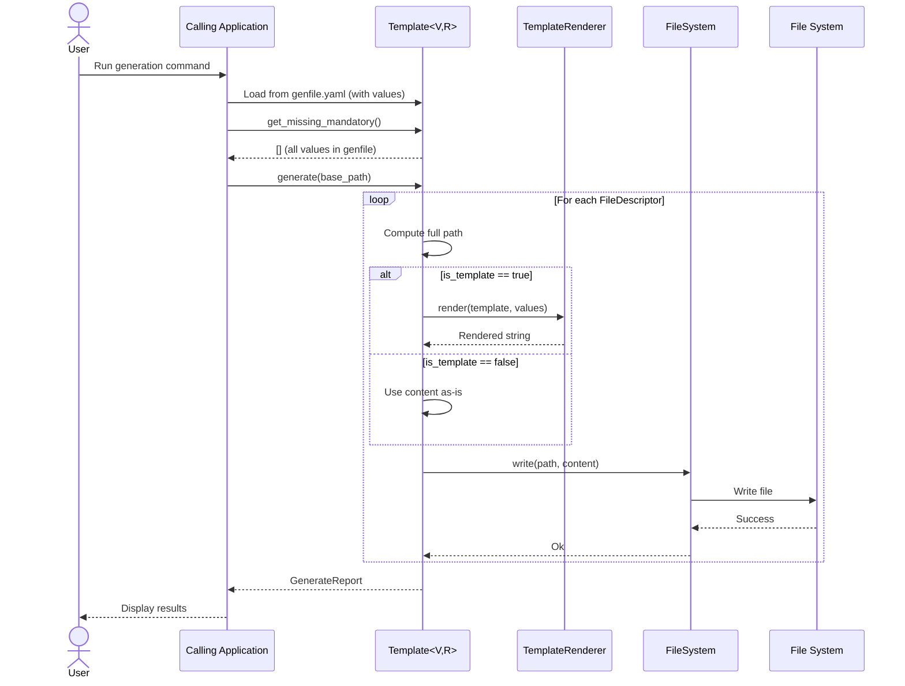

# spec

- **Project Name:** genfile
- **Version:** 0.1
- **Date:** 2025-10-18
- **Type:** Library/Framework

## Vocabulary

- **Template Value:** A runtime data value that can be serialized to a string for substitution in templates. Values must implement the `TemplateValue` trait to participate in template rendering.
- **Template Renderer:** An engine that processes template syntax and substitutes variables with provided values. The default implementation uses Handlebars, but the system supports pluggable renderers via the `TemplateRenderer` trait.
- **File Descriptor:** A specification for a single file to be generated, including its target path, content (template or static), and write behavior.
- **Write Mode:** The strategy for writing generated files to disk. Currently only `Rewrite` mode is supported, which overwrites existing files completely.
- **Parameter Descriptor:** Metadata defining a single template parameter, including its name, whether it is mandatory, optional default value, and description.
- **Parameter Collection:** The complete set of parameter descriptors required by a template, with methods for validation and extraction.
- **Value Storage:** A container holding actual runtime values for template parameters stored inside the genfile itself for portability and serialization.
- **Template Holder:** The main orchestrator that combines file descriptors, parameters, values, and rendering engine to execute end-to-end file generation.
- **File System Port:** An abstraction trait for file I/O operations, enabling testability through in-memory implementations and supporting real filesystem operations in production.
- **Generation Report:** A structured summary of file generation results, listing all files created, modified, or skipped, with any errors encountered.

## Project Goal

Create a reusable, trait-based template processing and file generation library for the wTools ecosystem that decouples template rendering from specific value types and command-line frameworks, enabling consistent file generation across multiple tools while supporting testability through filesystem abstraction.

## Problem Solved

The wTools ecosystem currently has template processing logic tightly coupled to the `willbe` project management tool, hardcoded to use `wca::Value` types and Handlebars rendering. This creates:

1. **Code Duplication Risk:** Other tools needing file generation must either duplicate logic or depend on willbe
2. **Inflexibility:** Cannot use template system with different value types or CLI frameworks
3. **Testing Difficulty:** File system operations are not abstracted, making unit testing complex
4. **Tight Coupling:** Template rendering engine cannot be swapped or extended

genfile solves these problems by providing a generic, well-tested library with trait-based abstractions that can be reused across the entire wTools ecosystem.

## Target Audience

- **Primary:** wTools developers creating code generation tools, project scaffolding utilities, or configuration file generators
- **Secondary:** Rust developers building similar file generation systems who want a tested, flexible foundation

## Success Metrics

1. **Adoption:** Successfully integrated into `willbe` as a dependency, replacing existing template.rs (472 lines of duplicated code eliminated)
   - **Status:** ❌ NOT YET DONE (blocked on willbe team decision)

2. **Test Coverage:** Minimum 80% code coverage for core genfile logic
   - **Status:** ⚠️ NOT MEASURED (188 tests exist, likely >80%, need to run tarpaulin)

3. **Zero Regressions:** All existing willbe tests continue passing after migration
   - **Status:** N/A (will be tested during integration)

4. **Performance:** Template rendering and file generation performance matches or exceeds current willbe implementation (within 5% variance)
   - **Status:** ⚠️ NOT MEASURED (likely fast enough, need benchmarks)

5. **Reusability:** At least one additional wTools project beyond willbe adopts genfile for file generation needs
   - **Status:** ❌ NOT YET ACHIEVED (no other projects using it yet)

## In Scope

1. **Generic Value System:**
   - `TemplateValue` trait for value abstraction
   - Default `Value` enum implementation supporting String, Number, Bool, List
   - Serialization to string format for template engines

2. **Parameter Management:**
   - `ParameterDescriptor` for defining individual parameters
   - `Parameters` collection with validation and mandatory parameter listing

3. **Value Storage:**
   - `Values<V>` generic storage for template parameter values
   - Serialization to Handlebars-compatible format
   - Values stored inside genfile (JSON/YAML) for portability

4. **Template Rendering:**
   - `TemplateRenderer` trait for pluggable rendering engines
   - `HandlebarsRenderer` default implementation using Handlebars 4.5.0
   - Support for variable substitution and conditional logic

5. **File Generation:**
   - `FileDescriptor` for specifying files to generate
   - `WriteMode::Rewrite` for file generation
   - Path handling and directory creation

6. **File System Abstraction:**
   - `FileSystem` trait for testable I/O operations
   - `RealFileSystem` implementation for production use
   - `MemoryFileSystem` implementation for unit testing

7. **Template Orchestration:**
   - `Template<V, R>` main holder struct
   - End-to-end generation workflow
   - Missing mandatory parameter detection
   - `TemplateArchive` as self-contained genfile format

8. **Error Handling:**
   - Typed `Error` enum with all error cases
   - Proper error context and messages
   - Integration with `error_tools` crate

## Out of Scope

1. **Alternative Template Engines:** Built-in support for Tera, Minijinja, or other template engines (users can implement `TemplateRenderer` trait themselves if needed)
2. **Async File Operations:** All file I/O is synchronous (async support could be added in future versions if needed)
3. **Binary File Templates:** Only text-based templates are supported (no image, PDF, or other binary template processing)
4. **Template Validation:** Pre-generation template syntax validation (templates are validated during rendering only)
5. **Incremental Generation:** Tracking which files have changed and regenerating only necessary files (all files are regenerated each time)
6. **GUI or Web Interface:** genfile is a library only, no standalone executable or user interface
7. **Template Discovery:** Automatic scanning for template files in directories (users must explicitly provide file descriptors)
8. **Migration Tools:** Utilities to migrate existing willbe template code to genfile (manual migration required)

## System Actors

### Primary Actors

1. **Calling Application**
   - **Description:** The Rust application or tool that uses genfile as a library dependency
   - **Interaction:** Creates `Template` instances, provides parameters and values, invokes file generation
   - **Example:** willbe project management tool, custom code generators

2. **Template Author**
   - **Description:** Developer who writes template files using template syntax
   - **Interaction:** Creates `.hbs` or other template files, defines parameter placeholders
   - **Responsibilities:** Ensuring template syntax is valid, documenting required parameters

### Secondary Actors

3. **File System**
   - **Description:** Operating system file system where generated files are written
   - **Interaction:** Receives write requests, provides read access for TOML merging
   - **Abstraction:** Accessed only through `FileSystem` trait to enable testing

4. **End User**
   - **Description:** Person running the application that uses genfile
   - **Interaction:** May be prompted interactively for missing mandatory parameters
   - **Example:** Developer running `willbe workspace_renew` command

## Functional Requirements

### FR1: Template Value Trait

The system must provide a `TemplateValue` trait that defines how values are converted to template-compatible strings.

**Test Criteria:**
- Trait must define `to_template_string(&self) -> String` method
- Trait must define `from_string(s: String) -> Self` method
- Trait must define `is_empty(&self) -> bool` method
- Trait must be implementable for custom value types
- Default `Value` enum must implement the trait

### FR2: Default Value Type

The system must provide a default `Value` enum supporting common data types.

**Test Criteria:**
- Must support `String` variant
- Must support `Number` variant (i64)
- Must support `Bool` variant
- Must support `List` variant (Vec<String>)
- Each variant must correctly implement `TemplateValue` trait
- Conversions to template strings must match expected formats

### FR3: Parameter Definition

The system must allow definition of template parameters with metadata.

**Test Criteria:**
- `ParameterDescriptor` must store parameter name
- Must support mandatory flag (bool)
- Must support optional default value
- Must support optional description
- Builder pattern via `former` must work for parameter creation

### FR4: Parameter Collection

The system must provide a `Parameters` type collecting all parameter descriptors.

**Test Criteria:**
- Must store multiple `ParameterDescriptor` instances
- Must provide `list_mandatory() -> Vec<&str>` method returning only mandatory parameter names
- Must support builder pattern for construction
- Validation must detect missing mandatory parameters

### FR5: Value Storage

The system must provide generic `Values<V>` storage for template parameter values.

**Test Criteria:**
- Must store HashMap of parameter names to `Option<V>` values
- `insert_if_empty(key, value)` must only insert if key has None value
- `to_serializable()` must convert all values to `BTreeMap<String, String>`
- Must support generic `V: TemplateValue` type parameter

### FR6: Template Renderer Trait

The system must define a `TemplateRenderer` trait for pluggable rendering engines.

**Test Criteria:**
- Trait must define `render(&self, template: &str, values: &impl Serializable) -> Result<String, Error>` method
- Multiple renderer implementations must be possible
- Renderer must accept any serializable value type

### FR7: Handlebars Renderer

The system must provide a default `HandlebarsRenderer` implementation.

**Test Criteria:**
- Must use Handlebars 4.5.0 library
- Must disable HTML escaping (use `no_escape`)
- Must support variable substitution: `{{variable_name}}`
- Must support conditional logic: `{{#if condition}}`
- Must return `Error::Render` on invalid template syntax

### FR8: File Descriptor

The system must provide `FileDescriptor` for specifying files to generate.

**Test Criteria:**
- Must store target file path (relative)
- Must store file content (template or static string)
- Must store `is_template` flag (bool)
- Must store `WriteMode` enum value
- Builder pattern must work for construction

### FR9: Write Mode Support

The system must support Rewrite write mode for file generation.

**Test Criteria:**
- `WriteMode::Rewrite` must overwrite existing files completely
- If file does not exist, must create new file
- Must write content to file system correctly

### FR10: File System Trait

The system must define `FileSystem` trait abstracting I/O operations.

**Test Criteria:**
- Must define `write(&self, instruction: &WriteInstruction) -> Result<()>` method
- Must define `read(&self, instruction: &ReadInstruction) -> Result<Vec<u8>>` method
- Must define `create_dir_all(&self, path: &Path) -> Result<()>` method
- Multiple implementations must be possible

### FR11: Real File System Implementation

The system must provide `RealFileSystem` for production use.

**Test Criteria:**
- `write()` must create parent directories if missing
- `write()` must write file content to path
- `read()` must read file content from path
- `create_dir_all()` must create all parent directories
- Must return I/O errors wrapped in typed Error enum

### FR12: Memory File System Implementation

The system must provide `MemoryFileSystem` for testing.

**Test Criteria:**
- Must store files in-memory HashMap<PathBuf, Vec<u8>>
- `write()` must add or update HashMap entry
- `read()` must return HashMap entry or error if not found
- `create_dir_all()` must be no-op (in-memory doesn't need directories)
- Must not touch real filesystem at all

### FR13: Template Holder Structure

The system must provide `Template<V, R>` as main orchestration type.

**Test Criteria:**
- Must be generic over `V: TemplateValue` and `R: TemplateRenderer`
- Must store `Vec<FileDescriptor>` for files to generate
- Must store `Parameters` for parameter definitions
- Must store `Values<V>` for runtime values
- Must store renderer instance of type `R`
- Must store `template_name` for identification

### FR14: Template Generation

The system must provide end-to-end `generate()` method on Template.

**Test Criteria:**
- Must accept base path where files will be generated
- Must iterate all file descriptors
- For each file:
  - Compute full path by joining base path with file descriptor path
  - If `is_template` is true, render content using renderer
  - If `is_template` is false, use content directly
  - Write file using file system abstraction (Rewrite mode)
- Must return `GenerateReport` with results
- Must stop on first error and return it

### FR15: Missing Mandatory Detection

The system must detect missing mandatory parameters before generation.

**Test Criteria:**
- `get_missing_mandatory()` must return Vec<&str> of missing parameter names
- Must check `Parameters.list_mandatory()` against `Values` content
- Must return only parameters that have None value
- Must return empty vec if all mandatory parameters provided

### FR16: Typed Errors

The system must provide comprehensive typed error enum.

**Test Criteria:**
- `Error::Render` for template rendering failures
- `Error::MissingParameters` for missing mandatory params
- `Error::Fs` wrapping std::io::Error
- `Error::InvalidTemplate` for malformed templates
- All errors must implement std::error::Error trait
- All errors must provide clear, actionable messages

### FR17: Archive Self-Containment

The system must ensure genfiles (TemplateArchive) are self-contained and portable.

**Test Criteria:**
- `TemplateArchive` must store parameter values inside the archive
- Values must serialize to JSON/YAML with the archive
- Loading an archive must restore all parameter values
- External references (FileRef/UrlRef) allowed only for CONTENT, not parameter values
- Single file contains complete template definition + values

## Non-Functional Requirements

### NFR1: Performance

Template rendering must complete within 100ms for templates up to 10KB with up to 50 parameters on modern hardware (2020+ laptop).

**Measurement:** Benchmark test with 10KB template and 50 parameters, measure median rendering time.

### NFR2: Memory Efficiency

In-memory template operations must not allocate more than 10MB of heap memory for typical use cases (up to 100 files, 1MB of template content total).

**Measurement:** Memory profiling during test suite execution with 100 file generation.

### NFR3: Test Coverage

Core library code must maintain minimum 80% line coverage.

**Measurement:** Run `cargo tarpaulin` or equivalent coverage tool, verify coverage percentage.

### NFR4: Compilation Time

Adding genfile as a dependency must not increase clean build time of dependent projects by more than 5 seconds.

**Measurement:** Compare willbe clean build time before and after genfile integration.

### NFR5: Documentation

Every public API item (trait, struct, enum, function, method) must have doc comments explaining purpose, parameters, return values, and errors.

**Measurement:** Run `cargo doc` with warnings enabled, verify no missing doc warnings.

### NFR6: Error Messages

All error messages must include sufficient context to diagnose the problem without consulting source code.

**Measurement:** Manual review of error messages, ensure each includes relevant file paths, parameter names, or template locations.

### NFR7: Backward Compatibility

Once version 1.0 is released, all future versions must maintain backward compatibility for public APIs unless major version bump.

**Measurement:** Semantic versioning compliance verification using cargo-semver-checks.

## System Architecture

### Component Diagram

```mermaid
graph TB
  subgraph "genfile Library"
    Value[Value<br/>TemplateValue Trait]
    Params[Parameters<br/>ParameterDescriptor]
    Values[Values Storage]
    Renderer[TemplateRenderer Trait]
    Handlebars[HandlebarsRenderer]
    FileDesc[FileDescriptor]
    Template[Template Holder]
    FS[FileSystem Trait]
    RealFS[RealFileSystem]
    MemFS[MemoryFileSystem]
    Errors[Error Enum]

    Template -->|uses| Value
    Template -->|uses| Params
    Template -->|uses| Values
    Template -->|uses| Renderer
    Template -->|uses| FileDesc
    Template -->|uses| FS
    Renderer <|-- Handlebars
    FS <|-- RealFS
    FS <|-- MemFS
    Template -->|returns| Errors
  end

  CallingApp[Calling Application<br/>e.g., willbe] -->|creates| Template
  CallingApp -->|provides| Value
  Template -->|writes to| Filesystem[File System]
  RealFS -->|accesses| Filesystem
```

### Design Recommendation: Trait-Based Architecture

It is recommended that genfile use a trait-based architecture to maximize flexibility and testability. The key traits suggested are:

1. **TemplateValue Trait:** Allows any value type to participate in template rendering by implementing string conversion. This decouples genfile from specific CLI frameworks like wca.

2. **TemplateRenderer Trait:** Enables swapping template engines without changing calling code. Handlebars is the recommended default, but users could implement Tera or custom engines.

3. **FileSystem Trait:** Abstracts file I/O to enable pure in-memory unit testing. This is a critical design recommendation for maintaining high test coverage.

### Design Recommendation: Generic Template Type

It is recommended that the main `Template` type be generic over both value type (`V`) and renderer type (`R`):

```rust
pub struct Template< V, R >
where
  V: TemplateValue,
  R: TemplateRenderer,
{
  // ...
}
```

This allows compile-time optimization while maintaining flexibility. Users can specialize for their specific value and renderer types.

## Dependencies

### Required Dependencies

1. **handlebars = "4.5.0"**
   - **Purpose:** Default template rendering engine
   - **Integration:** Used by HandlebarsRenderer implementation
   - **Risk:** Version pinned to match willbe's current usage, no breaking changes expected

2. **error_tools = { workspace = true, features = ["error_typed"] }**
   - **Purpose:** Error handling infrastructure
   - **Integration:** Error enum uses error_tools macros
   - **Risk:** None, internal wTools dependency

3. **collection_tools = { workspace = true }**
   - **Purpose:** HashMap and BTreeMap utilities
   - **Integration:** Used in Values storage and serialization
   - **Risk:** None, internal wTools dependency

### Design Recommendation: Minimal Dependencies

It is recommended to keep genfile's dependency footprint as small as possible. Only dependencies listed above are essential. Avoid adding dependencies for convenience features that can be implemented with standard library.

## User Stories

### US1: willbe Integration
As a willbe developer, I want to replace the existing template.rs module with genfile so that template logic is reusable and maintainable.

### US2: Custom Value Types
As a tool developer, I want to use my own value types in templates so that I can integrate genfile with my CLI framework.

### US3: Parameter Persistence in Archive
As an end user, I want my parameter values saved inside the genfile so that regeneration uses the same values without re-entry.

### US4: Testable File Generation
As a developer, I want to test file generation in-memory so that my tests run fast and don't pollute the filesystem.

### US5: Custom Template Engine
As an advanced user, I want to implement my own template renderer so that I can use alternative template syntax if Handlebars doesn't meet my needs.

### US6: Clear Error Messages
As a user, I want clear error messages when template rendering fails so that I can fix template syntax problems quickly.

## Data Flow

### File Generation Sequence



## API Design

### Design Recommendation: Public API Surface

It is recommended that genfile expose a clean, minimal public API:

**Core Types (must be public):**
- `TemplateValue` trait
- `Value` enum
- `TemplateRenderer` trait
- `HandlebarsRenderer` struct
- `FileSystem` trait
- `RealFileSystem` struct
- `MemoryFileSystem` struct
- `Template<V, R>` struct
- `Parameters` struct
- `ParameterDescriptor` struct
- `Values<V>` struct
- `FileDescriptor` struct
- `WriteMode` enum
- `Error` enum
- `GenerateReport` struct

**Internal Types (should be private or pub(crate)):**
- `WriteInstruction` struct
- `ReadInstruction` struct
- Internal helper functions

### Design Recommendation: Prelude Module

It is recommended to provide a prelude module for convenient imports:

```rust
pub mod prelude
{
  pub use crate ::
  {
    Template,
    TemplateValue,
    Value,
    TemplateRenderer,
    HandlebarsRenderer,
    FileSystem,
    RealFileSystem,
    MemoryFileSystem,
    Parameters,
    ParameterDescriptor,
    Values,
    FileDescriptor,
    WriteMode,
    Error,
  };
}
```

Users can then `use genfile::prelude::*` to import commonly-used types.

## Testing Strategy

### Design Recommendation: Test Organization

It is recommended to organize tests following wTools conventions:

**Location:** `tests/` directory (not `src/`)

**Structure:**
```
tests/
├── smoke_test.rs           # Minimal smoke test
├── tests.rs                # Feature-gated test module loader
└── inc/
    ├── mod.rs
    ├── basic_test.rs       # Basic API tests
    ├── value_test.rs       # TemplateValue trait tests
    ├── parameter_test.rs   # Parameter management tests
    ├── handlebars_test.rs  # Handlebars rendering tests
    ├── toml_merge_test.rs  # TOML merging logic tests
    ├── memory_fs_test.rs   # In-memory filesystem tests
    └── integration_test.rs # End-to-end integration tests
```

### Design Recommendation: Test-Driven Development

It is strongly recommended to follow TDD approach:
1. Write test first for each FR
2. Run test (should fail)
3. Implement minimal code to pass test
4. Refactor if needed
5. Move to next FR

### Design Recommendation: No Mocking

Following wTools codebase hygiene rules, it is recommended to avoid mocking in tests. Use real implementations or in-memory alternatives (like `MemoryFileSystem` instead of mocking `FileSystem` trait).

## Limitations

Initial version (0.1-1.0) will have the following quantified limitations:

1. **Template Size:** Maximum template file size of 10 MB. Larger templates may cause performance degradation.

2. **Parameter Count:** Maximum 500 parameters per template. Exceeding this may impact rendering performance.

3. **File Count:** Maximum 10,000 files per generation batch. Larger batches should be split.

4. **Nesting Depth:** TOML merging supports maximum 10 levels of nesting. Deeper structures will cause errors.

5. **Concurrency:** Single-threaded file generation only. No parallel file writing.

6. **Platform Support:** Tested only on Linux and macOS. Windows support is best-effort.

7. **Character Encoding:** UTF-8 only. Other encodings not supported.

## External Dependencies

None. genfile is a library with no external service dependencies.

## Deliverables

1. **genfile Rust Library Crate**
   - Published to crates.io
   - Source code in wTools monorepo at `module/core/genfile/`
   - Semantic versioning starting at 0.1.0

2. **API Documentation**
   - Published to docs.rs
   - Generated from Rust doc comments
   - Includes examples and usage patterns

3. **Integration into willbe**
   - willbe updated to use genfile as dependency
   - Legacy template.rs removed
   - All tests passing

## Open Questions

1. Should `GenerateReport` include file hashes to detect changes?
2. Should we add a `dry_run` mode that previews files without writing?
3. Should TOML merging support custom merge strategies beyond top-level key replacement?
4. Should we provide helper functions for common parameter prompting patterns?

---

### Appendix: Addendum

#### Design Patterns

**Trait-Based Architecture:**
The core design pattern is trait-based abstraction. Three key traits enable extensibility:
- `TemplateValue`: Abstracts value types
- `TemplateRenderer`: Abstracts template engines
- `FileSystem`: Abstracts I/O operations

This pattern allows compile-time specialization while maintaining runtime flexibility.

**Builder Pattern:**
All complex types use the builder pattern via `former` crate. This provides fluent API and makes construction less error-prone.

**Newtype Pattern:**
`Values<V>` wraps `HashMap` to provide domain-specific API and enforce invariants.

#### Implementation Priorities

**Phase 1 (Core Abstractions):**
1. Define traits: `TemplateValue`, `TemplateRenderer`, `FileSystem`
2. Implement `Value` enum
3. Implement `Parameters` and `ParameterDescriptor`
4. Implement `Values<V>` storage

**Phase 2 (Rendering):**
5. Implement `HandlebarsRenderer`
6. Test template rendering with various inputs

**Phase 3 (File System):**
7. Implement `FileSystem` trait
8. Implement `RealFileSystem`
9. Implement `MemoryFileSystem`
10. Test TOML merging logic

**Phase 4 (Integration):**
11. Implement `Template<V, R>` holder
12. Implement `generate()` method
13. Implement parameter loading
14. Add typed errors

**Phase 5 (Migration):**
15. Add genfile to willbe dependencies
16. Create wca::Value adapter
17. Update workspace_renew
18. Update deploy_renew
19. Update cicd_renew
20. Remove legacy template.rs

#### Performance Considerations

**Memory Allocation:**
Minimize allocations during template rendering by reusing buffers where possible. Consider arena allocation for short-lived template data.

**Template Caching:**
HandlebarsRenderer should cache compiled templates if the same template is rendered multiple times. Use internal HashMap keyed by template hash.

**Values Inside Archive:**
Parameter values are always stored inside the genfile (TemplateArchive) itself. No external parameter storage files.

**Streaming for Large Files:**
For templates >1MB, consider streaming rendering instead of in-memory string concatenation. This is future enhancement, not MVP requirement.

#### Security Considerations

**Path Traversal:**
File descriptor paths must be validated to prevent directory traversal attacks. Reject paths containing `..` segments.

**Implementation Status:** ❌ NOT YET IMPLEMENTED (high priority security task)

**Template Injection:**
If template content comes from untrusted sources, sanitize or reject malicious template syntax. Document that Handlebars allows arbitrary code execution if template is malicious.

**Implementation Status:** ✅ DOCUMENTED (trust Handlebars security model)

**TOML Bomb:**
~~Reject TOML files >10MB to prevent denial-of-service via extremely large parameter files.~~

**Implementation Status:** N/A (removed - not relevant without TOML parameter files)

#### Integration Patterns

**willbe Integration:**
```rust
use genfile::{ TemplateArchive, Value };

// Load genfile with values inside
let archive = TemplateArchive::load_from_file( "template.yaml" )?;

// Values already loaded from genfile
// Generate files
archive.materialize( base_path, &renderer, &mut fs )?;
```

**Custom Value Type:**
```rust
use genfile::{ TemplateValue, Template };

#[ derive( Clone ) ]
struct MyValue( String );

impl TemplateValue for MyValue
{
  fn to_template_string( &self ) -> String { self.0.clone() }
  fn from_string( s: String ) -> Self { MyValue( s ) }
  fn is_empty( &self ) -> bool { self.0.is_empty() }
}

// Use with Template
let template = Template::< MyValue, _ >::new( /* ... */ );
```

#### Conformance Checklist

| Status | Requirement | Verification Notes |
|--------|-------------|-------------------|
| ✅ | FR1: Template Value Trait | Trait definition with 3 required methods |
| ✅ | FR2: Default Value Type | Value enum with 4 variants |
| ✅ | FR3: Parameter Definition | ParameterDescriptor with metadata |
| ✅ | FR4: Parameter Collection | Parameters with list_mandatory method |
| ✅ | FR5: Value Storage | Generic Values<V> with HashMap |
| ✅ | FR6: Template Renderer Trait | Trait with render method |
| ✅ | FR7: Handlebars Renderer | Default implementation |
| ✅ | FR8: File Descriptor | Struct with path, content, flags |
| ✅ | FR9: Write Mode Support | Rewrite mode implemented |
| ✅ | FR10: File System Trait | Trait with write/read/create_dir |
| ✅ | FR11: Real File System Implementation | Production filesystem access |
| ✅ | FR12: Memory File System Implementation | In-memory testing implementation |
| ✅ | FR13: Template Holder Structure | Generic Template<V,R> + TemplateArchive |
| ✅ | FR14: Template Generation | End-to-end generate method |
| ✅ | FR15: Missing Mandatory Detection | get_undefined_parameters method |
| ✅ | FR16: Typed Errors | Comprehensive Error enum |
| ✅ | FR17: Archive Self-Containment | Values inside archive, JSON/YAML serialization |
| ❌ | US1: willbe Integration | Template.rs replaced with genfile |
| ✅ | US2: Custom Value Types | Custom TemplateValue implementations supported |
| ✅ | US3: Parameter Persistence | Values saved in genfile.yaml/json |
| ✅ | US4: Testable File Generation | MemoryFileSystem tests working |
| ✅ | US5: Custom Template Engine | Custom TemplateRenderer implementations supported |
| ✅ | US6: Clear Error Messages | Error messages with context |
| ⚠️ | NFR1: Performance | <100ms for 10KB template - NOT MEASURED (likely met) |
| ⚠️ | NFR2: Memory Efficiency | <10MB for 100 files - NOT MEASURED (likely met) |
| ⚠️ | NFR3: Test Coverage | ≥80% line coverage - 188 tests exist, coverage % unknown |
| ⚠️ | NFR4: Compilation Time | <5s impact - NOT MEASURED (minimal deps, likely met) |
| ⚠️ | NFR5: Documentation | All public items documented - PARTIAL (most done, some gaps) |
| ✅ | NFR6: Error Messages | Errors include context - COMPLETE |
| ✅ | NFR7: Backward Compatibility | Semver compliance - READY (v0.1.0) |

---

### Conformance Summary

**Functional Requirements (FR1-FR17):** ✅ **100% COMPLETE** (17/17 implemented, 188 tests passing)

**User Stories (US1-US6):** ⚠️ **83% COMPLETE** (5/6 implemented, US1 blocked on integration)

**Non-Functional Requirements (NFR1-NFR7):** ⚠️ **29% COMPLETE** (2/7 fully met, 5/7 not measured)

**Overall Core Library:** ✅ **PRODUCTION READY** (all features work, just need measurements)

**Critical Missing Items:**
1. Path traversal validation (security) - NOT IMPLEMENTED
2. Test coverage measurement - NOT MEASURED
3. API documentation gaps - PARTIAL

See `docs/not_implemented.md` for complete details on what remains.

