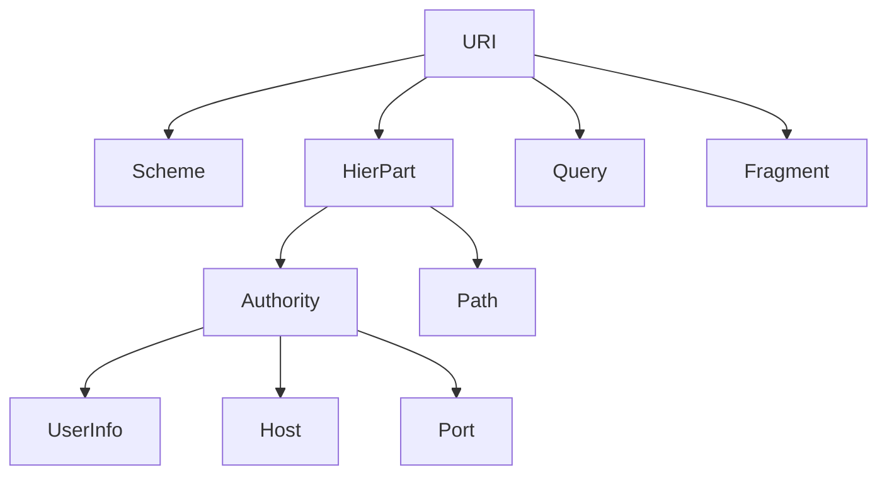

# Technical Specification: `pth` URI Framework

### Introduction & Core Concepts

#### Problem Solved

The development of robust, modern software is frequently hampered by the inconsistent and error-prone nature of resource identification. This specification addresses a set of related, critical challenges that developers face daily:

1.  **The Fragility of Filesystem Paths:** The most common form of this problem lies in filesystem path handling. The use of **relative paths** is a significant source of non-obvious, environment-dependent bugs. An application's behavior can change drastically based on the current working directory from which it is executed, leading to failures in production or CI/CD environments that are difficult to reproduce locally. Furthermore, the syntactic differences between operating systems (e.g., `\` vs. `/`, drive letters on Windows) force developers to write complex, platform-specific conditional logic (`#[cfg(...)]`). This code is difficult to test, maintain, and reason about, increasing the total cost of ownership.

2.  **The Fragmentation of Resource Schemes:** The filesystem path issue is a specific instance of a much broader challenge. Modern applications must interface with a diverse ecosystem of resources: web assets via HTTP(S), version control systems like Git, databases via JDBC/ODBC connection strings, and countless other protocols. Each of these has its own unique addressing scheme and syntax. This fragmentation forces developers to adopt multiple, often incompatible, libraries and ad-hoc parsing logic for each resource type. This leads to significant code duplication, a larger dependency footprint, and makes it nearly impossible to write generic, polymorphic code that can operate on a resource without knowing its underlying type.

This framework solves these issues by providing a single, unified, and type-safe system for resource identification, treating all of them as first-class citizens within a consistent architectural model.

#### Project Goal

The primary goal of this project is to engineer the `pth` crate into a comprehensive and extensible framework for creating, parsing, and manipulating any resource identifier in a safe, canonical, and unified way.

This mission will be accomplished through four key pillars:

1.  **Canonical Logical Representation:** The framework will introduce a platform-agnostic **Logical Path** model as the single, canonical representation for all internal path operations. This eliminates the ambiguity of relative vs. absolute paths at the type level and allows for the development of generic, cross-platform path algorithms that are written once and work everywhere.
2.  **Decoupled Native Handling:** The framework will provide clear, well-defined strategies for converting between the internal **Logical Path** and the platform-specific **Native Path** required by the operating system. This completely abstracts away platform differences, freeing the application developer from this burden.
3.  **Unified URI Architecture:** The framework will be built upon a scheme-based URI architecture, compliant with RFC 3986. This powerful abstraction treats a filesystem path as just one type of resource (`file://...`) on equal footing with others like `http://...` or `git://...`. This provides a single, consistent, and polymorphic API for all resource types.
4.  **Principled Extensibility:** The framework will be fundamentally open for extension. It will provide a clear, simple, and robust interface (`Scheme` trait) for developers to register their own custom URI schemes, ensuring the system can adapt to any current or future requirement.

#### Goals & Philosophy
The framework's design is guided by these non-negotiable goals:
1.  **Type-Safety:** To leverage Rust's powerful type system to make invalid resource states unrepresentable. A parsed `Uri` object is not just a container for strings; it is a guarantee of syntactic and semantic validity.
2.  **Extensibility:** To be fundamentally open for extension but closed for modification. The core engine will be stable, while the capabilities can be expanded infinitely by adding new schemes.
3.  **Performance:** To ensure that parsing and manipulation are highly efficient. The design will favor zero-cost abstractions and avoid unnecessary memory allocations, making it suitable for performance-sensitive applications.
4.  **Ergonomics:** To provide a public API that is intuitive, discoverable, and a pleasure to use. The design should reduce the developer's cognitive load for both simple and complex tasks.
5.  **Robustness:** To guarantee that the parser is secure and robust against malformed or malicious input, preventing security vulnerabilities and denial-of-service attacks.

#### Developer Experience (DX) Goals
*   **Intuitive API:** The primary methods for parsing (`pth::parse_with_registry`) and building (`UriBuilder`) will be simple, powerful, and predictable.
*   **Clear Error Messages:** Failures during parsing or validation will produce rich, descriptive errors that pinpoint the exact location and nature of the problem, making debugging trivial.
*   **Excellent Documentation:** Every public API will be thoroughly documented with clear explanations of its behavior, parameters, and return values, supplemented by practical, copy-paste-ready examples.
*   **Painless Extensibility:** The process for creating and registering a new scheme will be straightforward and well-documented, with a clear reference implementation to follow.

#### Key Terminology (Ubiquitous Language)
*   **URI (Uniform Resource Identifier):** The canonical, immutable object representing any resource identifier.
*   **Scheme:** The protocol identifier (e.g., `file`, `http`) that dictates the syntax, semantics, and validation rules for the rest of the URI.
*   **Logical Path:** A platform-agnostic, canonical representation of a path used for all internal framework operations. It uses forward slashes (`/`) as a separator and is represented by the `Path` enum, which structurally distinguishes between absolute and relative paths.
*   **Native Path:** A platform-specific path string or object that can be passed directly to the operating system's APIs (e.g., `C:\Users\Test` on Windows or `/home/test` on POSIX systems).
*   **Scheme Registry:** An object that holds a collection of registered `Scheme` implementations. It is passed to the parser to provide the necessary strategies for validation and parsing.

#### Versioning Strategy
The framework will strictly adhere to Semantic Versioning 2.0.0. The `Scheme` trait is the primary public contract for extensibility; any change to this trait that is not purely additive will be considered a breaking change and will necessitate a MAJOR version increment.

### Architectural Principles & Design Patterns

The architecture is founded on a set of proven principles and patterns to ensure it meets its goals of extensibility, maintainability, and safety.

#### Open-Closed Principle (OCP)
The framework's core parsing engine is closed for modification, but its capabilities are open for extension. This is achieved by allowing clients to provide their own `Scheme` implementations, which can be added without altering any of the framework's existing code.

#### Strategy Pattern
This is the primary architectural pattern. The main parser acts as the `Context`. It delegates the complex, scheme-specific parsing logic to a concrete `Scheme` object, which acts as the `Strategy`. This allows the parsing algorithm to be selected dynamically at runtime based on the URI's scheme.

#### Separation of Concerns (SoC)
The architecture enforces a strict separation between several key concerns:
*   Generic URI parsing vs. scheme-specific validation.
*   The platform-agnostic **Logical Path** model vs. the platform-specific **Native Path** representation.
*   The public-facing API vs. the internal implementation details.

#### Facade Pattern
The public API, specifically `pth::parse_with_registry` and `UriBuilder`, serves as a simple `Facade`. This hides the more complex internal machinery of the parser, scheme registry, and object construction, providing a clean and simple entry point for developers.

#### Builder Pattern
The `UriBuilder` provides a fluent, readable, and robust API for programmatically constructing `Uri` objects. It prevents common errors associated with long, ambiguous constructor argument lists (the "telescoping constructor" anti-pattern).

#### Composition Over Inheritance
The primary `Uri` object is not part of a complex inheritance hierarchy. Instead, it is a composite object built from its distinct parts (`SchemeInfo`, `Authority`, `Path`, etc.). This promotes flexibility and avoids the rigidity of inheritance-based designs.

### Formal Syntax & Grammar

The framework will parse URIs based on the structure defined in **RFC 3986**. A `mermaid` diagram of the components is as follows:



The generic parser is responsible only for identifying the `scheme` and the raw string slices corresponding to the `hier-part`, `query`, and `fragment`. The parsing of the `hier-part` into its constituent `authority` and `path` components is delegated entirely to the specific `Scheme` implementation, as its structure is highly scheme-dependent.

### Processing & Execution Model

#### Parsing Phases
1.  **Scheme Identification:** The input string is scanned to extract the `scheme` component (the string preceding the first `:`). This is done without full validation.
2.  **Scheme Dispatch:** The parser uses the extracted `scheme` name to look up the corresponding `Scheme` trait object in the provided `SchemeRegistry`. If the scheme is not found, an `UnknownScheme` error is returned immediately.
3.  **Delegated Parsing (Strategy Pattern):** The parser invokes the `parse()` method on the resolved `Scheme` object, passing it the remainder of the URI string (the part after the first `:`). The `Scheme` implementation is then fully responsible for parsing the authority, path, query, and fragment according to its own specific rules.
4.  **Object Construction:** The `Scheme`'s `parse()` method returns the fully structured component objects (`Authority`, `Path`, etc.). The framework then assembles these into the final, immutable `Uri` object.

#### Logical vs. Native Path Handling
This is a core architectural boundary for achieving cross-platform compatibility.
1.  **Ingress (Parsing to Logical):** During the `parse()` call, the responsible `Scheme` implementation (e.g., `FileScheme`) must convert the path string from its raw, potentially native format into the canonical, platform-agnostic **Logical Path** (`Path` enum). This is a mandatory step.
2.  **Internal Operations:** All internal framework logic, algorithms (e.g., normalization, comparison), and manipulations operate *only* on the **Logical Path**. This ensures all algorithms are generic and platform-agnostic.
3.  **Egress (Converting to Native):** When a developer needs to interact with the operating system (e.g., to open a file), they must explicitly call a method on the `Uri` object (e.g., `to_native_path()`). This is the designated egress point that translates the internal **Logical Path** into the correct platform-specific format (e.g., a `std::path::PathBuf`).

### Core Object Definitions

All core objects are immutable. Once created, their state cannot be changed, which guarantees that a valid `Uri` cannot be put into an invalid state.

#### The `Uri` Object
The primary, top-level object representing a fully parsed and validated URI.
*   **Attributes:** `scheme: SchemeInfo`, `authority: Option<Authority>`, `path: Path`, `query: Option<Query>`, `fragment: Option<Fragment>`.
*   **Behavior:** Provides getter methods for each component. It also provides a `to_native_path(&self) -> Option<std::path::PathBuf>` method, which is the designated way to convert the internal **Logical Path** to a platform-specific **Native Path**. This method will only return `Some` for schemes where this conversion is meaningful (e.g., `file`).

#### Component Objects
*   **`SchemeInfo` Object:**
    *   **Attributes:** `name: String` (normalized to lowercase).
*   **`Authority` Object:**
    *   **Attributes:** `userinfo: Option<String>`, `host: String`, `port: Option<u16>`.
*   **`Query` Object:**
    *   **Attributes:** `params: Vec<(String, String)>`.
    *   **Behavior:** Provides helper methods for looking up parameter values by key.
*   **`Fragment` Object:**
    *   **Attributes:** `value: String`.

### Extensibility Architecture

#### Type System
*   **Built-in Schemes:** The framework will provide default implementations of the `Scheme` trait for `file`, `http`, and `https`.
*   **Custom Schemes:** Users can define any custom scheme by implementing the `Scheme` trait.

#### Extensibility Model (The `Scheme` Trait)
This trait is the core of the framework's extensibility and the concrete implementation of the `Strategy Pattern`.
*   **`Scheme` Trait Definition:**
    ```rust
    pub trait Scheme
    {
        /// Returns the unique, lowercase name of the scheme (e.g., "http").
        fn name(&self) -> &'static str;

        /// Parses the scheme-specific part of the URI string (everything after the initial ":").
        /// This method is responsible for constructing the authority, path,
        |// query, and fragment components according to its own rules.
        fn parse(&self, remaining: &str) -> Result<(Option<Authority>, Path, Option<Query>, Option<Fragment>), SchemeParseError>;
    }
    ```
*   **Purpose:** This trait gives a `Scheme` implementation full control over parsing its own components, including the critical responsibility of converting the raw path string into the canonical `Path` enum. This enables true, powerful extensibility.

#### Scheme Registration & Discovery
The framework will use a dependency-injected registry to avoid global state and enhance testability.
*   **`SchemeRegistry` Object:** A simple object that holds a map of scheme names to `Scheme` implementations. It is explicitly *not* a singleton.
*   **Registration:** Users will create and populate their own `SchemeRegistry` instances. The framework will provide a `SchemeRegistry::default()` constructor that returns a registry pre-populated with the standard schemes (`file`, `http`, `https`).
*   **Usage:** The main `pth::parse_with_registry` function will require a reference to a `SchemeRegistry` to perform its work. This makes all dependencies explicit.

### Public API Design (Facades)

#### `UriBuilder` Facade
A fluent builder for programmatic `Uri` construction. Its `build()` method will use a `SchemeRegistry` to validate the final object against the rules of the specified scheme.

#### `pth::parse_with_registry` Facade
The primary parsing function. It takes the URI string and a reference to a `SchemeRegistry` to perform the parsing. A convenience function `pth::parse` may be provided which uses a default, thread-local registry containing standard schemes for simple use cases.

### Cross-Cutting Concerns

#### Error Handling Strategy
A comprehensive `Error` enum will be used, returning descriptive, contextual errors for failures in parsing, validation, or building. Variants will include `InvalidScheme`, `UnknownScheme`, `SyntaxError`, and `ValidationError`.

### Appendices

*   **A.1. Standard Scheme Implementations:** Reference source code for `FileScheme` and `HttpScheme`.
*   **A.2. Example: Implementing a Custom `git` Scheme:** A full tutorial.

### Meta-Requirements

1.  **Ubiquitous Language:** Terms defined in the vocabulary must be used consistently.
2.  **Single Source of Truth:** The version control repository is the single source of truth.
3.  **Naming Conventions:** Use `snake_case` for assets and `noun_verb` for functions.
4.  **Diagram Syntax:** All diagrams must be valid `mermaid` diagrams.

### Deliverables

1.  **`specification.md` (This Document):** The complete technical specification, including the developer addendum.
2.  **Source Code:** The full Rust source code for the `pth` crate.

### Conformance Check Procedure

1.  **Parsing Conformance:**
    *   **Check 1.1:** Verify `pth::parse_with_registry` dispatches to the correct `Scheme`.
    *   **Check 1.2:** Verify `UnknownScheme` error is returned for unregistered schemes.

2.  **Path Handling Conformance:**
    *   **Check 2.1:** Verify parsing `file:///etc/hosts` results in a `Path::Absolute` variant.
    *   **Check 2.2:** Verify parsing `urn:isbn:0451450523` results in a `Path::Relative` variant.
    *   **Check 2.3:** Verify that `uri.to_native_path()` on a `file:///C:/Users/Test` URI correctly produces a `std::path::PathBuf` representing `C:\Users\Test` on Windows.
    *   **Check 2.4:** Verify that `uri.to_native_path()` on an `http://...` URI returns `None`.

3.  **API & Facade Conformance:**
    *   **Check 3.1:** Verify the `UriBuilder` can construct a valid `Uri`.
    *   **Check 3.2:** Verify `SchemeRegistry::default()` provides standard schemes.

4.  **Extensibility Conformance:**
    *   **Check 4.1:** Implement and register the `GitScheme` from Appendix A.2.
    *   **Check 4.2:** Verify that parsing a `git` URI succeeds only when the scheme is registered.

### Specification Addendum

### Purpose
This section is a companion to the main specification, to be completed by the **Developer** during implementation to capture the "how" of the final build.

### Instructions for the Developer
As you build the system, please fill out the sections below with the relevant details. This creates a crucial record for future maintenance, debugging, and onboarding.

---

### Implementation Notes
*A space for any key decisions, trade-offs, or discoveries made during development.*
-   [Note 1]

### Environment Variables
*List all environment variables that might configure the library's behavior.*
| Variable | Description | Example |
| :--- | :--- | :--- |
| `RUST_LOG` | Controls the log level for debugging. | `info,pth=debug` |

### Finalized Library & Tool Versions
*List critical libraries and their exact locked versions from `Cargo.lock`.*
-   `rustc`: `1.78.0`

### Build & Test Checklist
*A step-by-step guide for building and testing the crate.*
1.  Clone the repository: `git clone ...`
2.  Build the crate: `cargo build --release`
3.  Run the test suite: `cargo test --all-features`
4.  Generate documentation: `cargo doc --open`
```