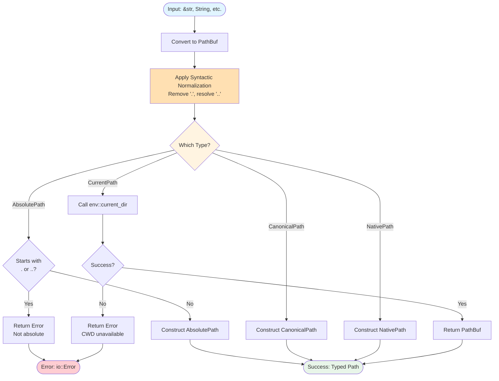

## 6. Public API Reference

### 6.1 Path Types

**Type Construction Flow:**



#### `AbsolutePath`

**Purpose**: Guarantees path doesn't start with `.` or `..` after normalization.

**Construction**:
```rust
// Implements TryFrom for multiple types:
//   TryFrom<PathBuf>, TryFrom<&PathBuf>, TryFrom<&Path>,
//   TryFrom<&str>, TryFrom<&String>, TryFrom<String>
//   TryFrom<Utf8PathBuf> (with path_utf8 feature)
// All normalize the path and verify it doesn't start with . or ..

// From iterator of paths
pub fn from_iter<'a, I, P>(iter: I) -> Result<Self, io::Error>
where
  I: Iterator<Item = P>,
  P: TryIntoCowPath<'a>;

// From tuple of paths
pub fn from_paths<Paths: PathJoined>(paths: Paths) -> Result<Self, io::Error>;
```

**Methods**:
```rust
pub fn parent(&self) -> Option<AbsolutePath>
pub fn join<P>(&self, path: P) -> AbsolutePath  // ⚠️ Panics if result not absolute
pub fn starts_with<P: AsRef<Path>>(&self, base: P) -> bool
pub fn inner(self) -> PathBuf
```

**Example**:
```rust
let abs = AbsolutePath::try_from("/home/user/project")?;
let parent = abs.parent(); // Some(AbsolutePath("/home/user"))
let joined = abs.join("src/main.rs"); // AbsolutePath("/home/user/project/src/main.rs")
```

**Validation**:
- Calls `path::canonicalize()` during construction (syntactic normalization)
- Checks path doesn't start with `.` or `..` components
- Returns error if not absolute after normalization

---

#### `CanonicalPath`

**Purpose**: Represents a syntactically normalized path.

**Construction**: Same as `AbsolutePath`

**Methods**: Identical to `AbsolutePath`

**Behavior**:
- Applies syntactic normalization during construction
- Does NOT validate absoluteness (commented out in code)
- Name is somewhat misleading (not filesystem canonicalization)

**Note**: Implementation is 95% identical to `NativePath`. Distinction is unclear.

---

#### `NativePath`

**Purpose**: Represents a platform-specific path (though implementation is identical to CanonicalPath).

**Construction, Methods, Behavior**: Identical to `CanonicalPath`

**Note**: Despite the name, there is no platform-specific behavior. This is effectively a type alias for CanonicalPath.

---

#### `CurrentPath`

**Purpose**: Zero-sized marker type representing the current working directory.

**Type**: `struct CurrentPath` (Copy, Clone, Debug)

**Conversion**:
```rust
impl TryFrom<CurrentPath> for PathBuf {
    fn try_from(_: CurrentPath) -> Result<PathBuf, io::Error> {
        std::env::current_dir()
    }
}
```

**Usage**:
```rust
let current = CurrentPath;
let path: PathBuf = current.try_into()?;
// path = std::env::current_dir()
```

---

### 6.2 Conversion Traits

#### `AsPath`

Convert to borrowed `&Path` without allocation.

```rust
pub trait AsPath {
    fn as_path(&self) -> &Path;
}
```

**Implementations**: `str`, `Path`, `Utf8Path`, `AsRef<Path>` (blanket)

**Example**:
```rust
fn process<P: AsPath>(path: P) {
    let p = path.as_path();
    // ...
}

process("foo/bar");        // &str
process(Path::new("baz")); // &Path
```

---

#### `TryIntoPath`

Convert to owned `PathBuf`, possibly with error.

```rust
pub trait TryIntoPath {
    fn try_into_path(self) -> Result<PathBuf, io::Error>;
}
```

**Implementations**: `&str`, `String`, `&Path`, `PathBuf`, `Component`, all path types, `CurrentPath`

**Example**:
```rust
fn make_absolute<P: TryIntoPath>(path: P) -> Result<PathBuf, io::Error> {
    let path = path.try_into_path()?;
    // ...
}

make_absolute("relative/path")?;
make_absolute(PathBuf::from("/abs"))?;
make_absolute(CurrentPath)?;  // Resolves to env::current_dir()
```

---

#### `TryIntoCowPath<'a>`

Convert to `Cow<'a, Path>` for efficient generic handling.

```rust
pub trait TryIntoCowPath<'a> {
    fn try_into_cow_path(self) -> Result<Cow<'a, Path>, io::Error>;
}
```

**Benefits**: Avoids cloning when input is already borrowed

**Example**:
```rust
fn process_efficiently<'a, P: TryIntoCowPath<'a>>(path: P) {
    let path = path.try_into_cow_path().unwrap();
    // path is Borrowed for &str, &Path
    // path is Owned for String, PathBuf
}
```

---

#### `TransitiveTryFrom` / `TransitiveTryInto`

Enable two-step conversions through intermediate types.

```rust
pub trait TransitiveTryFrom<Error, Initial> {
    fn transitive_try_from<Transitive>(src: Initial) -> Result<Self, Error>;
}

pub trait TransitiveTryInto<Error, Final>: Sized {
    fn transitive_try_into<Transitive>(self) -> Result<Final, Error>;
}
```

**Example**:
```rust
// Convert A -> B -> C when A and C don't directly convert
let c = TypeC::transitive_try_from::<TypeB>(type_a)?;
```

---

#### `PathJoined`

Join multiple path components.

```rust
pub trait PathJoined {
    fn iter_join(self) -> Result<PathBuf, io::Error>;
}
```

**Implementations**: Tuples (1-5 elements), slices, arrays

**Function**:
```rust
pub fn join<Paths: PathJoined>(paths: Paths) -> Result<PathBuf, io::Error>
```

**Example**:
```rust
let path = pth::path::join(("base", "sub", "file.txt"))?;
// path = "base/sub/file.txt"

let parts = vec!["a", "b", "c"];
let path = pth::path::join(&parts[..])?;
// path = "a/b/c"
```

---

### 6.3 Path Manipulation Functions

All functions in `pth::path` module.

#### `is_glob(path: &str) -> bool`

Detect if path contains unescaped glob pattern characters.

**Patterns Detected**: `*`, `?`, `[...]`, `{...}`

**Handles Escaping**: `\*` is not considered a glob

**Example**:
```rust
assert_eq!(pth::path::is_glob("*.txt"), true);
assert_eq!(pth::path::is_glob("file.txt"), false);
assert_eq!(pth::path::is_glob("\\*.txt"), false); // escaped
```

---

#### `normalize<P: AsRef<Path>>(path: P) -> PathBuf`

Syntactically normalize a path by removing `.` and resolving `..`.

**Behavior**:
- Removes all `.` (CurDir) components
- Resolves `..` by removing preceding normal component
- Preserves `..` when no preceding component exists
- Empty path becomes `.`
- Cross-platform: converts `\` to `/`

**Example**:
```rust
let norm = pth::path::normalize("/a/b/./c/../d");
// norm = "/a/b/d"

let norm = pth::path::normalize("../../a");
// norm = "../../a" (leading .. preserved)

let norm = pth::path::normalize("");
// norm = "."
```

**Does NOT**:
- Access filesystem
- Resolve symlinks
- Make path absolute
- Verify path existence

---

#### `canonicalize(path: impl AsRef<Path>) -> io::Result<PathBuf>`

⚠️ **Misleading Name**: This does NOT perform filesystem canonicalization like `std::fs::canonicalize()`.

**Actual Behavior**:
- Calls `normalize()` (syntactic only)
- Strips Windows `\\?\` verbatim prefix if present
- Returns `Ok(PathBuf)` always (no actual I/O despite Result type)

**Example**:
```rust
let canon = pth::path::canonicalize("/a/b/../c")?;
// canon = "/a/c"

// Windows:
let canon = pth::path::canonicalize(r"\\?\C:\foo")?;
// canon = "C:\foo"
```

**Comparison with std::fs::canonicalize**:
```rust
// pth::path::canonicalize - syntactic only
let result = pth::path::canonicalize("./foo")?;
// result = "foo" (string manipulation)

// std::fs::canonicalize - filesystem operation
let result = std::fs::canonicalize("./foo")?;
// result = "/full/absolute/path/to/foo" (resolves symlinks, requires file exists)
```

**Recommendation**: Consider renaming to `normalize_unchecked()` in future version.

---

#### `unique_folder_name() -> Result<String, SystemTimeError>`

Generate a unique folder name for temporary directories.

**Requires**: `path_unique_folder_name` feature

**Format**: `"{timestamp}_{pid}_{tid}_{counter}"`
- `timestamp`: nanoseconds since UNIX epoch
- `pid`: process ID
- `tid`: thread ID hash
- `counter`: thread-local incrementing counter

**Example**:
```rust
let name = pth::path::unique_folder_name()?;
// "1730113200123456789_12345_67890_0"
```

**Guarantees**: Unique within same process and thread, very likely unique across processes.

---

#### `iter_join<'a, I, P>(paths: I) -> PathBuf`

Join an iterator of paths with special handling for absolute paths.

**Signature**:
```rust
pub fn iter_join<'a, I, P>(paths: I) -> PathBuf
where
    I: Iterator<Item = P>,
    P: TryIntoCowPath<'a>,
```

**Behavior**:
- Converts all `\` to `/`
- When encountering absolute path (starts with `/`):
  - Clears accumulated result
  - Starts fresh from that absolute path
  - Similar to `Path::join()` behavior
- Resolves `.` and `..` during joining
- Handles trailing slashes

**Example**:
```rust
let paths = vec!["base", "sub", "file.txt"];
let result = pth::path::iter_join(paths.into_iter());
// result = "base/sub/file.txt"

let paths = vec!["base", "/absolute", "file.txt"];
let result = pth::path::iter_join(paths.into_iter());
// result = "/absolute/file.txt" (absolute resets)
```

**Note**: Complex string-based implementation. Marked with `qqq` comments as needing refactoring.

---

#### Extension Functions

**`ext<P: AsRef<Path>>(path: P) -> String`**

Get the last extension of a path. Returns empty string if no extension.

```rust
assert_eq!(pth::path::ext("file.txt"), "txt");
assert_eq!(pth::path::ext("file.tar.gz"), "gz"); // Last only
assert_eq!(pth::path::ext("file"), ""); // Empty string, not None
```

---

**`exts<P: AsRef<Path>>(path: P) -> Vec<String>`**

Get ALL extensions of a path.

```rust
assert_eq!(
  pth::path::exts("file.tar.gz"),
  vec!["tar".to_string(), "gz".to_string()]
);
assert_eq!(pth::path::exts("file.txt"), vec!["txt".to_string()]);
assert_eq!(pth::path::exts("file"), Vec::<String>::new());
```

---

**`without_ext<P: AsRef<Path>>(path: P) -> Option<PathBuf>`**

Remove the last extension from a path.

```rust
assert_eq!(
    pth::path::without_ext("file.txt"),
    Some(PathBuf::from("file"))
);
assert_eq!(
    pth::path::without_ext("file.tar.gz"),
    Some(PathBuf::from("file.tar"))
);
```

---

**`change_ext<P: AsRef<Path>>(path: P, ext: &str) -> Option<PathBuf>`**

Replace the last extension.

```rust
assert_eq!(
    pth::path::change_ext("file.txt", "json"),
    Some(PathBuf::from("file.json"))
);
assert_eq!(
    pth::path::change_ext("file.tar.gz", "zip"),
    Some(PathBuf::from("file.tar.zip"))
);
```

---

#### Relative Path Functions

**`path_common<'a, I>(paths: I) -> Option<String>`**

Find the common prefix of multiple paths. Returns `None` if iterator is empty.

```rust
let common = pth::path::path_common(vec![
    "/home/user/a/file.txt",
    "/home/user/b/file.txt",
].into_iter());
// common = Some("/home/user".to_string())
```

---

**`path_relative<P1: AsRef<Path>, P2: AsRef<Path>>(from: P1, to: P2) -> PathBuf`**

Compute relative path from `from` to `to`.

```rust
let rel = pth::path::path_relative("/a/b/c", "/a/d/e");
// rel = "../../d/e"

let rel = pth::path::path_relative("/a/b", "/a/b/c");
// rel = "c"
```

---

**`rebase<P1, P2, P3>(file_path: P1, new_path: P2, old_path: Option<P3>) -> io::Result<PathBuf>`**

Rebase a file path from an old base to a new base.

```rust
let rebased = pth::path::rebase(
    "/old/base/sub/file.txt",
    "/new/base",
    Some("/old/base")
)?;
// rebased = "/new/base/sub/file.txt"
```

---

