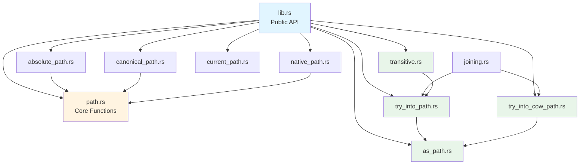
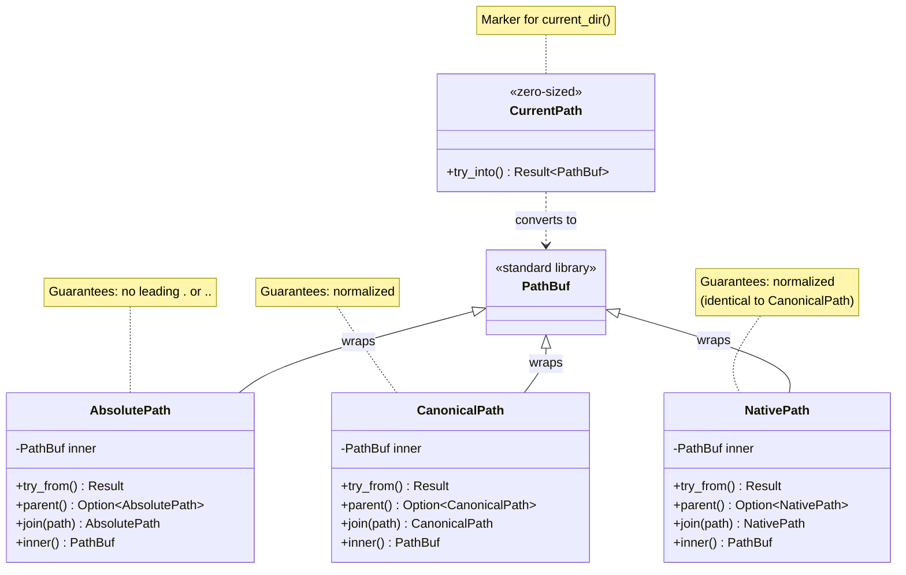
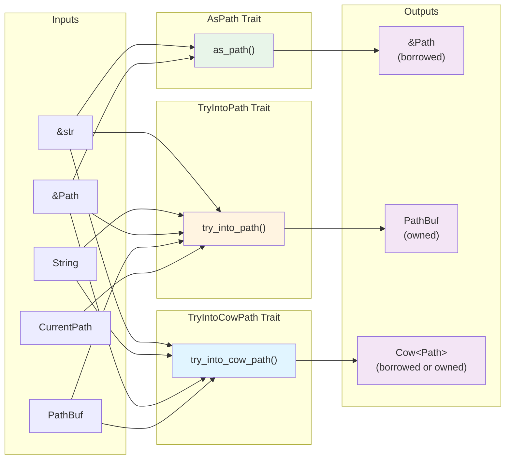

## 5. Architecture

### 5.1 Module Structure

```
pth/
├── lib.rs                   # Re-exports, module interface
├── path.rs                  # Core path manipulation functions
├── path/
│   ├── absolute_path.rs     # AbsolutePath newtype
│   ├── canonical_path.rs    # CanonicalPath newtype
│   ├── native_path.rs       # NativePath newtype
│   ├── current_path.rs      # CurrentPath marker type
│   └── joining.rs           # PathJoined trait
├── as_path.rs               # AsPath trait
├── try_into_path.rs         # TryIntoPath trait
├── try_into_cow_path.rs     # TryIntoCowPath trait
└── transitive.rs            # Transitive conversion traits
```

**Module Dependency Diagram:**



### 5.2 Design Patterns

#### Newtype Pattern
Each path type is a thin wrapper around `PathBuf`:
```rust
pub struct AbsolutePath(PathBuf);
pub struct CanonicalPath(PathBuf);
pub struct NativePath(PathBuf);
```

**Benefits**:
- Type-level documentation of intent
- Prevents accidental misuse
- Zero runtime overhead (transparent repr)
- Implements Deref for ergonomic access

**Type Hierarchy:**



#### Conversion Traits
Three-tier trait system for flexible generic functions:
```rust
pub trait AsPath {
    fn as_path(&self) -> &Path;
}

pub trait TryIntoPath {
    fn try_into_path(self) -> Result<PathBuf, io::Error>;
}

pub trait TryIntoCowPath<'a> {
    fn try_into_cow_path(self) -> Result<Cow<'a, Path>, io::Error>;
}
```

**Usage**:
- `AsPath` for borrowed references
- `TryIntoPath` for owned paths
- `TryIntoCowPath` for efficient generic handling (avoids cloning)

**Conversion Trait Flow:**



#### Transitive Conversion
Enables two-step conversions through intermediate types:
```rust
let final = FinalType::transitive_try_from::<IntermediateType>(initial)?;
```

**Use Case**: Convert through types that don't directly implement `TryFrom` for each other.

### 5.3 Dependencies

This section documents all external dependencies, their purpose, rationale for inclusion, and alternatives considered.

#### Required Dependencies

**`mod_interface` (version 0.49)**
- **Purpose**: Provides declarative module organization macro for cleaner module exports
- **Usage**: Used throughout src/lib.rs to define public API surface
- **Rationale**:
  - Reduces boilerplate in module declarations
  - Ensures consistent export patterns across modules
  - Zero runtime overhead (proc macro, compile-time only)
  - Maintained by the willbe project ecosystem
- **Alternatives Considered**:
  - Manual `pub use` statements: Rejected due to verbosity and error-prone nature
  - `pub_use` crate: Rejected due to less active maintenance
- **Impact**: Compile-time only, no runtime dependencies
- **License**: MIT
- **Trust Assessment**: Developed in-house by project maintainers

**`regex` (version 1.10.3, default-features = false)**
- **Purpose**: Pattern matching for glob detection in `is_glob()` function
- **Usage**: Single function (path.rs:31-60) to detect unescaped glob metacharacters
- **Rationale**:
  - Glob detection requires parsing with lookahead/lookbehind (e.g., detecting `\*` vs `*`)
  - regex crate is battle-tested, widely used, and maintained by Rust project members
  - `default-features = false` avoids regex's std dependency
  - No viable lightweight alternatives for this specific pattern matching need
- **Alternatives Considered**:
  - Manual parsing: Rejected due to complexity of escape handling and maintainability
  - `glob` crate: Rejected because it provides glob matching, not just detection (overweight)
  - `globset` crate: Rejected for same reason (provides matching, not detection)
  - Remove `is_glob()` entirely: Rejected because it's a useful utility function
- **Impact**: ~150KB in compiled binary, regex engine included
- **Performance**: Regex compiled once at initialization, <1μs per call
- **License**: MIT/Apache-2.0 dual
- **Trust Assessment**: Core Rust ecosystem crate, maintained by rust-lang org member

#### Optional Dependencies

**`serde` (version 1.0.197, optional, feature: `derive_serde`)**
- **Purpose**: Enable serialization/deserialization of path types
- **Usage**: Derive macros on AbsolutePath, CanonicalPath, NativePath
- **Rationale**:
  - Common use case: persisting paths in configuration files or network protocols
  - serde is the de facto serialization standard in Rust ecosystem
  - Optional feature ensures users who don't need serialization pay no cost
- **Alternatives Considered**:
  - Manual Serialize/Deserialize impls: Rejected due to maintainability and testing burden
  - `bincode` or format-specific serializers: Rejected because serde provides format-agnostic traits
- **Impact**: Enabled only when user activates `derive_serde` feature
- **License**: MIT/Apache-2.0 dual
- **Trust Assessment**: Most widely used Rust serialization framework, maintained by dtolnay

**`camino` (version 1.1.7, optional, feature: `path_utf8`)**
- **Purpose**: UTF-8 path support via `Utf8Path` and `Utf8PathBuf` types
- **Usage**: Conversion trait implementations for camino types
- **Rationale**:
  - Some users work exclusively with UTF-8 paths and prefer camino's ergonomic API
  - Enables interoperability with camino-based codebases
  - Optional feature ensures no cost for users who don't need UTF-8 paths
  - camino provides stronger UTF-8 guarantees than std::path
- **Alternatives Considered**:
  - Only support std::path types: Rejected because camino is popular in web/config processing
  - Implement custom UTF-8 path types: Rejected due to duplication and ecosystem fragmentation
- **Impact**: Enabled only when user activates `path_utf8` feature
- **License**: MIT/Apache-2.0 dual
- **Trust Assessment**: Maintained by Rust ecosystem contributors, used in large projects (cargo, nextest)

#### Standard Library Dependencies

**`std` (partial, opt-in via default features)**
- **Required for**:
  - `std::env::current_dir()` - Used by CurrentPath
  - `std::io::Error` - Error type for consistency with std::path
  - `std::path::{Path, PathBuf, Component}` - Core types
- **`no_std` Support**: All functions except CurrentPath work in `no_std + alloc` environments
- **Configuration**: Users can disable std by setting `default-features = false`

**`alloc`** (required for `no_std` builds)
- **Purpose**: Heap allocation for PathBuf and String types
- **Usage**: Essential for all dynamic path operations
- **Note**: No alternative possible for dynamic path handling

#### Dependency Tree Analysis

```bash
$ cargo tree --depth 1
pth v0.28.0
├── mod_interface v0.49.0
│   └── proc-macro dependencies (compile-time only)
└── regex v1.10.3
    ├── regex-automata v0.4.x
    └── regex-syntax v0.8.x

Total runtime dependencies: 2 direct + 2 transitive = 4 crates (well under NFR-DEP001 limit of 5)
```

#### Security & Supply Chain

**Vulnerability Monitoring**:
- All dependencies audited via `cargo audit` in CI
- Updates monitored via Dependabot
- Security advisory notifications enabled

**Pinning Strategy**:
- Required dependencies use `^` (caret) constraints for flexibility
- Optional dependencies also use `^` for user control
- MSRV enforced to ensure dependency version compatibility

**Justification for Each Dependency**:
- Each dependency provides significant value that outweighs its cost
- No transitive dependencies beyond regex's minimal tree
- All dependencies are widely trusted in Rust ecosystem
- No alternative solutions provide better cost/benefit tradeoff

---

