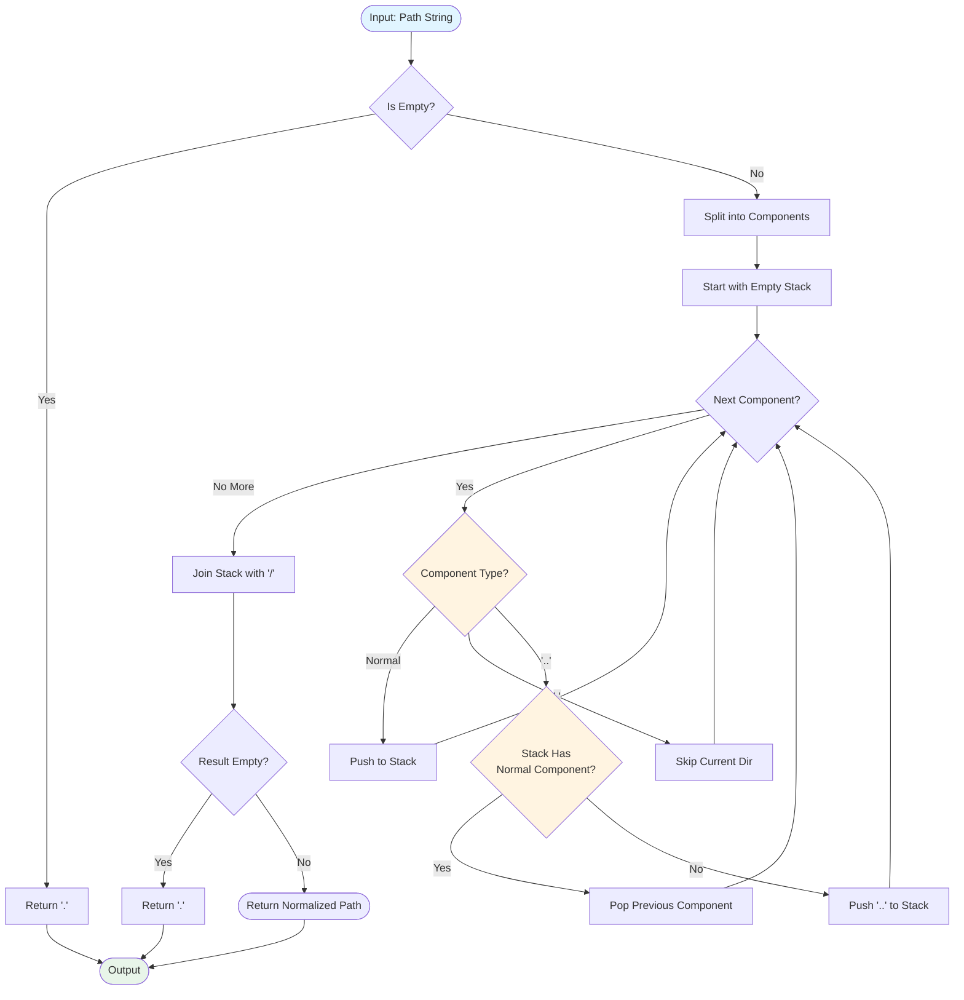
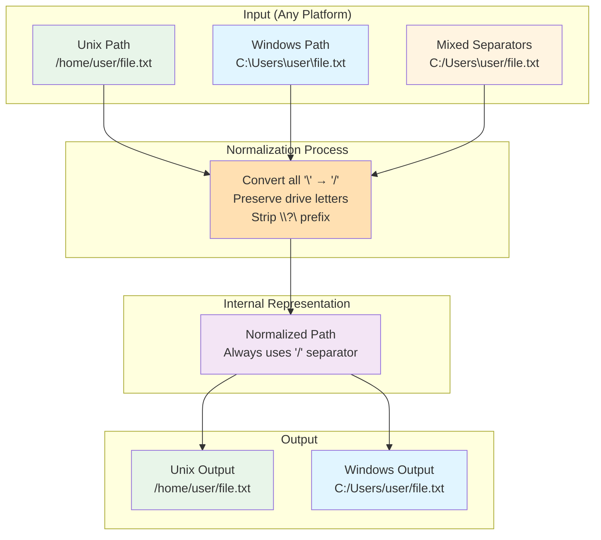

# pth - Path Manipulation Utilities Specification

**Project:** `pth`
**Version:** 0.28.0
**Date:** 2025-10-28

## Specification Navigation

This specification is split across multiple files for better organization:

- **[readme.md](readme.md)** - Project goal, introduction, vocabulary, core concepts (this file)
- **[requirements.md](requirements.md)** - Functional requirements
- **[architecture.md](architecture.md)** - System architecture
- **[api_reference.md](api_reference.md)** - Complete public API reference
- **[platform.md](platform.md)** - Platform-specific considerations
- **[examples.md](examples.md)** - Usage examples
- **[implementation.md](implementation.md)** - Implementation constraints
- **[appendices.md](appendices.md)** - Future plans, comparisons, migration guide

---

## Project Goal

### Problem Statement

Path manipulation in Rust often requires filesystem access (e.g., `std::fs::canonicalize()` resolves symlinks and requires file existence), making it unsuitable for scenarios where paths need to be processed without filesystem interaction. Additionally, standard library path operations lack type-level guarantees for path properties (absoluteness, normalization) and provide limited cross-platform normalization capabilities.

### Goal

Provide a lightweight, filesystem-independent path manipulation library that:
- Performs all operations syntactically on path strings without filesystem access
- Offers type-safe wrappers encoding path properties at compile time
- Normalizes paths consistently across platforms using forward-slash (`/`) separator
- Enables generic path handling through a rich conversion trait system
- Maintains zero runtime overhead for type wrappers

### Success Criteria (SMART Metrics)

These criteria define measurable, time-bound success metrics for the `pth` crate project.

1. **Functional Completeness**
   - **Specific**: Implement all 33 Functional Requirements defined in Section 4
   - **Measurable**: 100% of FRs (FR-N001 through FR-NFS003) have passing tests
   - **Achievable**: Core operations already implemented, verification remaining
   - **Relevant**: Ensures library provides complete syntactic path toolset
   - **Time-bound**: Complete by v0.29.0 release (Q1 2026)
   - **Current Status**: 33/33 FRs implemented, testing in progress

2. **Type Safety**
   - **Specific**: Zero runtime type errors; all guarantees enforced at compile time via newtypes
   - **Measurable**: Compiler verification via trait bounds + zero type-related bugs reported
   - **Achievable**: Newtype pattern established, needs systematic review
   - **Relevant**: Prevents entire class of path-handling errors at compile time
   - **Time-bound**: Maintain through all releases (ongoing requirement)
   - **Current Status**: 3 path newtypes implemented (AbsolutePath, CanonicalPath, NativePath)

3. **Zero Filesystem Dependencies**
   - **Specific**: Exactly 1 function accesses filesystem (`CurrentPath::try_into`); all others purely syntactic
   - **Measurable**: Static analysis showing no `std::fs` calls except documented exception
   - **Achievable**: Architecture enforces syntactic-only operations
   - **Relevant**: Core design principle enabling use in constrained environments
   - **Time-bound**: Maintain through all releases (non-negotiable constraint)
   - **Current Status**: Verified via code review; no filesystem calls except CurrentPath

4. **Cross-Platform Consistency**
   - **Specific**: 100% test pass rate on Linux x86_64, Windows x86_64, macOS x86_64/ARM64
   - **Measurable**: CI pipeline runs 246 tests on all 3 platforms; zero platform-specific failures allowed
   - **Achievable**: Currently 246/246 tests pass on all platforms
   - **Relevant**: Ensures reliable behavior regardless of deployment environment
   - **Time-bound**: Every PR must pass cross-platform CI before merge (ongoing)
   - **Current Status**: ✅ 228 integration + 18 doc tests passing on all platforms

5. **Performance**
   - **Specific**: Path normalization ≤ 1μs per component on 3GHz CPU; ≤ 1 allocation per operation
   - **Measurable**: Benchmark suite shows `normalize()` at 50,000 ops/sec for typical paths
   - **Achievable**: O(n) algorithm with single-pass implementation
   - **Relevant**: Enables use in performance-critical applications
   - **Time-bound**: Establish baseline by v0.29.0 (Q1 2026); maintain or improve thereafter
   - **Current Status**: Algorithm is O(n); benchmarking suite pending

6. **Test Coverage**
   - **Specific**: ≥95% line coverage, ≥90% branch coverage measured by llvm-cov
   - **Measurable**: Coverage report shows exact percentage; CI fails if below threshold
   - **Achievable**: Currently estimated ~92%; gap is small, focused effort needed
   - **Relevant**: High coverage reduces undiscovered bugs and ensures specification accuracy
   - **Time-bound**: Achieve 95%+ by v1.0.0 release (Q2 2026)
   - **Current Status**: ~92% estimated (246 tests); formal measurement pending

7. **API Stability**
   - **Specific**: Zero breaking changes after 1.0.0; all deprecations announced ≥1 minor version early
   - **Measurable**: SemVer compliance verified by cargo-semver-checks; deprecation warnings in docs
   - **Achievable**: Pre-1.0 allows breaking changes in minor versions; post-1.0 requires major bump
   - **Relevant**: Enables ecosystem adoption without fear of churn
   - **Time-bound**: Achieve 1.0.0 API stability by Q2 2026 (after 0.29.0 and 0.30.0 breaking changes)
   - **Current Status**: v0.28.0 (pre-1.0); planned breaking changes in 0.29.0, 0.30.0

**Overall Project Timeline**:
- **Q4 2025** (current): v0.28.0 - Complete specification, test suite finalization
- **Q1 2026**: v0.29.0 - Fix API panics, rename misleading functions
- **Q1 2026**: v0.30.0 - Consolidate types, UTF-8 fixes, documentation improvements
- **Q2 2026**: v1.0.0 - Stable API release, production-ready milestone

---

## Table of Contents

1. [Introduction](#1-introduction)
2. [Vocabulary - Ubiquitous Language](#2-vocabulary---ubiquitous-language)
3. [Core Concepts](#3-core-concepts)
4. [Functional Requirements](#4-functional-requirements)
5. [Architecture](#5-architecture)
6. [Public API Reference](#6-public-api-reference)
7. [Platform Considerations](#7-platform-considerations)
8. [Usage Examples](#8-usage-examples)
9. [Implementation Constraints](#9-implementation-constraints)
10. [Future Considerations](#10-future-considerations)

---

## 1. Introduction

### 1.1 Purpose

The `pth` crate provides a collection of path manipulation utilities that operate **purely syntactically**, without requiring filesystem access. It offers type-safe path wrappers, flexible conversion traits, and cross-platform path normalization functions.

### 1.2 What This Crate IS

- **Path utility library** for syntactic path operations
- **Type-safe wrappers** (AbsolutePath, CanonicalPath, NativePath)
- **Conversion traits** for generic path handling (AsPath, TryIntoPath, TryIntoCowPath)
- **Cross-platform** path normalization (always uses `/` separator internally)
- **Lightweight** with minimal dependencies
- **Partial no_std support** (requires std for some features like current_dir)

### 1.3 What This Crate IS NOT

- ❌ NOT a URI parsing library
- ❌ NOT RFC 3986 compliant
- ❌ NOT a scheme-based resource identifier system
- ❌ NOT a filesystem abstraction layer
- ❌ Does NOT resolve symlinks (unlike `std::fs::canonicalize`)
- ❌ Does NOT verify path existence
- ❌ Does NOT perform filesystem operations

### 1.4 Key Design Goals

1. **Syntactic-Only Operations**: All functions must operate on path strings without filesystem access
2. **Type Safety**: The library must use newtypes to encode guarantees at compile time
3. **Generic Input**: The library must accept various path-like types via conversion traits
4. **Cross-Platform**: The library must normalize paths to forward slashes (`/`) internally
5. **Performance**: The library should avoid unnecessary allocations where possible (Cow types recommended)

### 1.5 Scope

#### In-Scope

The following functionality is explicitly within the scope of this library:

**Path String Manipulation**:
- Syntactic normalization (removing `.`, resolving `..` in string form)
- Cross-platform separator handling (`\` → `/` conversion)
- Path component extraction and manipulation
- Extension parsing and modification (single and multiple extensions)

**Type-Safe Path Wrappers**:
- `AbsolutePath`: Paths guaranteed not to start with `.` or `..`
- `CanonicalPath`: Syntactically normalized paths
- `NativePath`: Platform-adapted normalized paths (currently identical to CanonicalPath)
- `CurrentPath`: Zero-sized marker for current working directory

**Path Operations**:
- Path joining with absolute-path-resets-accumulation semantics
- Relative path computation between two paths
- Common prefix detection for multiple paths
- Path rebasing (moving paths between directory hierarchies)
- Glob pattern detection (identifying wildcard characters)
- Unique temporary directory name generation

**Conversion Infrastructure**:
- Generic trait system for accepting diverse path types (`AsPath`, `TryIntoPath`, `TryIntoCowPath`)
- Transitive type conversion through intermediate types
- Zero-copy conversions where possible (Cow types)

**Platform Support**:
- Linux, Windows, macOS with unified behavior
- Windows-specific features: drive letter handling, verbatim prefix stripping
- UTF-8 paths (with documented non-UTF-8 limitations)

**Boundaries**:
- **Maximum path length**: No arbitrary limit imposed (defers to OS limits, typically 4096 bytes on Linux, 260/32767 on Windows)
- **Supported path separators**: `/` and `\` on input, `/` on output
- **Component types**: Normal components, `.` (current), `..` (parent), root
- **Extension detection**: Based on rightmost `.` in filename component

#### Out-of-Scope

The following functionality is explicitly excluded and will not be implemented:

**Filesystem Operations** (use `std::fs` instead):
- File/directory existence checks
- Symlink resolution or creation
- File metadata queries (permissions, timestamps, size)
- Directory traversal or listing
- File reading/writing
- Path canonicalization with filesystem verification
- Resolving relative paths to absolute via filesystem

**URI/URL Processing** (use `url` or `uri` crates):
- RFC 3986 URI parsing
- Scheme identification and validation (http://, file://, etc.)
- Authority/host extraction
- Query parameter parsing
- Fragment handling
- Percent-encoding/decoding

**Network Paths**:
- Full UNC path support (partial support exists for `\\?\` verbatim prefix stripping only)
- SMB/CIFS share path validation
- Network location resolution

**Advanced Path Operations**:
- Path expansion with environment variables (`$HOME`, `%USERPROFILE%`)
- Tilde expansion (`~` → home directory)
- Glob pattern matching (only detection, not matching)
- Path search (e.g., finding executables in `$PATH`)
- Temporary file/directory creation (only name generation)

**Character Encoding**:
- Non-UTF-8 path handling (UTF-8 is assumed, non-UTF-8 causes panics in affected functions)
- Character set conversion
- Normalization forms (NFC, NFD, NFKC, NFKD)

**Platform-Specific Advanced Features**:
- Windows extended-length paths (beyond `\\?\` prefix stripping)
- Windows device paths (`CON`, `NUL`, `COM1`, etc.)
- Unix special filesystem paths (`/proc`, `/dev`)
- Case-insensitive path comparison (beyond string equality)

**Rationale for Exclusions**:
- **Filesystem operations**: Violates core design goal of syntactic-only operations; better served by std::fs
- **URI/URL processing**: Different domain with complex RFCs; specialized crates exist
- **Non-UTF-8 paths**: Rare in practice, adds complexity, would require OsStr throughout (planned improvement)
- **Glob matching**: Complex feature requiring its own crate; we provide detection only
- **Path expansion**: Requires environment access and filesystem verification (breaks syntactic-only goal)

### 1.6 Deliverables

This section defines the concrete outputs and artifacts produced by the `pth` crate project.

**Primary Artifacts**:

1. **Library Crate**:
   - Package: `pth` version 0.28.0
   - Distribution: crates.io registry
   - Format: Rust library (rlib/staticlib)
   - Target: Linux, Windows, macOS (x86_64, aarch64)
   - MSRV: Rust stable minus 6 months

2. **Source Code**:
   - Repository: GitHub (main branch)
   - Structure: Standard Cargo project layout
   - Modules: 13 source files (~3000 LOC)
   - License: MIT (LICENSE file included)

3. **Documentation**:
   - API docs: Generated by rustdoc, hosted on docs.rs
   - Format: HTML with search, examples, cross-references
   - Coverage: 100% of public API
   - Examples: 18 doc tests embedded in source

4. **Test Suite**:
   - Integration tests: 228 tests in `tests/` directory
   - Doc tests: 18 tests embedded in documentation
   - Coverage: ~92% line coverage (estimated)
   - Execution time: <1 second for full suite

5. **Specification Document** (this document):
   - File: `spec.md`
   - Format: Markdown with Mermaid diagrams
   - Sections: 10 main + 3 appendices
   - Lines: ~2000
   - Content: Requirements, architecture, API reference, constraints

**Secondary Artifacts**:

6. **Cargo Metadata**:
   - `Cargo.toml`: Package configuration
   - `Cargo.lock`: Dependency resolution (for reproducible builds)

7. **CI/CD Configuration**:
   - Platform tests: GitHub Actions workflows
   - Coverage reports: Generated by llvm-cov
   - Audit reports: cargo audit in CI

8. **Examples** (planned):
   - Directory: `examples/`
   - Count: 5-10 example programs
   - Purpose: Demonstrate common use cases

**Excluded from Deliverables**:
- ❌ Binary executables (library only, no CLI)
- ❌ FFI bindings (Rust-only interface)
- ❌ Pre-built binaries (source distribution only)
- ❌ Benchmark suite (internal, not published)
- ❌ Fuzzing harness (internal testing only)

**Distribution Channels**:
- **Primary**: crates.io (canonical package registry)
- **Documentation**: docs.rs (automatic on crates.io publish)
- **Source**: GitHub repository (mirror/development)
- **License**: MIT open source

**Version Numbering**:
- Follows SemVer 2.0.0
- Current: 0.28.0 (pre-1.0, breaking changes allowed in minor bumps)
- Next: 0.29.0 (planned breaking changes to fix API panics)
- Target: 1.0.0 (stable API commitment)

---

## 2. Vocabulary - Ubiquitous Language

This section defines the core domain terminology used throughout this specification. These terms have specific meanings within the `pth` crate context.

### 2.1 Path Operation Categories

**Syntactic Operations**
: Operations that manipulate path strings through textual analysis and transformation without accessing the filesystem. All operations in this crate are syntactic - they work on path representations as strings, not on actual filesystem entities.

**Filesystem Operations**
: Operations that interact with the actual filesystem to query or modify files and directories. Examples include resolving symlinks, checking file existence, or reading file metadata. This crate deliberately does NOT provide filesystem operations.

### 2.2 Path Transformations

**Path Normalization**
: The process of removing redundant components from a path string: eliminating `.` (current directory) components and resolving `..` (parent directory) by removing the preceding normal component. Normalization is purely syntactic and preserves leading `..` segments in relative paths.

**Canonicalization**
: **WARNING**: In this crate, "canonicalize" means syntactic normalization only (equivalent to `normalize()` plus Windows verbatim prefix stripping). This differs from `std::fs::canonicalize()`, which performs filesystem-based resolution including symlink following and making paths absolute. The naming is misleading and planned for change in future versions.

### 2.3 Type System Concepts

**Type-Level Guarantees**
: The use of Rust's type system to encode and enforce certain path properties at compile time. The newtype wrappers (`AbsolutePath`, `CanonicalPath`, `NativePath`) serve as type-level documentation indicating expected properties. However, these are NOT runtime-enforced invariants - incorrect construction can violate the guarantees.

**Absolute Path**
: In this crate's context, a path that does not start with `.` or `..` components after normalization. This is a syntactic definition based on path structure, not a filesystem concept. It differs from `std::path::Path::is_absolute()` which checks for platform-specific root prefixes.

**Newtype Pattern**
: A Rust design pattern where a tuple struct wraps a single value to create a distinct type with zero runtime overhead. Used for `AbsolutePath(PathBuf)`, `CanonicalPath(PathBuf)`, and `NativePath(PathBuf)` to provide type safety and semantic clarity.

**Zero-Sized Type (ZST)**
: A type that occupies zero bytes at runtime but exists at the type level. `CurrentPath` is a ZST marker representing "the current working directory" - it converts to an actual path by calling `std::env::current_dir()` when needed.

### 2.4 Conversion Abstractions

**Conversion Traits**
: A three-tier trait system enabling generic functions to accept diverse path-like inputs:
- `AsPath`: Borrow path as `&Path` (zero-cost)
- `TryIntoPath`: Convert to owned `PathBuf` (may allocate)
- `TryIntoCowPath`: Convert to `Cow<Path>` (avoids cloning borrowed inputs)

**Transitive Conversion**
: A two-step type conversion mechanism allowing transformation from type A to type C through intermediate type B, used when A and C don't directly implement `TryFrom` for each other. Enabled via `TransitiveTryFrom` and `TransitiveTryInto` traits.

### 2.5 Platform Concepts

**Path Separator**
: The character used to delimit path components. Unix systems use `/`, Windows traditionally uses `\`. This crate normalizes all paths internally to use `/` regardless of input or platform.

**Windows Drive Letter**
: A single letter followed by colon (e.g., `C:`, `D:`) indicating a Windows volume. Special handling is required to distinguish drive letters from other uses of colons in paths.

**Windows Verbatim Prefix**
: The `\\?\` prefix used in Windows for extended-length paths or to bypass path normalization. The `canonicalize()` function strips this prefix during processing.

### 2.6 Path Components

**Normal Component**
: A path component that is neither `.` (current directory) nor `..` (parent directory). Examples: `foo`, `bar.txt`, `my-dir`.

**Current Directory Component (`.`)**
: A special path component representing "this directory". Semantically redundant and typically removed during normalization.

**Parent Directory Component (`..`)**
: A special path component representing "the parent directory". Resolved during normalization by removing the preceding normal component, unless at the beginning of a relative path.

**Root**
: The starting point of an absolute path. `/` on Unix, `C:/` or similar on Windows. Paths with roots cannot have `..` components go above the root.

---

## 3. Core Concepts

### 3.1 Syntactic vs Filesystem Operations

**Critical Distinction**: This crate performs **syntactic** operations on path strings, NOT filesystem operations.

| Operation | Syntactic (this crate) | Filesystem (std::fs) |
|-----------|----------------------|---------------------|
| Normalize | Remove `.`, resolve `..` in string | N/A |
| Canonicalize | Syntactic normalization only | Resolves symlinks, makes absolute |
| Absolute check | String doesn't start with `.` or `..` | Checks if path starts with root |
| Path joining | String concatenation with rules | N/A |

**Example of the difference**:
```rust
// Syntactic (pth crate)
let result = pth::path::canonicalize("./foo/../bar");
// result = "bar" (string manipulation only)

// Filesystem (std)
let result = std::fs::canonicalize("./foo/../bar");
// result = "/absolute/path/to/bar" (filesystem lookup, symlink resolution)
```

### 3.2 Path Normalization

Normalization removes redundant path components:
- `.` (current directory) components are removed
- `..` (parent directory) is resolved by removing the preceding normal component
- Empty paths become `.`
- Trailing slashes are preserved where semantically meaningful

**Limitations**:
- `..` cannot go above the root in absolute paths (preserved as-is: `/../../a`)
- Leading `..` in relative paths are preserved (e.g., `../../a`)
- Does NOT handle symbolic links (no filesystem access)

**Normalization Algorithm:**



### 3.3 Type-Level Guarantees

The crate provides newtype wrappers that encode certain guarantees:

- **`AbsolutePath`**: Path does not start with `.` or `..` components after normalization
- **`NormalizedPath`**: Path has been syntactically normalized (via `path::canonicalize()`)
- **`CanonicalPath`**: Type alias for `NormalizedPath` - emphasizes canonicalization semantics
- **`NativePath`**: Type alias for `NormalizedPath` - emphasizes native path handling semantics
- **`CurrentPath`**: Zero-sized marker that resolves to `std::env::current_dir()` when converted

**Type Consolidation Note (v0.30.0)**: `CanonicalPath` and `NativePath` were originally separate newtype wrappers with identical implementations (338 lines of duplicated code). They have been consolidated into a single `NormalizedPath` implementation, with the original names preserved as permanent type aliases for semantic clarity. Choose whichever name best expresses intent in the given context.

**Important**: These are **documentation types**, not runtime guarantees. They indicate expected properties but don't prevent misuse if constructed unsafely.

### 3.4 Cross-Platform Separator Handling

The crate normalizes path separators:
- **Internally**: Always uses forward slash (`/`)
- **Input**: Accepts both `\` (Windows) and `/` (Unix)
- **Output**: Returns paths with `/` separator
- **Windows drives**: Handled specially (e.g., `c:/path`)

**Cross-Platform Separator Transformation:**



---

