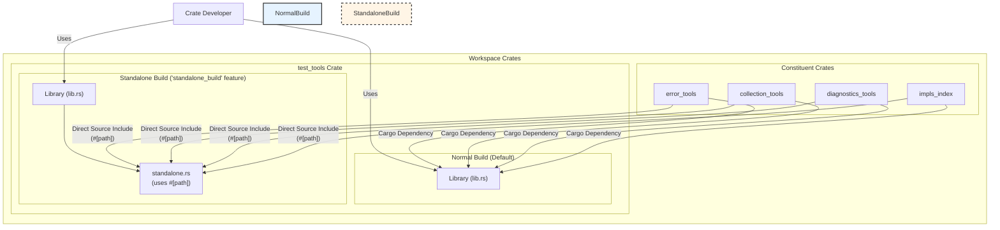
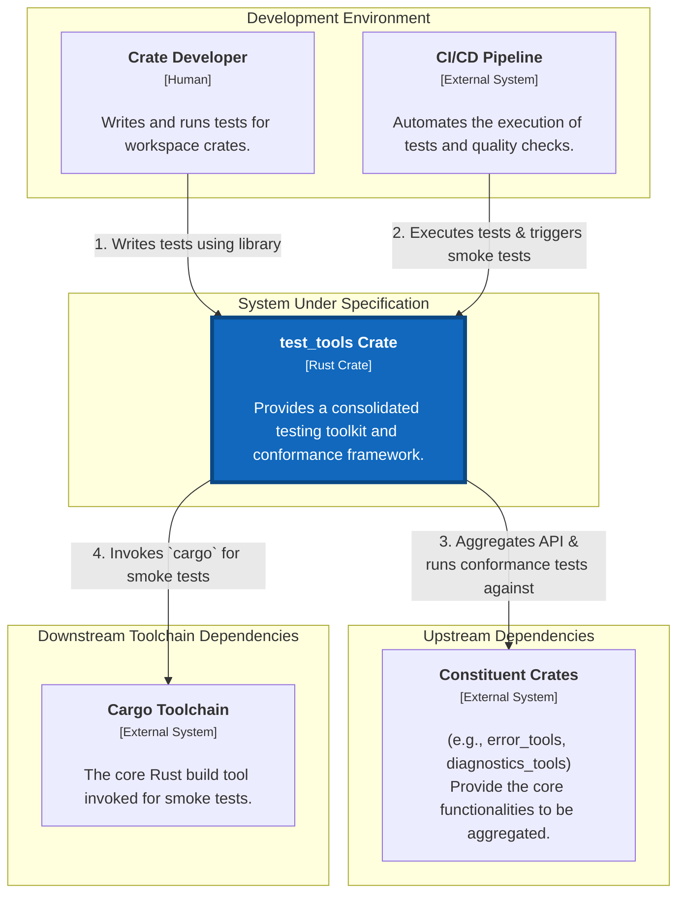

# spec

- **Name:** test_tools
- **Version:** 2.4 (Full and Final Draft)
- **Date:** 2025-08-19

### Table of Contents

**Part I: Public Contract (Mandatory Requirements)**
*   1. Goal
*   2. Vision & Scope
    *   2.1. Vision
    *   2.2. In Scope
    *   2.3. Out of Scope
*   3. Vocabulary (Ubiquitous Language)
*   4. System Actors
*   5. Success Metrics
*   6. User Stories
*   7. Functional Requirements
    *   7.1. Conformance Testing
    *   7.2. Aggregation & Re-export
    *   7.3. Smoke Testing
*   8. Non-Functional Requirements
    *   8.1. Distribution Model
    *   8.2. Build Modes (`normal_build` vs. `standalone_build`)
    *   8.3. Concurrency
    *   8.4. Architectural Principles
*   9. Limitations
*   10. Feature Gating Strategy

**Part II: Internal Design (Design Recommendations)**
*   11. System Architecture
    *   11.1. Aggregator & Facade Pattern
    *   11.2. Standalone Build Mechanism
    *   11.3. Recommended Crate Location
*   12. Architectural & Flow Diagrams
    *   12.1. High-Level Architecture Diagram
    *   12.2. C4 Model: System Context Diagram
    *   12.3. Use Case Diagram
    *   12.4. Activity Diagram: Smoke Test Workflow
*   13. Custom Module Namespace Convention (`mod_interface` Protocol)
*   14. Build & Environment Integration (`build.rs`)

**Part III: Project & Process Governance**
*   15. Open Questions
*   16. Core Principles of Development

---

### 1. Goal

The primary goal of the `test_tools` crate is to serve two distinct but related purposes:

1.  **Provide a Consolidated Toolset:** To act as an aggregator crate that collects and re-exports a consistent set of testing utilities from various foundational modules (e.g., `error_tools`, `collection_tools`, `diagnostics_tools`). This provides a single, convenient dependency for developers.
2.  **Guarantee Conformance:** To ensure that the aggregated and re-exported functionality maintains perfect behavioral equivalence with the original, underlying modules. This is achieved by importing and running the original test suites of the constituent modules against the `test_tools` facade itself.

### 2. Vision & Scope

#### 2.1. Vision

To provide a robust, centralized, and reliable testing toolkit for the workspace that accelerates development by offering a single, convenient testing dependency. The crate ensures architectural consistency by not only providing shared testing utilities but also by guaranteeing that its aggregated components are perfectly conformant with their original sources.

#### 2.2. In Scope

*   Aggregating and re-exporting testing utilities from other foundational workspace crates.
*   Providing a mechanism to run the original test suites of constituent crates against the `test_tools` facade to ensure conformance.
*   Offering a configurable smoke-testing framework to validate both local (unpublished) and published versions of a crate.
*   Supporting two distinct, mutually exclusive build modes: `normal_build` and `standalone_build`.

#### 2.3. Out of Scope

*   This crate is **not** a test runner; it relies on the standard `cargo test` command.
*   This crate **will not** provide any Command Line Interface (CLI) executables. It is a library-only crate. Any CLI for test orchestration will be a separate crate.
*   It will not introduce novel or proprietary assertion macros, preferring to re-export them from underlying crates like `diagnostics_tools`.
*   It is not a general-purpose application library; its functionality is exclusively for testing purposes.
*   It will not manage the CI/CD environment itself, only react to it.

### 3. Vocabulary (Ubiquitous Language)

*   **Exposure Level:** A predefined submodule within a `Layer` that dictates how its contents are propagated to parent layers. The five levels are `private`, `own`, `orphan`, `exposed`, and `prelude`.
*   **Layer:** A Rust module structured using the `mod_interface!` macro to have a standardized set of `Exposure Levels` for controlling item visibility and propagation.
*   **`private`:** The exposure level where all items are originally defined. Items in this level are for internal use within the layer and are not propagated.
*   **`own`:** The exposure level for public items that are specific to the layer and should not be propagated to parent layers.
*   **`orphan`:** The exposure level for items that should be propagated only to the immediate parent layer's `own` namespace and root.
*   **`exposed`:** The exposure level for items intended for broad use throughout the module hierarchy. These items propagate to all ancestor layers' `own`, `orphan`, and `exposed` namespaces.
*   **`prelude`:** The most visible exposure level. Items propagate to all ancestors and are intended for glob imports (`use ...::prelude::*`).

### 4. System Actors

*   **Crate Developer (Human):** The primary user of this crate. A software engineer working within the workspace who needs to write, run, and maintain unit, integration, and smoke tests for their modules.
*   **CI/CD Pipeline (External System):** An automated build and test system (e.g., GitHub Actions). This actor executes the test suite in a non-interactive environment. The `test_tools` crate detects this actor to conditionally run certain tests (e.g., smoke tests).
*   **Constituent Crates (Internal System):** The set of foundational workspace modules (e.g., `error_tools`, `collection_tools`, `impls_index`) whose functionality is aggregated by `test_tools`. `test_tools` directly interacts with their source code, particularly their test suites, for conformance validation.
*   **Cargo Toolchain (Internal System):** The Rust compiler and build tool. The smoke testing feature directly invokes `cargo` as a subprocess to create, build, and run temporary test projects.

### 5. Success Metrics

*   **SM-1 (Developer Adoption):** Within 3 months of release, at least 80% of active workspace crates **must** use `test_tools` as a `dev-dependency`, replacing direct dependencies on the individual constituent crates it aggregates.
*   **SM-2 (Conformance Guarantee):** The conformance test suite (FR-1) **must** maintain a 100% pass rate on the `main` branch. Any regression is considered a critical, release-blocking bug.
*   **SM-3 (Smoke Test Reliability):** The smoke tests (FR-4) **must** have a pass rate of over 99% for valid releases. Failures should correlate exclusively with genuine packaging or code issues, not test flakiness.

### 6. User Stories

*   **US-1 (Convenience):** As a Crate Developer, I want to depend on a single `test_tools` crate to get access to all common testing utilities, so that I can simplify my dev-dependencies and not have to import multiple foundational crates.
*   **US-2 (Confidence in Aggregation):** As a Crate Developer, I want to be confident that the assertions and tools re-exported by `test_tools` are identical in behavior to their original sources, so that I can refactor my code to use `test_tools` without introducing subtle bugs.
*   **US-3 (Release Validation):** As a Crate Developer, I want to run an automated smoke test against both the local and the recently published version of my crate, so that I can quickly verify that the release was successful and the crate is usable by consumers.
*   **US-4 (Dependency Cycle Breaking):** As a Crate Developer working on a foundational module, I want `test_tools` to have a `standalone_build` mode that removes its dependency on my crate, so that I can use `test_tools` for my own tests without creating a circular dependency.

### 7. Functional Requirements

#### 7.1. Conformance Testing

*   **FR-1:** The crate **must** provide a mechanism to execute the original test suites of its constituent sub-modules (e.g., `error_tools`, `collection_tools`) against the re-exported APIs within `test_tools` to verify interface and implementation integrity. This is typically achieved by including the test files of the sub-modules directly using `#[path]` attributes.

#### 7.2. Aggregation & Re-export

*   **FR-2:** The crate **must** aggregate and re-export testing utilities from its constituent crates according to the `mod_interface` protocol.
*   **FR-3:** The public API exposed by `test_tools` **must** be a stable facade; changes in the underlying constituent crates should not, wherever possible, result in breaking changes to the `test_tools` API.

#### 7.3. Smoke Testing

*   **FR-4:** The system **must** provide a smoke testing utility (`SmokeModuleTest`) capable of creating a temporary, isolated Cargo project in the filesystem.
*   **FR-5:** The smoke testing utility **must** be able to configure the temporary project's `Cargo.toml` to depend on either a local, path-based version of a crate or a published, version-based version from a registry.
*   **FR-6:** The smoke testing utility **must** execute `cargo test` and `cargo run` within the temporary project and assert that both commands succeed.
*   **FR-7:** The smoke testing utility **must** clean up all temporary files and directories from the filesystem upon completion, regardless of success or failure.
*   **FR-8:** The execution of smoke tests **must** be conditional, triggered by the presence of the `WITH_SMOKE` environment variable or by the detection of a CI/CD environment.

### 8. Non-Functional Requirements

#### 8.1. Distribution Model

*   **NFR-1 (Workspace-Centric Distribution):** This crate is a foundational, internal tool for this specific workspace. It **must not** be published to a public registry like `crates.io`. Its intended consumption models are:
    *   **Workspace Consumers:** Crates within this monorepo **must** depend on `test_tools` using a `path` dependency.
    *   **External Consumers:** Tightly-coupled external projects **must** depend on `test_tools` using a `git` dependency.
*   **Rationale:** This distribution model is a deliberate architectural choice. It allows the crate to maintain a single source of truth for the tools it aggregates (see NFR-5) and use the `standalone_build` mechanism (NFR-2) to solve internal cyclic dependencies, which would not be possible with a public publishing model.

#### 8.2. Build Modes (`normal_build` vs. `standalone_build`)

*   **NFR-2 (Dual Build Modes):** The crate **must** provide two mutually exclusive build modes to solve the cyclic dependency problem inherent in foundational tooling crates. This is a critical, non-negotiable architectural requirement.
    *   **`normal_build` (Default):** This mode **must** use standard Cargo `path` dependencies to link to other workspace crates (e.g., `error_tools`, `diagnostics_tools`). This is the standard mode for most consumers.
    *   **`standalone_build`:** This mode **must** be used by constituent crates that `test_tools` itself depends on (e.g., `diagnostics_tools` needs to use `test_tools` for its own tests). It **must** break the dependency cycle by disabling standard Cargo dependencies and instead directly including the required source code of its dependencies via `#[path]` attributes that point to the original source files within the workspace.

#### 8.3. Concurrency

*   **NFR-3 (Concurrency Limitation):** The system is **not** guaranteed to be safe for parallel execution. Specifically, the smoke testing feature, which interacts with a shared, temporary filesystem, is known to have race conditions. The system must function correctly when tests are run sequentially (`cargo test -- --test-threads=1`).

#### 8.4. Architectural Principles

*   **NFR-4 (Single Source of Truth - DRY):** The crate **must** adhere to the "Don't Repeat Yourself" principle. It **must** act as an aggregator of functionality from other crates, not duplicate their implementation. This ensures that bug fixes and updates in the source crates are automatically inherited, guaranteeing conformance and reducing maintenance. The `standalone_build` feature is the designated mechanism for managing the resulting dependency complexities.

### 9. Limitations

*   **L-1 (Parallel Execution):** As stated in NFR-3, the smoke testing framework is not thread-safe. Running `cargo test` with default parallel execution may result in intermittent and unpredictable test failures due to filesystem conflicts.
*   **L-2 (External Environment Dependency):** The smoke testing functionality is critically dependent on the external execution environment. It requires:
    *   The `cargo` command to be available in the system's `PATH`.
    *   Permissions to create, write to, and delete directories within the system's temporary directory (`std::env::temp_dir()`).
    *   For published smoke tests, it requires network access to `crates.io` or the relevant package registry.
    The crate cannot function if these external dependencies are not met.
*   **L-3 (`doctest` Compatibility):** Certain modules and macro-generated code within the crate are incompatible with Rust's documentation testing framework. These sections are explicitly compiled out when the `doctest` feature is enabled, meaning they do not have associated doctests.

### 10. Feature Gating Strategy

The design of this crate **must** adhere to the following principles of granular feature gating to ensure it is lightweight and flexible for consumers.

*   **Principle 1: Minimal Core:** The default build of the crate (with no features enabled) **must** contain only the absolute minimum functionality and dependencies required for its core purpose.
*   **Principle 2: Granular Features:** All non-essential or optional functionality **must** be organized into small, independent Cargo features. Consumers of the library **must** be able to opt-in to only the specific functionality they need.

---

**Part II: Internal Design (Design Recommendations)**

### 11. System Architecture

It is recommended that the `test_tools` crate be structured as a hybrid library and binary crate, with a clear separation between the core testing library and the optional `tt` CLI tool.

#### 11.1. Aggregator & Facade Pattern

**It is suggested** the core of the library be designed using the Facade pattern. `test_tools` acts as a simplified, unified interface over a set of more complex, underlying subsystems (the constituent crates like `error_tools`, `diagnostics_tools`, etc.).

*   **Mechanism:** The library should use the `mod_interface` protocol to re-export selected functionalities from the constituent crates, presenting them through its own consistent, layered API (`own`, `orphan`, `exposed`, `prelude`).
*   **Benefit:** This decouples developers from the underlying crates, providing a stable and convenient single dependency for all testing needs.

#### 11.2. Standalone Build Mechanism

To address the circular dependency problem (US-4), **a recommended approach is for** the `standalone_build` feature to trigger a conditional compilation path.

*   **Mechanism:** When the `standalone_build` feature is enabled, `Cargo.toml` dependencies should be disabled, and the crate should instead use `#[path = "..."]` attributes (likely within a dedicated `standalone.rs` module) to include the required source files from other crates directly.
*   **Structure:** This creates a temporary, self-contained version of the necessary tools, breaking the build-time dependency link and allowing foundational crates to use `test_tools` for their own testing.

#### 11.3. Recommended Crate Location

To enhance architectural clarity and align with existing workspace conventions, it is strongly recommended to relocate the `test_tools` crate.

*   **Current Location:** `module/core/test_tools/`
*   **Recommended Location:** `module/step/test_tools/`
*   **Rationale:** This move properly categorizes the crate as a tool that supports a specific *step* of the development lifecycle (testing). This aligns with the purpose of the `module/step/` directory, which already contains meta-programming tools like the `meta` crate. It creates a clear distinction between core runtime libraries (`module/core/`) and tools that support the development process.

### 12. Architectural & Flow Diagrams

#### 12.1. High-Level Architecture Diagram

This diagram illustrates the dual-mode architecture of the `test_tools` crate. It shows how the crate consumes its constituent dependencies differently based on the selected build feature (`normal_build` vs. `standalone_build`).



#### 12.2. C4 Model: System Context Diagram

This diagram shows the `test_tools` crate as a single system within its wider ecosystem. It highlights the key external actors and systems that interact with it, defining the system's boundaries and high-level responsibilities.



#### 12.3. Use Case Diagram

This diagram outlines the primary interactions (use cases) that the `Crate Developer` has with the `test_tools` system. It defines the functional scope of the crate from the end-user's perspective.

```mermaid
graph TD
    actor Developer as "Crate Developer"

    subgraph "test_tools System"
        UC1["Use Aggregated Test Utilities<br/>(e.g., assertions, helpers)"]
        UC2["Execute Smoke Tests<br/>(for local & published crates)"]
        UC4["Verify Conformance<br/>(by running internal tests)"]
    end

    Developer --|> UC1
    Developer --|> UC2
    Developer --|> UC4
```

#### 12.4. Activity Diagram: Smoke Test Workflow

This diagram models the step-by-step process executed by the `smoke_test` functionality. It shows the flow of control, the key decisions based on the environment, and the different paths leading to success, failure, or skipping the test.

```mermaid
activityDiagram
    title Smoke Test Workflow

    start
    if (is_cicd() OR WITH_SMOKE env var?) then (yes)
        :Initialize SmokeModuleTest context;
        :Clean up any previous temp directories;
        if (Is 'local' test?) then (yes)
            :Configure dependency with local path;
        else (no, is 'published' test)
            :Configure dependency with version from registry;
        endif
        :form(): Create temporary Cargo project on filesystem;
        :perform(): Execute `cargo test` in temp project;
        if (cargo test succeeded?) then (yes)
            :perform(): Execute `cargo run --release`;
            if (cargo run succeeded?) then (yes)
                :clean(): Remove temporary directory;
                stop
            else (no)
                :FAIL;
                stop
            endif
        else (no)
            :FAIL;
            stop
        endif
    else (no)
        :SKIP;
        stop
    endif
```

### 13. Custom Module Namespace Convention (`mod_interface` Protocol)

The `test_tools` crate, like all crates in this workspace, **must** adhere to the modularity protocol defined by the `mod_interface` crate. This is a non-negotiable architectural requirement that ensures a consistent, layered design across the project.

#### 13.1. Core Principle

The protocol is designed to create structured, layered modules where the visibility and propagation of items are explicitly controlled. All items are defined once in a `private` module and then selectively exposed through a series of standardized public modules, known as **Exposure Levels**.

#### 13.2. Exposure Levels & Propagation Rules

| Level     | Propagation Scope                               | Purpose                                                              |
| :-------- | :---------------------------------------------- | :------------------------------------------------------------------- |
| `private` | Internal to the defining module only.           | Contains the original, canonical definitions of all items.           |
| `own`     | Public within the module; does not propagate.   | For items that are part of the module's public API but not its parents'. |
| `orphan`  | Propagates to the immediate parent's `own` level. | For items needed by the direct parent module for its internal logic.   |
| `exposed` | Propagates to all ancestors' `exposed` levels.  | For items that form the broad, hierarchical API of the system.       |
| `prelude` | Propagates to all ancestors' `prelude` levels.  | For essential items intended for convenient glob (`*`) importing.      |

#### 13.3. Implementation Mechanism

*   **Macro-Driven:** The `mod_interface!` procedural macro is the sole mechanism for defining these structured interfaces. It automatically generates the required module structure and `use` statements based on simple directives.
*   **Workflow:**
    1.  Define all functions, structs, and traits within a `mod private { ... }`.
    2.  In the `mod_interface!` block, use directives like `own use ...`, `orphan use ...`, etc., to re-export items from `private` into the appropriate exposure level.
    3.  To consume another module as a layer, use the `layer ...` or `use ...` directive within the macro.

### 14. Build & Environment Integration (`build.rs`)

The `build.rs` script is a critical component for adapting the `test_tools` crate to different Rust compiler environments, particularly for enabling or disabling features based on the compiler channel.

#### 14.1. Purpose

The primary purpose of `build.rs` is to detect the currently used Rust compiler channel (e.g., Stable, Beta, Nightly, Dev) at compile time.

#### 14.2. Mechanism

*   **Channel Detection:** The `build.rs` script utilizes the `rustc_version` crate to programmatically determine the active Rust compiler channel.
*   **Conditional Compilation Flags:** Based on the detected channel, the script emits `cargo:rustc-cfg` directives to Cargo. These directives set specific `cfg` flags (e.g., `RUSTC_IS_STABLE`, `RUSTC_IS_NIGHTLY`) that can then be used within the crate's source code for conditional compilation.

#### 14.3. `doctest` Configuration

The `.cargo/config.toml` file configures `rustdocflags` to include `--cfg feature="doctest"`. This flag is used to conditionally compile out certain code sections (as noted in L-3) that are incompatible with Rust's doctest runner, ensuring that doctests can be run without compilation errors.

---

**Part III: Project & Process Governance**

### 15. Open Questions

This section lists unresolved questions that must be answered to finalize the specification and guide implementation.

*   **1. Concurrency in Smoke Tests:** The `smoke_test` module is known to have concurrency issues (NFR-3, L-1). Is resolving this race condition in scope for the current development effort, or is documenting the limitation and requiring sequential execution (`--test-threads=1`) an acceptable long-term solution?
*   **2. `doctest` Incompatibility Root Cause:** What is the specific technical reason that parts of the codebase are incompatible with the `doctest` runner (L-3)? A clear understanding of the root cause is needed to determine if a fix is feasible or if this limitation is permanent.
*   **3. Rust Channel `cfg` Flag Usage:** The `build.rs` script sets `cfg` flags for different Rust channels (e.g., `RUSTC_IS_NIGHTLY`). Are these flags actively used by any code in `test_tools` or the wider workspace? If not, should this mechanism be considered for removal to simplify the build process?

### 16. Core Principles of Development

#### 1. Single Source of Truth
The project's Git repository **must** be the absolute single source of truth for all project-related information. This includes specifications, documentation, source code, configuration files, and architectural diagrams.

#### 2. Documentation-First Development
All changes to the system's functionality or architecture **must** be documented in the relevant specification files *before* implementation begins. The workflow is:
1.  **Propose:** A change is proposed by creating a new branch and modifying the documentation.
2.  **Review:** The change is submitted as a Pull Request (PR) for team review.
3.  **Implement:** Implementation work starts only after the documentation PR is approved and merged.

#### 3. Review-Driven Change Control
All modifications to the repository, without exception, **must** go through a formal Pull Request review. Each PR **must** have a clear description of its purpose and be approved by at least one other designated reviewer before being merged.

#### 4. Test-Driven Development (TDD)
All new functionality, without exception, **must** be developed following a strict Test-Driven Development (TDD) methodology. The development cycle for any feature is:
1.  **Red:** Write a failing automated test that verifies a specific piece of functionality.
2.  **Green:** Write the minimum amount of production code necessary to make the test pass.
3.  **Refactor:** Refactor the code to meet quality standards, ensuring all tests continue to pass.
This principle is non-negotiable and ensures a robust, verifiable, and maintainable codebase.

---
### Appendix: Addendum

#### Purpose
This document is intended to be completed by the **Developer** during the implementation phase. It is used to capture the final, as-built details of the **Internal Design**, especially where the implementation differs from the initial `Design Recommendations` in `specification.md`.

#### Instructions for the Developer
As you build the system, please use this document to log your key implementation decisions, the final data models, environment variables, and other details. This creates a crucial record for future maintenance, debugging, and onboarding.

---

#### Conformance Checklist
*This checklist is the definitive list of acceptance criteria for the project. Before final delivery, each item must be verified as complete and marked with `✅`. Use the 'Verification Notes' column to link to evidence (e.g., test results, screen recordings).*

| Status | Requirement | Verification Notes |
| :--- | :--- | :--- |
| ❌ | **FR-1:** The crate must provide a mechanism to execute the original test suites of its constituent sub-modules against the re-exported APIs within `test_tools` to verify interface and implementation integrity. | |
| ❌ | **FR-2:** The crate must aggregate and re-export testing utilities from its constituent crates according to the `mod_interface` protocol. | |
| ❌ | **FR-3:** The public API exposed by `test_tools` must be a stable facade; changes in the underlying constituent crates should not, wherever possible, result in breaking changes to the `test_tools` API. | |
| ❌ | **FR-4:** The system must provide a smoke testing utility (`SmokeModuleTest`) capable of creating a temporary, isolated Cargo project in the filesystem. | |
| ❌ | **FR-5:** The smoke testing utility must be able to configure the temporary project's `Cargo.toml` to depend on either a local, path-based version of a crate or a published, version-based version from a registry. | |
| ❌ | **FR-6:** The smoke testing utility must execute `cargo test` and `cargo run` within the temporary project and assert that both commands succeed. | |
| ❌ | **FR-7:** The smoke testing utility must clean up all temporary files and directories from the filesystem upon completion, regardless of success or failure. | |
| ❌ | **FR-8:** The execution of smoke tests must be conditional, triggered by the presence of the `WITH_SMOKE` environment variable or by the detection of a CI/CD environment. | |
| ❌ | **US-1:** As a Crate Developer, I want to depend on a single `test_tools` crate to get access to all common testing utilities, so that I can simplify my dev-dependencies and not have to import multiple foundational crates. | |
| ❌ | **US-2:** As a Crate Developer, I want to be confident that the assertions and tools re-exported by `test_tools` are identical in behavior to their original sources, so that I can refactor my code to use `test_tools` without introducing subtle bugs. | |
| ❌ | **US-3:** As a Crate Developer, I want to run an automated smoke test against both the local and the recently published version of my crate, so that I can quickly verify that the release was successful and the crate is usable by consumers. | |
| ❌ | **US-4:** As a Crate Developer working on a foundational module, I want `test_tools` to have a `standalone_build` mode that removes its dependency on my crate, so that I can use `test_tools` for my own tests without creating a circular dependency. | |

#### Finalized Internal Design Decisions
*A space for the developer to document key implementation choices for the system's internal design, especially where they differ from the initial recommendations in `specification.md`.*

-   [Decision 1: Reason...]
-   [Decision 2: Reason...]

#### Finalized Internal Data Models
*The definitive, as-built schema for all databases, data structures, and objects used internally by the system.*

-   [Model 1: Schema and notes...]
-   [Model 2: Schema and notes...]

#### Environment Variables
*List all environment variables required to run the application. Include the variable name, a brief description of its purpose, and an example value (use placeholders for secrets).*

| Variable | Description | Example |
| :--- | :--- | :--- |
| `WITH_SMOKE` | If set to `1`, `local`, or `published`, forces the execution of smoke tests, even outside of a CI environment. | `1` |

#### Finalized Library & Tool Versions
*List the critical libraries, frameworks, or tools used and their exact locked versions (e.g., from `Cargo.lock`).*

-   `rustc`: `1.78+`
-   `trybuild`: `1.0+`
-   `rustc_version`: `0.4+`

#### Deployment Checklist
*This is a library crate and is not deployed as a standalone application. It is consumed via `path` or `git` dependencies as defined in NFR-1.*

1.  Increment the version number in `Cargo.toml` following Semantic Versioning.
2.  Run all tests, including smoke tests: `cargo test --all-features`.
3.  Commit and push changes to the Git repository.
