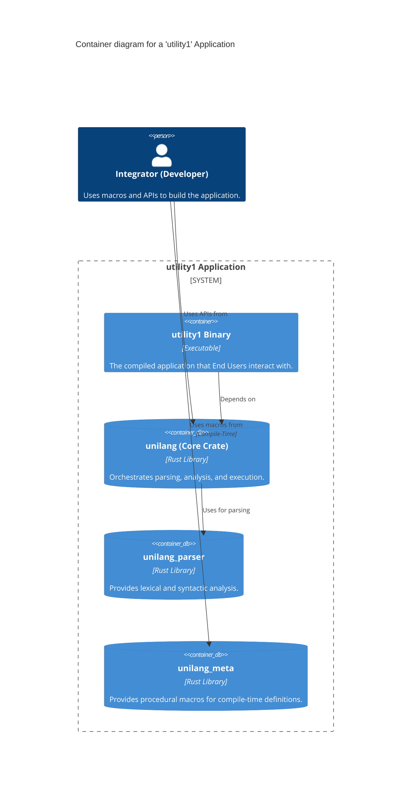
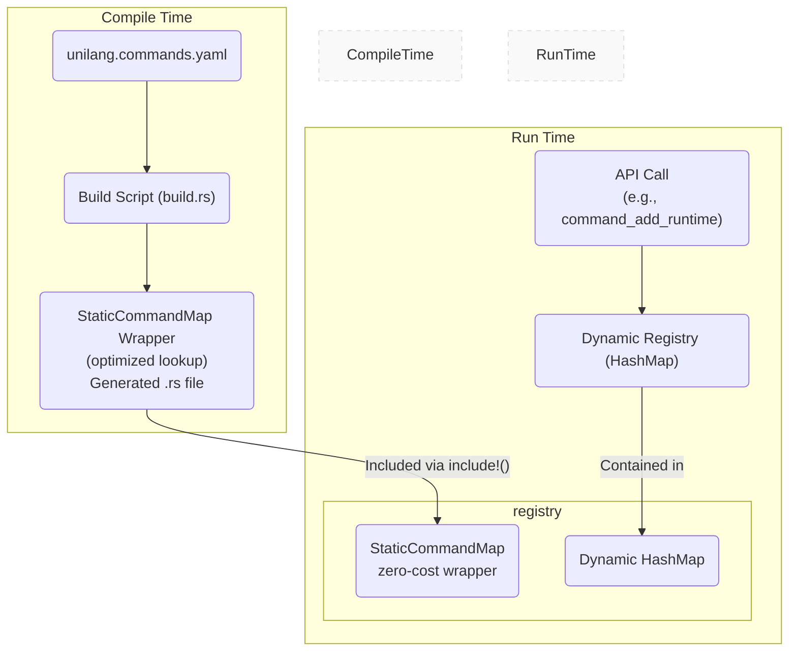
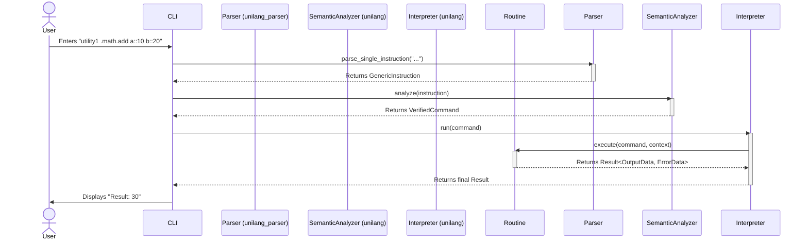

# spec

- **Name:** Unilang Framework
- **Version:** 3.1.0
- **Date:** 2025-09-16

### Table of Contents
*   **Part I: Public Contract (Mandatory Requirements)**
    *   1. Vision & Scope
        *   1.1. Core Vision: Define Once, Use Everywhere
        *   1.2. In Scope: The Multi-Crate Framework
        *   1.3. Out of Scope
    *   2. System Actors
    *   3. Ubiquitous Language (Vocabulary)
    *   4. Core Functional Requirements
        *   4.1. Command & Registry Management
        *   4.2. Argument Parsing & Type System
        *   4.3. Command Execution Pipeline
        *   4.4. Help & Discovery System
        *   4.5. Modality Support
    *   5. Non-Functional Requirements
    *   6. CLI Modality: Language Syntax & Processing
    *   7. API Reference: Core Data Structures
    *   8. Cross-Cutting Concerns (Error Handling, Security, Verbosity)
    *   9. Feature Flags & Modularity
*   **Part II: Internal Design (Design Recommendations)**
    *   10. Architectural Mandates & Design Principles
    *   11. Architectural Diagrams
    *   12. Crate-Specific Responsibilities
*   **Part III: Project & Process Governance**
    *   13. Project Goals & Success Metrics
    *   14. Deliverables
    *   15. Open Questions
        *   15.1. Governing Principles
    *   16. Core Principles of Development
*   **Appendix: Addendum**
    *   Conformance Checklist
    *   Finalized Internal Design Decisions
    *   Finalized Internal Data Models
    *   Environment Variables
    *   Finalized Library & Tool Versions
    *   Deployment Checklist

---
## Part I: Public Contract (Mandatory Requirements)
*This part of the specification defines the stable, externally visible promises of the `unilang` framework. All requirements in this section are mandatory.*

### 1. Vision & Scope

#### 1.1. Core Vision: Define Once, Use Everywhere
The `unilang` framework **must** provide a unified way to define command-line utility interfaces once, automatically enabling consistent interaction across multiple modalities such as CLI, TUI, GUI, and Web APIs. The core goals are:

*   **Consistency:** A single, declarative way to define commands and their arguments, regardless of how they are presented or invoked.
*   **Discoverability:** Easy ways for users and systems to find available commands and understand their usage through an automated help system.
*   **Flexibility:** Support for various methods of command definition (compile-time, run-time, declarative, procedural).
*   **Extensibility:** Provide structures that enable an integrator to build an extensible system.
*   **Efficiency:** Support for efficient parsing and zero-overhead command dispatch for statically defined commands.
*   **Interoperability:** A standardized representation for commands, enabling integration with other tools or web services.
*   **Robustness:** Clear, user-friendly error handling and a rich argument validation system.
*   **Security:** Provide a framework for defining and enforcing secure command execution.

#### 1.2. In Scope: The Multi-Crate Framework
The Unilang specification governs a suite of related crates that work together to provide the full framework functionality. The primary crates **must** be:

*   **`unilang`**: The core framework crate that orchestrates parsing, semantic analysis, execution, and modality management. It provides the primary public API for integrators.
*   **`unilang_parser`**: A dedicated, low-level crate responsible for the lexical and syntactic analysis of the `unilang` command language.
*   **`unilang_meta`**: A companion crate providing procedural macros (e.g., `#[command]`) to simplify compile-time command definition.

#### 1.3. Out of Scope
The `unilang` framework is responsible for the command interface and execution pipeline, not the business logic itself. The following are explicitly out of scope for the framework:

*   **Business Logic Implementation:** The framework will invoke command `Routines`, but the implementation of the business logic within those routines is the responsibility of the `Integrator`.
*   **Transactional Guarantees:** The framework does not provide transactional guarantees for sequences of commands. A failure in one command in a sequence does not automatically roll back the effects of previously executed commands.
*   **Inter-Command State Management:** The framework provides an `ExecutionContext` for passing data to commands, but it does not manage complex state between command invocations. State management is the responsibility of the `Integrator`.
*   **User Interface (UI) Rendering:** The framework provides the data and structure for different modalities (CLI, TUI, GUI) but does not render the UI itself. UI rendering is the responsibility of modality-specific crates or the `Integrator`'s application.

### 2. System Actors

An Actor is any entity that plays a distinct role and participates in an interaction within the system's architecture.

#### 2.1. Human Actors
*   **`Integrator (Developer)`**: The primary human actor who uses the `unilang` framework crates (`unilang`, `unilang_parser`, `unilang_meta`) to build a `utility1` application. Their responsibilities include defining commands, implementing routines, and configuring the framework.
*   **`End User`**: A human actor who interacts with the compiled `utility1` application through one of its exposed `Modalities` (e.g., by typing commands into a CLI).

#### 2.2. External System Actors
*   **`Operating System`**: A system actor that provides the execution environment for `utility1`, including the CLI shell, file system, and environment variables.
*   **`External Service`**: Any external system (e.g., a database, a web API) that a command `Routine` might interact with. The `unilang` framework does not interact with these services directly, but it facilitates the execution of routines that do.

#### 2.3. Internal System Actors
*   **`Build Script (build.rs)`**: A critical internal actor responsible for compile-time operations. Its primary role is to process static command definitions (from code or manifests) and generate optimized static command maps (using Perfect Hash Functions internally) wrapped in `StaticCommandMap`, enabling the zero-overhead static command registry while hiding implementation details from downstream crates.
*   **`Command Registry`**: An internal actor that serves as the runtime database for all command definitions. It manages both the static (`StaticCommandMap` wrapper) and dynamic (HashMap) command sets and provides the lookup service used by the `Semantic Analyzer`.
*   **`Parser (unilang_parser)`**: An internal actor that performs lexical and syntactic analysis on a raw input string, converting it into a structured `GenericInstruction` without any knowledge of command definitions.
*   **`Semantic Analyzer`**: An internal actor that validates a `GenericInstruction` against the `Command Registry` to produce a `VerifiedCommand` that is guaranteed to be executable.
*   **`Interpreter`**: An internal actor that takes a `VerifiedCommand` and invokes its corresponding `Routine`, managing the execution context and handling results.

### 3. Ubiquitous Language (Vocabulary)

*   **`unilang`**: This specification and the core framework crate.
*   **`utility1`**: A generic placeholder for the primary application that implements `unilang`.
*   **`Command Registry`**: The runtime data structure that holds all known `CommandDefinition`s and their associated `Routine`s. It supports both static (compile-time) and dynamic (run-time) registration.
*   **`CommandDefinition`**: The canonical metadata for a command, defining its name, arguments, aliases, and behavior. **Phase 2:** Now uses private fields with validated newtypes (`CommandName`, `NamespaceType`, `VersionType`, `CommandStatus`) and type-state builder pattern for type-safe construction.
*   **`ArgumentDefinition`**: The canonical metadata for a command's argument, defining its name, `Kind`, and validation rules.
*   **`Routine`**: The executable code (a Rust closure or function) associated with a command.
*   **`Modality`**: A specific way of interacting with `utility1` (e.g., CLI, REPL, Web API).
*   **`GenericInstruction`**: The structured, syntax-aware output of the `unilang_parser`, representing a parsed but unvalidated command invocation.
*   **`VerifiedCommand`**: The output of the `Semantic Analyzer`; a command that has been validated against the `Command Registry` and is guaranteed to be executable.
*   **`Pipeline`**: A high-level API object that orchestrates the full processing flow from string input to execution result.
*   **`Kind`**: The data type of an argument (e.g., `Integer`, `String`, `List`, `Map`).

### 4. Core Functional Requirements

This section lists the specific, testable functions the `unilang` framework **must** provide.

#### 4.1. Command & Registry Management
*   **FR-REG-1 (Static Registration):** The framework **must** provide a mechanism, via a `build.rs` script, to register commands at compile-time from a manifest file (e.g., `unilang.commands.yaml`).
*   **FR-REG-2 (Dynamic Registration):** The framework **must** expose a public API (`CommandRegistry::command_add_runtime`) for registering new commands and their routines at runtime.
*   **FR-REG-3 (Declarative Loading):** The framework **must** provide functions (`load_from_yaml_str`, `load_from_json_str`) to load `CommandDefinition`s from structured text at runtime.
*   **FR-REG-4 (Namespace Support):** The framework **must** support hierarchical command organization through dot-separated namespaces (e.g., `.math.add`).
*   **FR-REG-5 (Alias Resolution):** The framework **must** support command aliases. When an alias is invoked, the framework **must** execute the corresponding canonical command.
*   **FR-REG-6 (Explicit Command Names):** The framework **must** enforce explicit command naming with the following rules:
    - All fully-qualified command names **must** start with a dot prefix (e.g., `.chat`, `.session.list`)
    - Runtime API (`CommandRegistry::command_add_runtime`) **must** reject command registrations lacking a dot prefix with a clear error
    - Runtime API **must not** automatically add, remove, or transform command names - commands are registered and executed exactly as specified
    - Build-time YAML manifests **may** use two valid formats that both produce dot-prefixed command names:
      - **Format 1 (Compound Names - Recommended for Examples):** `name: ".session.list"`, `namespace: ""` → produces `.session.list`
      - **Format 2 (Separate Namespace - Valid for Production):** `name: "list"`, `namespace: ".session"` → produces `.session.list` (note: namespace field MUST include dot prefix)
    - The `build.rs` script applies the following transformations to YAML manifests:
      - If `namespace` is empty and `name` starts with `.`: uses `name` as-is
      - If `namespace` is empty and `name` lacks `.`: adds dot prefix to produce `.{name}`
      - If `namespace` is not empty: concatenates to produce `{namespace}.{name}` (requires namespace to have dot prefix)
    - Documentation and examples **should** use Format 1 to show users the exact command syntax they will type
*   **FR-REG-7 (CLI Module Aggregation):** The framework **must** provide a `CliBuilder` API for aggregating multiple CLI modules into a unified command interface. The API **must** support:
    - **Module Registration:** `static_module_with_prefix(name, prefix, commands)` to register command modules with namespace prefixes
    - **Conflict Detection:** Automatic detection of duplicate command names or conflicting prefixes when enabled
    - **Namespace Isolation:** Each module's commands are isolated within its prefix namespace (e.g., `.db.` prefix for database module)
    - **Build Modes:** `build_static()` for compile-time registry (`StaticCommandMap` wrapper), `build_hybrid()` for mixed static/dynamic
    - **Prefix Application:** Automatic prefix prepending to all commands in a module (e.g., prefix `.db` + command `.migrate` → `.db.migrate`)
    - This enables organizations to consolidate multiple CLI tools while maintaining clear separation of concerns and preventing naming conflicts

#### 4.2. Argument Parsing & Type System
*   **FR-ARG-1 (Type Support):** The framework **must** support parsing and type-checking for the following `Kind`s: `String`, `Integer`, `Float`, `Boolean`, `Path`, `File`, `Directory`, `Enum`, `Url`, `DateTime`, `Pattern`, `List`, `Map`, `JsonString`, and `Object`.
*   **FR-ARG-2 (Positional Binding):** The framework **must** correctly bind positional arguments from a `GenericInstruction` to the corresponding `ArgumentDefinition`s in the order they are defined.
*   **FR-ARG-3 (Named Binding):** The framework **must** correctly bind named arguments (`name::value`) from a `GenericInstruction` to the corresponding `ArgumentDefinition`, regardless of order.
*   **FR-ARG-4 (Alias Binding):** The framework **must** correctly bind named arguments specified via an alias to the correct `ArgumentDefinition`.
*   **FR-ARG-5 (Default Values):** If an optional argument with a default value is not provided, the framework **must** use the default value during semantic analysis.
*   **FR-ARG-6 (Validation Rule Enforcement):** The `Semantic Analyzer` **must** enforce all `ValidationRule`s (`Min`, `Max`, `MinLength`, `MaxLength`, `Pattern`, `MinItems`) defined for an argument. If a rule is violated, a `UNILANG_VALIDATION_RULE_FAILED` error **must** be returned.
*   **FR-ARG-7 (Automatic Multiple Parameter Collection):** When the same parameter name appears multiple times in a command invocation (e.g., `command::"value1" command::"value2" command::"value3"`), the `Semantic Analyzer` **must** automatically collect all values into a `Value::List`, regardless of the argument definition's `multiple` attribute. This ensures that no parameter values are lost due to semantic processing limitations. Single parameters **must** remain as single values to maintain backward compatibility.
*   **FR-ARG-8 (Unknown Parameter Detection):** The `Semantic Analyzer` **must** reject any command invocation that contains named parameters not defined in the `CommandDefinition` (including aliases). When unknown parameters are detected, a `UNILANG_UNKNOWN_PARAMETER` error **must** be returned with helpful error messages. For single unknown parameters with Levenshtein distance <= 2 from a valid parameter name, the error message **must** include a "Did you mean...?" suggestion. The error message **must** reference command-specific help (e.g., "Use '.command ??' for help"). This validation is **mandatory** and **cannot** be bypassed - there are no flags, settings, or configurations to disable unknown parameter detection. All named parameters are validated against the command definition's canonical parameter names and all defined aliases before command execution proceeds.

#### 4.3. Command Execution Pipeline
*   **FR-PIPE-1 (Pipeline Orchestration):** The `Pipeline` API **must** correctly orchestrate the full sequence: Parsing -> Semantic Analysis -> Interpretation.
*   **FR-PIPE-2 (Batch Processing):** The `Pipeline::process_batch` method **must** execute a list of commands independently, collecting results for each and not stopping on individual failures.
*   **FR-PIPE-3 (Sequence Processing):** The `Pipeline::process_sequence` method **must** execute a list of commands in order and **must** terminate immediately upon the first command failure.
*   **FR-PIPE-4 (Argv-Based Command Execution):** The framework **must** provide argv-based parsing and execution APIs (`Pipeline::process_command_from_argv`, `Pipeline::process_command_from_argv_simple`) that accept command-line arguments as `&[String]` arrays. These methods **must** intelligently combine consecutive argv elements to preserve argument boundaries: elements containing `::` start named arguments, following elements without `::` or `.` prefix are combined into parameter values with proper quoting. This eliminates information loss when CLI applications receive OS-provided argv arrays, enabling natural shell syntax without special quoting requirements. The argv API **must** integrate with the full semantic analysis and execution pipeline, providing identical functionality to string-based APIs while preserving type-safe argv boundaries.

#### 4.4. Help & Discovery System
*   **FR-HELP-1 (Command List):** The `HelpGenerator` **must** be able to produce a formatted list of all registered commands, including their names, namespaces, and hints.
*   **FR-HELP-2 (Detailed Command Help):** The `HelpGenerator` **must** be able to produce detailed, formatted help for a specific command, including its description, arguments (with types, defaults, and validation rules), aliases, and examples.
*   **FR-HELP-3 (Help Operator):** The parser **must** recognize the `?` operator. When present, the `Semantic Analyzer` **must** return a `HELP_REQUESTED` error containing the detailed help text for the specified command, bypassing all argument validation.
*   **FR-HELP-4 (Standardized Help Commands):** For every registered command `.command`, the framework **must** provide automatic registration of a corresponding `.command.help` command that returns detailed help information for the parent command. This standardization ensures consistent help access across all commands.
*   **FR-HELP-5 (Double Question Mark Parameter):** The framework **must** recognize a special parameter `??` that can be appended to any command to trigger help display (e.g., `.command "??"`). When this parameter is detected, the system **must** return help information identical to calling `.command.help`, providing an alternative help access method. *Implementation Note: The `??` parameter must be quoted to avoid parser conflicts with the `?` help operator.*
*   **FR-HELP-6 (Automatic Help Command Generation API):** The framework **must** provide APIs (`CommandDefinition::with_auto_help`) that automatically generate `.command.help` commands and enable `??` parameter processing with minimal developer effort. Help generation is now mandatory for all commands - no opt-out mechanism exists.

    *Implementation Notes:* ✅ **IMPLEMENTED**
    - Automatic `.command.help` command registration via `register_with_auto_help()`
    - Help generation is mandatory and always enabled
    - Per-command control via `auto_help_enabled` field (for configuration only - help still generated)
    - Pipeline enhancement converts `HELP_REQUESTED` errors to successful help output
    - Comprehensive help formatting with all command metadata, validation rules, and examples
    - Three help access methods: `?` operator, `"??"` parameter, and `.command.help` commands
*   **FR-HELP-7 (Help Verbosity Levels):** The framework **must** support configurable help verbosity levels to accommodate different user preferences and use cases. The `HelpGenerator` **must** provide five verbosity levels (0-4) controlling the amount of information displayed:
    - **Level 0 (Minimal):** Command name and brief description only - for quick reference
    - **Level 1 (Basic):** Add parameters list with types - for syntax lookup
    - **Level 2 (Standard - DEFAULT):** Concise format with USAGE, PARAMETERS with descriptions, and EXAMPLES sections - optimized for terminal use like unikit
    - **Level 3 (Detailed):** Full metadata including version, aliases, tags, validation rules - comprehensive documentation
    - **Level 4 (Comprehensive):** Extensive format with rationale, use cases, and detailed explanations like runbox - for learning and documentation

    The default verbosity **must** be Level 2 (Standard) to provide concise, actionable help without overwhelming users. The API **must** provide methods to create generators with specific verbosity (`HelpGenerator::with_verbosity`), set verbosity dynamically (`set_verbosity`), and query current verbosity (`verbosity`). The verbosity level **must** be parsed from integers 0-4 via `HelpVerbosity::from_level`, with values above 4 capped at Comprehensive.

#### 4.5. Modality Support
*   **FR-REPL-1 (REPL Support):** The framework's core components (`Pipeline`, `Parser`, `SemanticAnalyzer`, `Interpreter`) **must** be structured to support a REPL-style execution loop. They **must** be reusable for multiple, sequential command executions within a single process lifetime.
    
    *Implementation Notes:* ✅ **IMPLEMENTED**
    - Pipeline components are fully stateless and reusable
    - Each command execution is independent with no state accumulation
    - Memory efficient operation verified through performance benchmarks
    - Reference implementations available in `examples/12_repl_loop.rs`, `examples/15_interactive_repl_mode.rs`, `examples/17_advanced_repl_features.rs`
    
*   **FR-INTERACTIVE-1 (Interactive Argument Prompting):** When a mandatory argument with the `interactive: true` attribute is not provided, the `Semantic Analyzer` **must** return a distinct, catchable error (`UNILANG_ARGUMENT_INTERACTIVE_REQUIRED`). This allows the calling modality to intercept the error and prompt the user for input.
    
    *Implementation Notes:* ✅ **IMPLEMENTED** 
    - Error code `UNILANG_ARGUMENT_INTERACTIVE_REQUIRED` is returned as specified
    - Implemented in `src/semantic.rs` lines 196-203
    - Comprehensive test coverage in `tests/inc/phase5/interactive_args_test.rs`
    - REPL examples demonstrate proper error handling and secure input simulation
*   **FR-MOD-WASM-REPL (WebAssembly REPL Modality):** The framework **must** support a web-based REPL modality that can operate entirely on the client-side without a backend server. This requires the core `unilang` library to be fully compilable to the `wasm32-unknown-unknown` target.

### 5. Non-Functional Requirements

*   **NFR-PERF-1 (Startup Time):** For a utility with 1,000,000+ statically compiled commands, the framework **must** introduce zero runtime overhead for command registration. Application startup time **must not** be proportional to the number of static commands. This **must** be achieved via compile-time generation of optimized static lookup tables (using Perfect Hash Functions).
*   **NFR-PERF-2 (Lookup Latency):** The p99 latency for resolving a command `FullName` and its arguments **must** be less than 100 nanoseconds for any registry size.
*   **NFR-PERF-3 (Throughput):** The framework **must** be capable of processing over 5,000,000 simple command lookups per second on a standard developer machine.
*   **NFR-SEC-1 (Sensitive Data):** Argument values marked as `sensitive: true` **must not** be displayed in logs or user interfaces unless explicitly required by a secure context.
*   **NFR-ROBUST-1 (Error Reporting):** All user-facing errors **must** be returned as a structured `ErrorData` object and provide clear, actionable messages. Internal panics **must** be caught and converted to a user-friendly `UNILANG_INTERNAL_ERROR`.
*   **NFR-PLATFORM-1 (WASM Compatibility):** The core logic of the `unilang` and `unilang_parser` crates **must** be platform-agnostic and fully compatible with the WebAssembly (`wasm32-unknown-unknown`) target. This implies that the core crates **must not** depend on libraries or functionalities that are tied to a specific native OS (e.g., native threading, direct file system access that cannot be abstracted) unless those features are conditionally compiled and disabled for the WASM target.
*   **NFR-MODULARITY-1 (Granular Features):** All non-essential framework functionality **must** be gated behind Cargo features. This includes support for complex types (`Url`, `DateTime`), declarative loading (`serde_yaml`, `serde_json`), and other features that introduce dependencies.
*   **NFR-MODULARITY-2 (Lightweight Core):** When compiled with `default-features = false`, the `unilang` framework **must** have a minimal dependency footprint, comparable in lightness (dependencies, compile time) to the `pico-args` crate. The core functionality **must** be contained within the `enabled` feature.

#### 5.1. REPL Implementation Requirements & Technical Insights

The REPL (Read-Eval-Print Loop) modality has unique technical challenges and requirements that have been discovered through implementation:

**Stateless Operation Requirements:**
- Each command execution cycle must be completely independent
- No state accumulation between command executions to prevent memory leaks
- Components (`Parser`, `SemanticAnalyzer`, `Interpreter`) must be reusable without internal state corruption
- Performance requirement: Command execution overhead must remain constant regardless of session length

**Interactive Argument Handling:**
- The error code `UNILANG_ARGUMENT_INTERACTIVE_REQUIRED` must be catchable at the REPL level
- REPL implementations must handle secure input (passwords, API keys) without logging or state persistence
- Optional interactive arguments with defaults must not trigger interactive prompts
- Interactive argument validation must occur during semantic analysis, not execution

**Memory Management Insights:**
- Pipeline component reuse provides 20-50% performance improvement over creating new instances
- Command history storage should be bounded to prevent unbounded memory growth
- Large command outputs should be handled with streaming or pagination for long-running REPL sessions

**Error Recovery Patterns:**
- Parse errors should provide contextual suggestions for command correction
- Semantic analysis errors should indicate available commands and proper syntax
- Execution errors should not terminate the REPL session
- Error history tracking enables improved user experience with "last-error" functionality

**User Experience Requirements:**
- Auto-completion suggestions require command registry introspection capabilities
- Command history must support search and replay functionality  
- Session statistics provide valuable debugging information
- Clear screen and session reset capabilities are essential for productive use

**Performance Considerations:**
- Optimized static command registry provides zero-cost lookups even in REPL context
- Dynamic command registration during REPL sessions should be supported for development workflows
- Batch command processing capabilities enable script-like functionality within REPL
- Command validation without execution supports syntax checking workflows

### 6. CLI Modality: Language Syntax & Processing

The `unilang_parser` crate **must** be the reference implementation for this section. The parser **must** adhere to the following rules in order:

*   **Rule 1 (Tokenization):** Whitespace separates tokens. Quoted strings (`'...'` or `"..."`) are treated as a single token.
*   **Rule 2 (Command Path):** The command path is the first token. It **must** be a dot-separated identifier (e.g., `.system.echo`). A leading dot is optional.
*   **Rule 3 (Arguments):** All subsequent tokens are arguments.
    *   **Named Arguments:** **Must** use the `name::value` syntax.
    *   **Positional Arguments:** Any token that is not a named argument is a positional argument.
*   **Rule 4 (Help Operator):** The `?` operator, if present, **must** be the final token and triggers the help system.
*   **Rule 5 (Double Question Mark Parameter):** The `??` parameter, if present as any argument, **must** trigger help display for the command, identical to calling `.command.help`. This provides a consistent alternative to the `?` operator.
*   **Rule 6 (Special Case - Discovery):** A standalone dot (`.`) **must** be interpreted as a request to list all available commands.

### 7. API Reference: Core Data Structures

The public API **must** include the following data structures with the specified fields. (See `src/data.rs` for the source of truth).

*   `CommandDefinition`: Defines a command's metadata, including the new `auto_help_enabled: bool` field for help convention support.
*   `ArgumentDefinition`: Defines an argument's metadata.
*   `ArgumentAttributes`: Defines behavioral flags for an argument.
*   `Kind`: Defines the data type of an argument.
*   `ValidationRule`: Defines a validation constraint for an argument.
*   `OutputData`: Standardized structure for successful command output.
*   `ErrorData`: Standardized structure for command failure information.
*   `StaticCommandMap`: Opaque wrapper for compile-time optimized command maps.
*   `StaticCommandDefinition`: Const-compatible version of CommandDefinition for static storage.
*   `StaticArgumentDefinition`: Const-compatible version of ArgumentDefinition for static storage.

#### 7.0. Phase 2 Type-Safe Redesign (Breaking Changes)

**Status:** ✅ **IMPLEMENTED** (v3.1.0)

The `CommandDefinition` structure underwent a complete type-safe redesign implementing the "parse don't validate" pattern. This redesign makes invalid states impossible to represent at compile time.

**Design Philosophy:**

The core principle is "Invalid States Should Be Impossible". The old API allowed commands to be constructed in invalid states that only failed at runtime during registration. The new API catches errors at construction time, moving bugs from runtime to compile time.

**Key Changes:**

1. **Private Fields with Getter Methods**
   - All `CommandDefinition` fields are now private
   - Access via getter methods only (e.g., `cmd.name()` instead of `cmd.name`)
   - Prevents mutation after construction
   - Guarantees immutability and validity

2. **Validated Newtypes**
   - `CommandName`: Wrapper type guaranteeing dot prefix (e.g., `.build`)
   - `NamespaceType`: Wrapper type guaranteeing valid namespace (empty or dot-prefixed)
   - `VersionType`: Wrapper type guaranteeing non-empty version string
   - `CommandStatus`: Enum (`Active`, `Deprecated`, `Experimental`, `Internal`) replacing String

3. **Type-State Builder Pattern**
   - `CommandDefinition::former()` returns a type-state builder
   - `end()` method: Requires only `name` + `description`, provides defaults (ergonomic)
   - `build()` method: Requires ALL fields explicitly set (explicit for production)
   - Compile-time enforcement of required fields via phantom types

**Construction Patterns:**

```rust
// Pattern 1: Direct constructor (simple commands)
let name = CommandName::new(".build").unwrap();
let cmd = CommandDefinition::new(name, "Build the project".to_string());

// Pattern 2: Builder with defaults (tests, simple cases)
let cmd = CommandDefinition::former()
  .name(".build")
  .description("Build the project")
  .end(); // Provides defaults: namespace="", status=Active, version="1.0.0"

// Pattern 3: Builder fully explicit (production)
let cmd = CommandDefinition::former()
  .name(".build")
  .description("Build the project")
  .namespace("")
  .hint("Build hint")
  .status("active")
  .version("1.0.0")
  .build(); // No defaults, all fields required
```

**Validated Types API:**

```rust
// CommandName - guarantees dot prefix
pub struct CommandName(String);
impl CommandName {
  pub fn new(name: impl Into<String>) -> Result<Self, Error>;
  pub fn as_str(&self) -> &str;
  pub fn into_inner(self) -> String;
}

// NamespaceType - guarantees valid namespace
pub struct NamespaceType(String);
impl NamespaceType {
  pub fn new(namespace: impl Into<String>) -> Result<Self, Error>;
  pub fn as_str(&self) -> &str;
  pub fn is_root(&self) -> bool; // Returns true if namespace is empty
}

// VersionType - guarantees non-empty version
pub struct VersionType(String);
impl VersionType {
  pub fn new(version: impl Into<String>) -> Result<Self, Error>;
  pub fn as_str(&self) -> &str;
}

// CommandStatus - enum eliminates typos
pub enum CommandStatus {
  Active,
  Deprecated { reason: String, since: Option<String>, replacement: Option<String> },
  Experimental,
  Internal,
}
```

**Builder API:**

```rust
// Type-state builder with phantom types
impl CommandDefinition {
  pub fn former() -> CommandDefinitionBuilder<NotSet, NotSet, NotSet, NotSet, NotSet, NotSet>;
}

impl CommandDefinitionBuilder<Set, Set, Namespace, Hint, Status, Version> {
  // Available when name + description are set (others optional)
  pub fn end(self) -> CommandDefinition;
}

impl CommandDefinitionBuilder<Set, Set, Set, Set, Set, Set> {
  // Only available when ALL fields are set
  pub fn build(self) -> CommandDefinition;
}
```

**Getter Methods:**

All `CommandDefinition` fields now have getter methods:

```rust
impl CommandDefinition {
  pub fn name(&self) -> &CommandName;
  pub fn description(&self) -> &str;
  pub fn namespace(&self) -> &str;
  pub fn status(&self) -> &CommandStatus;
  pub fn version(&self) -> &VersionType;
  pub fn auto_help_enabled(&self) -> bool;
  // ... all other fields

  pub fn full_name(&self) -> String; // Returns namespace + name
  pub fn generate_help_command(&self) -> CommandDefinition;
}
```

**Migration Impact:**

- **BREAKING:** All `CommandDefinition` construction must use builder or `new()` method
- **BREAKING:** Field access changed from direct (`cmd.name`) to getters (`cmd.name()`)
- **BREAKING:** Invalid commands now panic at construction, not registration
- **BREAKING:** Status strings replaced with `CommandStatus` enum
- **BENEFIT:** Bugs caught at compile time instead of runtime
- **BENEFIT:** Type system documents valid states
- **BENEFIT:** IDE autocomplete guides correct usage

**Design Rationale:**

See `src/data.rs` module documentation for comprehensive design rationale explaining:
- Why private fields (immutability guarantees)
- Why validated newtypes (fail-fast construction)
- Why type-state pattern (compile-time enforcement)
- Why `end()` vs `build()` (flexibility vs explicitness trade-offs)
- Why `ArgumentDefinition` retains public fields (pragmatic exception)

**Trade-offs:**

- **Cost:** More verbose construction, complex type signatures, breaking changes
- **Benefit:** Entire categories of bugs eliminated at compile time

This trade-off strongly favors type safety for domain objects where correctness is critical.

#### 7.1. CommandDefinition Structure

The `CommandDefinition` struct has private fields accessible via getter methods. Key fields include:
*   `auto_help_enabled: bool` - Controls whether this command automatically generates a corresponding `.command.help` command. When `true`, the framework automatically creates the help counterpart during registration.

#### 7.2. Help Convention API Methods

The following API methods **must** be provided to support standardized help conventions:

**CommandRegistry Methods:**
*   `register_with_auto_help(&mut self, command: CommandDefinition, routine: CommandRoutine)` - Registers a command with automatic help command generation (now mandatory for all commands).
*   `get_help_for_command(&self, command_name: &str) -> Option<String>` - Retrieves formatted help text for any registered command.

**CommandRegistryBuilder Methods:**
*   `builder() -> CommandRegistryBuilder` - Creates a new builder for fluent command registration.
*   `command_with_routine(name: &str, description: &str, routine: F) -> Self` - Adds a command with inline routine using fluent builder pattern.
*   `build(self) -> CommandRegistry` - Builds and returns the CommandRegistry, ignoring any registration errors (for backward compatibility). **Warning:** Silently ignores registration errors.
*   `build_checked(self) -> Result<CommandRegistry, Error>` - **NEW:** Builds and returns the CommandRegistry with proper error propagation. Returns an error if any command failed to register during the build process. **Recommended** for production code to ensure all commands registered successfully.

**VerifiedCommand Helper Methods:**
The following helper methods **must** be provided to eliminate boilerplate in command routines (eliminates ~90% of argument extraction code):

*String extraction:*
*   `get_string(&self, name: &str) -> Option<&str>` - Extracts optional string argument, returns None if not found or wrong type.
*   `require_string(&self, name: &str) -> Result<&str, Error>` - Extracts required string argument, returns error if missing or wrong type.

*Integer extraction:*
*   `get_integer(&self, name: &str) -> Option<i64>` - Extracts optional integer argument.
*   `require_integer(&self, name: &str) -> Result<i64, Error>` - Extracts required integer argument.

*Float extraction:*
*   `get_float(&self, name: &str) -> Option<f64>` - Extracts optional float argument.
*   `require_float(&self, name: &str) -> Result<f64, Error>` - Extracts required float argument.

*Boolean extraction:*
*   `get_boolean(&self, name: &str) -> Option<bool>` - Extracts optional boolean argument.
*   `require_boolean(&self, name: &str) -> Result<bool, Error>` - Extracts required boolean argument.

*Path extraction:*
*   `get_path(&self, name: &str) -> Option<&Path>` - Extracts optional path argument (works with Path, File, Directory variants).
*   `require_path(&self, name: &str) -> Result<&Path, Error>` - Extracts required path argument.

*List extraction:*
*   `get_list(&self, name: &str) -> Option<&Vec<Value>>` - Extracts optional list argument.
*   `require_list(&self, name: &str) -> Result<&Vec<Value>, Error>` - Extracts required list argument.

*Generic helpers:*
*   `has_argument(&self, name: &str) -> bool` - Returns true if argument exists (regardless of type).
*   `get_value(&self, name: &str) -> Option<&Value>` - Gets raw Value reference for custom handling.

These helpers replace the verbose pattern:
```rust
// OLD (verbose, error-prone):
let name = cmd.arguments.get("name")
  .and_then(|v| if let Value::String(s) = v { Some(s) } else { None })
  .unwrap_or("default");

// NEW (concise, type-safe):
let name = cmd.get_string("name").unwrap_or("default");
```

**CommandDefinition Methods:**

*Construction (Phase 2 Type-Safe API):*
*   `new(name: CommandName, description: String) -> Self` - Direct constructor requiring validated `CommandName` and description. Provides defaults for all optional fields (namespace="", status=Active, version="1.0.0", auto_help_enabled=true, etc.). Use when you already have a validated CommandName.
*   `former() -> CommandDefinitionBuilder<NotSet, NotSet, NotSet, NotSet, NotSet, NotSet>` - Returns a type-state builder for fluent construction. The builder enforces required fields at compile time.

*Builder Methods (available on `CommandDefinitionBuilder`):*
*   `name(self, name: impl Into<String>) -> CommandDefinitionBuilder<Set, ...>` - Sets command name (validates dot prefix). Transitions `Name` type parameter to `Set`.
*   `description(self, description: impl Into<String>) -> CommandDefinitionBuilder<..., Set, ...>` - Sets command description. Transitions `Description` type parameter to `Set`.
*   `namespace(self, namespace: impl Into<String>) -> CommandDefinitionBuilder` - Sets namespace (validates if non-empty). Optional field.
*   `hint(self, hint: impl Into<String>) -> CommandDefinitionBuilder` - Sets command hint. Optional field.
*   `status(self, status: impl Into<String>) -> CommandDefinitionBuilder` - Sets command status ("active", "deprecated", "experimental", "internal"). Optional field.
*   `version(self, version: impl Into<String>) -> CommandDefinitionBuilder` - Sets version string. Optional field.
*   `arguments(self, arguments: Vec<ArgumentDefinition>) -> CommandDefinitionBuilder` - Sets command arguments. Optional field.
*   `tags(self, tags: Vec<String>) -> CommandDefinitionBuilder` - Sets command tags. Optional field.
*   `aliases(self, aliases: Vec<String>) -> CommandDefinitionBuilder` - Sets command aliases. Optional field.
*   `permissions(self, permissions: Vec<String>) -> CommandDefinitionBuilder` - Sets required permissions. Optional field.
*   `idempotent(self, idempotent: bool) -> CommandDefinitionBuilder` - Sets idempotent flag. Optional field.
*   `http_method_hint(self, method: impl Into<String>) -> CommandDefinitionBuilder` - Sets HTTP method hint. Optional field.
*   `examples(self, examples: Vec<String>) -> CommandDefinitionBuilder` - Sets usage examples. Optional field.
*   `auto_help_enabled(self, enabled: bool) -> CommandDefinitionBuilder` - Controls automatic help command generation. Optional field.
*   `category(self, category: impl Into<String>) -> CommandDefinitionBuilder` - Sets command category. Optional field.
*   `short_desc(self, desc: impl Into<String>) -> CommandDefinitionBuilder` - Sets short description. Optional field.
*   `hidden_from_list(self, hidden: bool) -> CommandDefinitionBuilder` - Sets hidden flag. Optional field.
*   `priority(self, priority: i32) -> CommandDefinitionBuilder` - Sets command priority. Optional field.
*   `group(self, group: impl Into<String>) -> CommandDefinitionBuilder` - Sets command group. Optional field.
*   `end(self) -> CommandDefinition` - Builds CommandDefinition with defaults for unset fields. Available when `Name` and `Description` are `Set`.
*   `build(self) -> CommandDefinition` - Builds CommandDefinition with no defaults. Available only when ALL type parameters are `Set`.

*Getter Methods (available on `CommandDefinition`):*
*   `name(&self) -> &CommandName` - Returns the validated command name.
*   `description(&self) -> &str` - Returns the command description.
*   `namespace(&self) -> &str` - Returns the namespace (empty string for root-level commands).
*   `hint(&self) -> &str` - Returns the command hint.
*   `status(&self) -> &CommandStatus` - Returns the command status enum.
*   `version(&self) -> &VersionType` - Returns the validated version.
*   `arguments(&self) -> &[ArgumentDefinition]` - Returns the command arguments.
*   `routine_link(&self) -> Option<&String>` - Returns the routine link if set.
*   `tags(&self) -> &[String]` - Returns the command tags.
*   `aliases(&self) -> &[String]` - Returns the command aliases.
*   `permissions(&self) -> &[String]` - Returns required permissions.
*   `idempotent(&self) -> bool` - Returns the idempotent flag.
*   `deprecation_message(&self) -> &str` - Returns the deprecation message.
*   `http_method_hint(&self) -> &str` - Returns the HTTP method hint.
*   `examples(&self) -> &[String]` - Returns usage examples.
*   `auto_help_enabled(&self) -> bool` - Returns true if auto-help is enabled.
*   `category(&self) -> &str` - Returns the command category.
*   `short_desc(&self) -> &str` - Returns the short description.
*   `hidden_from_list(&self) -> bool` - Returns the hidden flag.
*   `priority(&self) -> i32` - Returns the command priority.
*   `group(&self) -> &str` - Returns the command group.

*Helper Methods:*
*   `full_name(&self) -> String` - Returns the full command name (namespace + name). For root commands returns just the name.
*   `generate_help_command(&self) -> CommandDefinition` - Generates the corresponding `.command.help` command definition for this command.
*   `has_auto_help(&self) -> bool` - Alias for `auto_help_enabled()` (deprecated, use `auto_help_enabled()` instead).

**ArgumentDefinition Methods:**
*   `new(name, kind) -> Self` - **NEW (Phase 2):** Simplified constructor with sensible defaults. Requires only name and type, providing defaults for all optional fields (required by default, no validation rules, etc.).
*   `with_optional(default: Option<String>) -> Self` - **NEW (Phase 2):** Makes argument optional with optional default value.
*   `with_description(description: String) -> Self` - **NEW (Phase 2):** Sets argument description.
*   `with_validation_rules(rules: Vec<ValidationRule>) -> Self` - **NEW (Phase 2):** Adds validation rules.
*   `with_sensitive(sensitive: bool) -> Self` - **NEW (Phase 2):** Marks argument as sensitive (for passwords, API keys).
*   `with_interactive(interactive: bool) -> Self` - **NEW (Phase 2):** Marks argument as interactive (requires user prompting).

**OutputData Structure and Methods:**

The `OutputData` struct is the standardized structure for successful command execution results. It **must** include the following fields:

```rust
pub struct OutputData {
    pub content : String,              // The actual output content
    pub format : String,               // Output format identifier (e.g., "text", "json", "xml")
    pub execution_time_ms : Option< u64 >,  // Execution time in milliseconds (automatically populated by Interpreter)
}
```

**OutputData Methods:**
*   `new(content, format) -> Self` - **NEW (Phase 2):** Simplified constructor for creating output data. Accepts content and format parameters (both can be strings or string-like types), setting `execution_time_ms` to `None` initially. The Interpreter will automatically populate execution timing when the command is executed.

**Performance Monitoring:**
The `execution_time_ms` field is automatically populated by the `Interpreter` during command execution. Command routines do not need to manually track timing - the framework captures execution duration automatically using high-precision timing (`std::time::Instant`). This provides:
- Zero-overhead timing instrumentation (measured at interpreter level)
- Consistent timing methodology across all commands
- Optional field design for backward compatibility
- Millisecond precision suitable for performance analysis

Example usage in command routines:
```rust
fn my_command_routine(cmd: VerifiedCommand, _ctx: ExecutionContext) -> Result<OutputData, ErrorData> {
    // Perform command logic
    let result = do_work();

    // Simple output construction - timing added automatically by Interpreter
    Ok(OutputData::new(
        format!("Work completed: {}", result),
        "text"
    ))
}
```

**Pipeline Methods:**
*   `process_help_request(&self, command_name: &str, context: ExecutionContext) -> Result<OutputData, Error>` - Processes help requests uniformly across the framework.

#### 7.3. StaticCommandMap Structure

The `StaticCommandMap` struct **must** be implemented as an opaque wrapper that hides compile-time optimization implementation details from the public API. This design ensures downstream crates depend only on unilang's public API.

**Design Requirements:**
*   **Opaque Wrapper:** The struct **must** hide internal optimization types completely - no implementation-specific types in public signatures.
*   **Zero Dependencies:** Downstream crates using `StaticCommandMap` **must not** require internal optimization library dependencies.
*   **Zero Overhead:** All wrapper methods **must** be `#[inline]` to ensure the wrapper compiles away with no performance cost.
*   **Const Initialization:** The struct **must** support `const fn` initialization for compile-time map creation.

**Internal Implementation Note:** See Appendix A for details on the compile-time optimization strategy (PHF).

**Implementation Pattern:**
```rust
// Internal (hidden from users)
pub struct StaticCommandMap {
  inner: &'static phf::Map<&'static str, &'static StaticCommandDefinition>,
}
```

**Public API Methods:**
*   `get(name: &str) -> Option<&'static StaticCommandDefinition>` - Retrieve command by name (O(1) lookup).
*   `contains_key(name: &str) -> bool` - Check if command exists.
*   `keys() -> impl Iterator<Item = &&'static str>` - Iterate over command names.
*   `entries() -> impl Iterator` - Iterate over (name, definition) pairs.
*   `values() -> impl Iterator` - Iterate over command definitions.
*   `len() -> usize` - Get number of commands.
*   `is_empty() -> bool` - Check if map is empty.
*   `Index<&str>` trait - Enable indexing syntax (`map["command"]`), panics if key not found.

**Hidden Internal API:**
*   `from_phf_internal(...)` - Used only by generated code, marked `#[doc(hidden)]`. See Appendix A for implementation details.

**Registry Integration:**
*   `StaticCommandRegistry::from_commands(commands: &'static StaticCommandMap)` - Primary API for creating registry from static map.

**Performance Characteristics:**
*   Lookup time: O(1), approximately 80 nanoseconds per command.
*   Memory overhead: Zero runtime allocation (all data is compile-time).
*   Binary size impact: Minimal (<100 bytes for wrapper code).

**Build System Integration:**
The `build.rs` script **must** generate code following this pattern:
```rust
// Generated code pattern (internal implementation hidden)
const STATIC_COMMANDS_INTERNAL: /* optimization structure */ = /* generated */;
pub static STATIC_COMMANDS: StaticCommandMap =
  StaticCommandMap::from_phf_internal(&STATIC_COMMANDS_INTERNAL);
```

This ensures implementation details remain internal while exposing a clean, dependency-free API to users.

### 8. Cross-Cutting Concerns (Error Handling, Security, Verbosity)

*   **Error Handling:** All recoverable errors **must** be propagated as `unilang::Error`, which wraps an `ErrorData` struct containing a machine-readable `code` (typed `ErrorCode` enum) and a human-readable `message`. The framework defines the following standard error codes via the `ErrorCode` enum:
    - `ErrorCode::CommandNotFound` (as string: `UNILANG_COMMAND_NOT_FOUND`): Command does not exist in registry
    - `ErrorCode::ArgumentMissing` (as string: `UNILANG_ARGUMENT_MISSING`): Required argument not provided
    - `ErrorCode::ArgumentTypeMismatch` (as string: `UNILANG_ARGUMENT_TYPE_MISMATCH`): Argument value has wrong type
    - `ErrorCode::TooManyArguments` (as string: `UNILANG_TOO_MANY_ARGUMENTS`): Excess positional arguments provided
    - `ErrorCode::UnknownParameter` (as string: `UNILANG_UNKNOWN_PARAMETER`): Named parameter not defined in command (with typo suggestions)
    - `ErrorCode::ValidationRuleFailed` (as string: `UNILANG_VALIDATION_RULE_FAILED`): Argument validation rule violated
    - `ErrorCode::ArgumentInteractiveRequired` (as string: `UNILANG_ARGUMENT_INTERACTIVE_REQUIRED`): Interactive argument requires user input
    - `ErrorCode::CommandAlreadyExists` (as string: `UNILANG_COMMAND_ALREADY_EXISTS`): Duplicate command registration attempt
    - `ErrorCode::CommandNotImplemented` (as string: `UNILANG_COMMAND_NOT_IMPLEMENTED`): Command registered but not implemented
    - `ErrorCode::TypeMismatch` (as string: `UNILANG_TYPE_MISMATCH`): Type conversion or mismatch error
    - `ErrorCode::HelpRequested` (as string: `HELP_REQUESTED`): User requested help via `?` operator or `??` parameter
    - `ErrorCode::InternalError` (as string: `UNILANG_INTERNAL_ERROR`): Unexpected system error

    The `ErrorCode` enum provides compile-time type safety and prevents typos in error code strings. The `ErrorData::new()` method now requires an `ErrorCode` enum variant instead of a string.
*   **Security:** The framework **must** provide a `permissions` field in `CommandDefinition` for integrators to implement role-based access control. The `sensitive` attribute on arguments **must** be respected.
*   **Verbosity:** The framework **must** support at least three verbosity levels (`quiet`, `normal`, `debug`) configurable via environment variable (`UNILANG_VERBOSITY`) or programmatically.
*   **Shell Integration:** CLI applications **should** use the argv-based API (`Pipeline::process_command_from_argv`) when receiving command-line arguments from the shell (see FR-PIPE-4). This API preserves argument boundaries from the OS and eliminates information loss, enabling natural shell syntax without special quoting requirements. The string-based API (`process_command_simple`) is recommended for REPL/interactive applications where input comes as a single string. **Legacy Approach:** For applications using the string-based API with shell arguments, integrators must implement argument preprocessing to re-quote values containing spaces before passing them to the parser, but the argv-based API eliminates this requirement entirely.

### 9. Feature Flags & Modularity

The framework **must** be highly modular, allowing integrators to select only the features they need to minimize binary size and compile times.

#### 9.1. The `enabled` Feature
Every crate in the `unilang` ecosystem (`unilang`, `unilang_parser`, `unilang_meta`) **must** expose an `enabled` feature. This feature **must** be part of the `default` feature set. Disabling the `enabled` feature (`--no-default-features`) **must** effectively remove all of the crate's code and dependencies from the compilation, allowing it to be "turned off" even when included as a non-optional dependency in a workspace.

#### 9.2. Opinionated Defaults Strategy

The framework implements an **opinionated defaults strategy** where only **Approach #2** (Multi-YAML Build-Time Static) is enabled by default. This design choice:

1. **Guides users to the recommended approach** with best performance and developer experience
2. **Minimizes binary size** by excluding unused parsers and dependencies
3. **Forces conscious opt-in** for alternative approaches, ensuring developers understand trade-offs
4. **Reduces compilation time** by not building unused infrastructure

To use any approach other than #2, integrators **must** explicitly enable the corresponding feature flag.

#### 9.3. Feature Architecture

The framework uses a two-tier feature architecture:

**Tier 1: Approach Features (User-Facing)**
Each CLI definition approach has its own feature flag that automatically enables required infrastructure:

| Approach Feature | Enables | Default | Description |
| :--- | :--- | :--- | :--- |
| `approach_yaml_single_build` | `static_registry`, `yaml_parser` | No | Single YAML → Build-time static |
| `approach_yaml_multi_build` | `static_registry`, `yaml_parser`, `multi_file` | **Yes** | Multi-YAML → Build-time static (**DEFAULT**) |
| `approach_yaml_runtime` | `yaml_parser` | No | YAML → Runtime registry |
| `approach_json_single_build` | `static_registry`, `json_parser` | No | Single JSON → Build-time static |
| `approach_json_multi_build` | `static_registry`, `json_parser`, `multi_file` | No | Multi-JSON → Build-time static |
| `approach_json_runtime` | `json_parser` | No | JSON → Runtime registry |
| *(Approach #7)* | *(always available)* | Yes | Rust DSL builder (core API) |
| `approach_rust_dsl_const` | `static_registry` | No | Rust DSL → Build-time const |
| `approach_hybrid` | `static_registry` | No | Mixed static + dynamic registry |

**Tier 2: Infrastructure Features (Building Blocks)**
These are enabled automatically by approach features and should not be used directly:

| Infrastructure Feature | Dependencies | Purpose |
| :--- | :--- | :--- |
| `static_registry` | `phf` (Perfect Hash Functions) | Zero-overhead static command lookup |
| `yaml_parser` | `serde_yaml` | YAML deserialization |
| `json_parser` | `serde_json` | JSON deserialization |
| `multi_file` | `walkdir` | Auto-discovery of command files |
| `simd` | `simd-json`, `bytecount` | SIMD-optimized parsing (4-25x faster) |
| `repl` | - | Basic REPL functionality |
| `enhanced_repl` | `rustyline` | Advanced REPL with history/completion |
| `on_unknown_suggest` | `textdistance` | Fuzzy command suggestions |

**Core Features:**

| Feature | Description | Default |
| :--- | :--- | :--- |
| `enabled` | Master switch - disables entire crate when off | Yes |
| `default` | Default features: `enabled`, `simd`, `repl`, `enhanced_repl`, `approach_yaml_multi_build` | Yes |
| `full` | All features except dev-only | No |

#### 9.4. Usage Examples

**Using the default (Approach #2):**
```toml
[dependencies]
unilang = "0.28"  # Only YAML multi-file enabled
```

**Using alternative approach:**
```toml
[dependencies]
unilang = { version = "0.28", default-features = false, features = [
  "enabled",
  "approach_json_single_build"  # Switch to JSON single-file
]}
```

**Using multiple approaches:**
```toml
[dependencies]
unilang = { version = "0.28", features = [
  "approach_yaml_multi_build",   # Default
  "approach_json_runtime"         # Add runtime JSON loading
]}
```

**Minimal configuration (no parsers):**
```toml
[dependencies]
unilang = { version = "0.28", default-features = false, features = [
  "enabled"  # Only Rust DSL builder API (Approach #7)
]}
```

---
## Part II: Internal Design (Design Recommendations)
*This part of the specification describes the recommended internal architecture and implementation strategies. These are best-practice starting points, and the development team has the flexibility to modify them as needed.*

### 10. Architectural Mandates & Design Principles

It is recommended that the `unilang` ecosystem adhere to the following principles:

*   **Parser Independence:** The `unilang` core crate **should** delegate all command string parsing to the `unilang_parser` crate.
*   **Zero-Overhead Static Registry:** To meet `NFR-PERF-1`, it is **strongly recommended** that the `CommandRegistry` be implemented using a hybrid model:
    *   An **optimized static map**, generated at compile-time in `build.rs`, for all statically known commands. The implementation **must** be hidden behind the `StaticCommandMap` wrapper to prevent dependency leakage.
    *   A standard `HashMap` for commands registered dynamically at runtime.
    *   Lookups **should** check the static map first before falling back to the dynamic map.
    *   Downstream crates **must not** require implementation-specific dependencies - the wrapper ensures complete encapsulation.
    *   **Implementation detail:** See Appendix A for the compile-time optimization strategy.
*   **`enabled` Feature Gate Mandate:** All framework crates **must** implement the `enabled` feature gate pattern. The entire crate's functionality, including its modules and dependencies, **should** be conditionally compiled using `#[cfg(feature = "enabled")]`. This is a critical mechanism for managing complex feature sets and dependencies within a Cargo workspace, allowing a crate to be effectively disabled even when it is listed as a non-optional dependency.

### 11. Architectural Diagrams

#### 11.1. Use Case Diagram
```mermaid
graph TD
    subgraph Unilang Framework
        UC1(Define Command<br/>(Static or Dynamic))
        UC2(Implement Routine)
        UC3(Configure Framework)
        UC4(Execute Command)
        UC5(Request Help)
        UC6(List Commands)
    end

    actorIntegrator["Integrator<br/>(Developer)"]
    actorEndUser["End User"]

    actorIntegrator --> UC1
    actorIntegrator --> UC2
    actorIntegrator --> UC3

    actorEndUser --> UC4
    actorEndUser --> UC5
    actorEndUser --> UC6
```

#### 11.2. System Context Diagram
```mermaid
graph TD
    style Integrator fill:#fff,stroke:#333,stroke-width:2px
    style EndUser fill:#fff,stroke:#333,stroke-width:2px

    Integrator(Integrator<br/>(Developer))
    EndUser(End User)

    subgraph "utility1 Application"
        Unilang["unilang Framework"]
        Utility1[utility1 Binary]
    end

    style Unilang fill:#1168bd,color:#fff
    style Utility1 fill:#22a6f2,color:#fff

    Integrator -- "Uses to build" --> Unilang
    Unilang -- "Is a dependency of" --> Utility1
    EndUser -- "Interacts with" --> Utility1
```

#### 11.3. C4 Container Diagram


#### 11.4. High-Level Architecture (Hybrid Registry)


#### 11.5. Sequence Diagram: Unified Processing Pipeline


### 12. Crate-Specific Responsibilities

*   **`unilang` (Core Framework):** Recommended to be the central orchestrator, implementing the `CommandRegistry`, `SemanticAnalyzer`, `Interpreter`, `Pipeline`, and all core data structures.
*   **`unilang_parser` (Parser):** Recommended to be the dedicated lexical and syntactic analyzer. It should be stateless and have no knowledge of command definitions.
*   **`unilang_meta` (Macros):** Recommended to provide procedural macros for a simplified, compile-time developer experience.

---
## Part III: Project & Process Governance
*This part of the specification defines the project's goals, scope, and the rules governing its development process.*

### 13. Project Goals & Success Metrics
*   **Primary Goal:** To create a stable, performant, and ergonomic framework for building multi-modal command-line utilities in Rust that allows developers to define a command interface once and deploy it everywhere with zero-overhead for static commands.
*   **Success Metric 1 (Performance):** The framework **must** meet all performance NFRs defined in Section 5, verified by the project's benchmark suite.
*   **Success Metric 2 (Adoption):** The framework is considered successful if it is used to build at least three distinct `utility1` applications with different modalities within 12 months of the v1.0 release.

### 14. Deliverables

Upon completion, the project will deliver the following artifacts:

1.  The published `unilang` Rust crate on crates.io.
2.  The published `unilang_parser` Rust crate on crates.io.
3.  The published `unilang_meta` Rust crate on crates.io.
4.  A compiled WebAssembly (`.wasm`) package and associated JavaScript bindings for the core framework, enabling client-side execution.
5.  Full access to the source code repository, including all examples and benchmarks.
6.  Generated API documentation hosted on docs.rs for all public crates.

### 15. Open Questions
1.  **Custom Type Registration:** What is the API and process for an `Integrator` to define a new custom `Kind` and register its associated parsing and validation logic with the framework?
2.  **Plugin System:** What would a formal plugin system look like, allowing third-party crates to provide `unilang` commands to a host application?

### 15.1. Governing Principles

The unilang framework is built on fundamental principles that guide all architectural decisions and implementation details:

#### 15.1.1. Minimum Implicit Magic
The framework **must** minimize implicit behavior and transformations to maximize predictability:
- **Explicit Operations**: All operations should be explicit rather than implicit
- **Predictable Behavior**: What you specify is exactly what you get - no hidden transformations
- **Clear APIs**: Function behavior should be obvious from signatures and documentation
- **No Surprising Side Effects**: Commands and functions should behave exactly as documented

#### 15.1.2. Single Source of Truth
Each piece of information **must** have exactly one authoritative source:
- **Command Definitions**: Commands registered exactly as specified, used exactly as registered
- **Configuration**: One canonical location for each configuration setting
- **Documentation**: Single authoritative source for each concept or procedure

#### 15.1.3. Fail-Fast Validation
The framework **must** detect and report errors as early as possible:
- **Registration Time**: Invalid command definitions rejected immediately during registration
- **Parse Time**: Syntax errors detected during parsing phase
- **Semantic Analysis**: Type and validation errors caught before execution
- **Clear Error Messages**: All errors include actionable guidance for resolution

#### 15.1.4. Explicit Dependencies
All dependencies and relationships **must** be made explicit:
- **Command Dependencies**: Clear specification of required arguments and constraints
- **Type Dependencies**: Explicit type requirements and conversions
- **System Dependencies**: Clear documentation of external requirements

#### 15.1.5. Consistent Help Access
The framework **must** provide standardized, predictable help access for all commands:
- **Universal Help Commands**: Every command `.command` automatically generates a `.command.help` counterpart
- **Uniform Help Parameter**: The `??` parameter provides consistent help access across all commands
- **Help Convention APIs**: Developer-friendly APIs make following help conventions effortless
- **Discoverability**: Users can always find help through predictable patterns

These principles serve as the foundation for all design decisions and implementation choices throughout the framework.

### 16. Core Principles of Development

#### 16.1. Single Source of Truth
The project's Git repository **must** be the absolute single source of truth for all project-related information. This includes specifications, documentation, source code, configuration files, and architectural diagrams.

#### 16.2. Documentation-First Development
All changes to the system's functionality or architecture **must** be documented in the relevant specification files *before* implementation begins.

#### 16.3. Review-Driven Change Control
All modifications to the repository, without exception, **must** go through a formal Pull Request review.

#### 16.4. Radical Transparency and Auditability
The development process **must** be fully transparent and auditable. All significant decisions and discussions **must** be captured in writing within the relevant Pull Request or a linked issue tracker. The repository's history should provide a clear, chronological narrative of the project's evolution.

#### 16.5. File Naming Conventions
All file names within the project repository **must** use lowercase `snake_case`.

#### 16.6. Explicit Command Naming Principle
The framework **must** adhere to the principle of explicit command naming with minimal implicit transformations:

- **Commands as Registered**: Command names **must** be used exactly as registered, without automatic prefix addition or name transformation
- **Dot Prefix Requirement**: All commands **must** be registered with explicit dot prefix (e.g., `.chat`, `.session.list`)  
- **Validation Enforcement**: The framework **must** reject command registrations that do not start with a dot prefix
- **No Implicit Behavior**: The system **must not** automatically add dots, modify namespaces, or transform command names during registration or execution
- **Principle of Least Surprise**: Command behavior should be predictable - what you register is exactly what gets executed

---
### Appendix: Addendum
*This appendix is intended for developer use during implementation. It captures as-built details and serves as a living document during the development cycle.*

#### Purpose
This document is intended to be completed by the **Developer** during the implementation phase. It is used to capture the final, as-built details of the **Internal Design**, especially where the implementation differs from the initial `Design Recommendations` in `spec.md`.

#### Instructions for the Developer
As you build the system, please use this document to log your key implementation decisions, the final data models, environment variables, and other details. This creates a crucial record for future maintenance, debugging, and onboarding.

---

#### Conformance Checklist
*This checklist is the definitive list of acceptance criteria for the project. Before final delivery, each item must be verified as complete and marked with `✅`. Use the 'Verification Notes' column to link to evidence (e.g., test results, screen recordings).*

| Status | Requirement | Verification Notes |
| :--- | :--- | :--- |
| ❌ | **FR-REG-1:** The framework must provide a mechanism, via a `build.rs` script, to register commands at compile-time from a manifest file (e.g., `unilang.commands.yaml`). | |
| ❌ | **FR-REG-2:** The framework must expose a public API (`CommandRegistry::command_add_runtime`) for registering new commands and their routines at runtime. | |
| ❌ | **FR-REG-3:** The framework must provide functions (`load_from_yaml_str`, `load_from_json_str`) to load `CommandDefinition`s from structured text at runtime. | |
| ❌ | **FR-REG-4:** The framework must support hierarchical command organization through dot-separated namespaces (e.g., `.math.add`). | |
| ❌ | **FR-REG-5:** The framework must support command aliases. When an alias is invoked, the framework must execute the corresponding canonical command. | |
| ✅ | **FR-REG-6:** The framework must enforce explicit command naming with dot-prefixed command names. Runtime API must reject registrations lacking dot prefix. Build-time YAML manifests may use two valid formats (compound names or separate namespace) that both produce dot-prefixed commands. | Implemented with runtime validation in `src/command_validation.rs:48-76` and build.rs transformations in `build.rs:208-223`. Two YAML formats documented and tested: Format 1 (compound names) recommended for examples, Format 2 (separate namespace) valid for production. All 608 tests passing including test data files using both formats. |
| ✅ | **FR-REG-7:** The framework must provide a CliBuilder API for aggregating multiple CLI modules with namespace isolation, conflict detection, and prefix application. Supports static/hybrid build modes for performance. | Implemented in `src/multi_yaml/aggregator.rs` and `src/multi_yaml/cli_builder.rs`. Comprehensive test coverage in `tests/cli/cli_builder_api.rs` (25+ tests) covering module registration, prefix application, conflict detection, namespace isolation, and build modes. Examples: `examples/22_minimal_cli_aggregation.rs`. All tests passing. |
| ❌ | **FR-ARG-1:** The framework must support parsing and type-checking for the following `Kind`s: `String`, `Integer`, `Float`, `Boolean`, `Path`, `File`, `Directory`, `Enum`, `Url`, `DateTime`, `Pattern`, `List`, `Map`, `JsonString`, and `Object`. | |
| ❌ | **FR-ARG-2:** The framework must correctly bind positional arguments from a `GenericInstruction` to the corresponding `ArgumentDefinition`s in the order they are defined. | |
| ❌ | **FR-ARG-3:** The framework must correctly bind named arguments (`name::value`) from a `GenericInstruction` to the corresponding `ArgumentDefinition`, regardless of order. | |
| ❌ | **FR-ARG-4:** The framework must correctly bind named arguments specified via an alias to the correct `ArgumentDefinition`. | |
| ❌ | **FR-ARG-5:** If an optional argument with a default value is not provided, the framework must use the default value during semantic analysis. | |
| ❌ | **FR-ARG-6:** The `Semantic Analyzer` must enforce all `ValidationRule`s (`Min`, `Max`, `MinLength`, `MaxLength`, `Pattern`, `MinItems`) defined for an argument. If a rule is violated, a `UNILANG_VALIDATION_RULE_FAILED` error must be returned. | |
| ✅ | **FR-ARG-7:** When the same parameter name appears multiple times in a command invocation, the `Semantic Analyzer` must automatically collect all values into a `Value::List`, regardless of the argument definition's `multiple` attribute. Single parameters must remain as single values to maintain backward compatibility. | Implemented in `src/semantic.rs` with comprehensive test coverage in `tests/task_024_comprehensive_test_suite.rs` and `tests/tokenization_failure_reproduction_test.rs`. Resolves Task 024 critical tokenization failure. |
| ✅ | **FR-ARG-8:** The `Semantic Analyzer` must reject any command invocation containing named parameters not defined in the `CommandDefinition` (including aliases). Must return `UNILANG_UNKNOWN_PARAMETER` error with "Did you mean...?" suggestions (Levenshtein distance <= 2) and command-specific help references. Validation is mandatory with no bypass mechanisms. | Implemented in `src/semantic.rs` with `check_unknown_named_arguments()`, `find_closest_parameter_name()`, and `levenshtein_distance()` functions. Comprehensive test coverage: 21 tests across `tests/semantic/unknown_parameters.rs` (5 core tests) and `tests/semantic/unknown_parameters_edge_cases.rs` (16 edge case tests) covering all boundary conditions, alias matching, distance thresholds, and complex scenarios. All 564 tests passing. |
| ❌ | **FR-PIPE-1:** The `Pipeline` API must correctly orchestrate the full sequence: Parsing -> Semantic Analysis -> Interpretation. | |
| ❌ | **FR-PIPE-2:** The `Pipeline::process_batch` method must execute a list of commands independently, collecting results for each and not stopping on individual failures. | |
| ❌ | **FR-PIPE-3:** The `Pipeline::process_sequence` method must execute a list of commands in order and must terminate immediately upon the first command failure. | |
| ✅ | **FR-PIPE-4:** The framework must provide argv-based parsing and execution APIs that accept command-line arguments as `&[String]` arrays, intelligently combining consecutive argv elements to preserve argument boundaries and eliminate information loss in CLI applications. | Implemented in `unilang_parser/src/parser_engine.rs:1076-1169` (`parse_from_argv`) and `unilang/src/pipeline.rs:738-908` (`process_command_from_argv`, `process_command_from_argv_simple`). Comprehensive test coverage in `tests/argv_api.rs` with 9 tests covering all argv scenarios. Resolves Task 080 CLI integration issues. |
| ✅ | **FR-HELP-1:** The `HelpGenerator` must be able to produce a formatted list of all registered commands, including their names, namespaces, and hints. | Implemented with comprehensive formatting and namespace-aware command listing |
| ✅ | **FR-HELP-2:** The `HelpGenerator` must be able to produce detailed, formatted help for a specific command, including its description, arguments (with types, defaults, and validation rules), aliases, and examples. | Implemented with hierarchical help formatting including all metadata, validation rules, and usage examples |
| ✅ | **FR-HELP-3:** The parser must recognize the `?` operator. When present, the `Semantic Analyzer` must return a `HELP_REQUESTED` error containing the detailed help text for the specified command, bypassing all argument validation. | Implemented with Pipeline enhancement to convert HELP_REQUESTED errors to successful help output |
| ✅ | **FR-HELP-4:** For every registered command `.command`, the framework must provide automatic registration of a corresponding `.command.help` command that returns detailed help information for the parent command. | Implemented via `register_with_auto_help()` and `auto_help_enabled` field with automatic help command generation |
| ✅ | **FR-HELP-5:** The framework must recognize a special parameter `??` that can be appended to any command to trigger help display (e.g., `.command ??`). When this parameter is detected, the system must return help information identical to calling `.command.help`. | Implemented with semantic analyzer support for `??` parameter (requires quoting as `"??"` to avoid parser conflicts) |
| ✅ | **FR-HELP-6:** The framework must provide APIs (`CommandDefinition::with_auto_help`) that automatically generate `.command.help` commands and enable `??` parameter processing with minimal developer effort. Help generation is now mandatory. | Implemented with `register_with_auto_help()` and `auto_help_enabled` field - help generation is mandatory for all commands |
| ✅ | **FR-HELP-7:** The framework must support configurable help verbosity levels (0-4) to accommodate different user preferences. Default verbosity is Level 2 (Standard - concise like unikit). Provides methods to create, set, and query verbosity levels. | Implemented in `src/help.rs` with `HelpVerbosity` enum (Minimal, Basic, Standard, Detailed, Comprehensive), `HelpGenerator::with_verbosity()`, `set_verbosity()`, and `verbosity()` methods. Default is Standard (Level 2). Comprehensive test coverage in `tests/help_verbosity.rs` with 9 tests verifying all verbosity levels and progressive information display. All tests passing. |
| ✅ | **FR-REPL-1:** The framework's core components (`Pipeline`, `Parser`, `SemanticAnalyzer`, `Interpreter`) must be structured to support a REPL-style execution loop. They must be reusable for multiple, sequential command executions within a single process lifetime. | Implemented with comprehensive examples and verified stateless operation |
| ✅ | **FR-INTERACTIVE-1:** When a mandatory argument with the `interactive: true` attribute is not provided, the `Semantic Analyzer` must return a distinct, catchable error (`UNILANG_ARGUMENT_INTERACTIVE_REQUIRED`). This allows the calling modality to intercept the error and prompt the user for input. | Implemented in semantic analyzer with comprehensive test coverage and REPL integration |
| ❌ | **FR-MOD-WASM-REPL:** The framework must support a web-based REPL modality that can operate entirely on the client-side without a backend server. This requires the core `unilang` library to be fully compilable to the `wasm32-unknown-unknown` target. | |

#### Finalized Internal Design Decisions
*This section documents key architectural decisions and implementation choices.*

The framework's implementation is fully documented through:
- **Functional Requirements (Section 4):** Complete specification of all features and capabilities
- **Conformance Checklist (below):** Verification status and implementation details for each requirement
- **Git History:** Detailed commit messages documenting all design decisions, bug fixes, and refactoring

Key architectural decisions:
- **Hybrid Registry:** `StaticCommandMap` wrapper (compile-time optimized) for static commands + dynamic HashMap for runtime commands - downstream crates require no internal optimization dependencies
- **Two-Phase Validation:** Parse-time syntax validation + semantic-time type and constraint validation
- **Explicit Naming:** Commands require dot prefix (`.command`); YAML manifests support two valid formats
- **Help Conventions:** Three access methods (`?` operator, `??` parameter, `.command.help` commands)
- **Argv-Based API:** Native `&[String]` array support for CLI applications alongside string-based API
- **Automatic Performance Monitoring:** Interpreter-level execution timing capture with `execution_time_ms` field in `OutputData` - provides zero-overhead timing instrumentation without manual tracking in command routines

#### Finalized Internal Data Models
*The definitive, as-built schema for all databases, data structures, and objects used internally by the system.*

**CommandDefinition Structure (as of 2025-09-16):**
```rust
pub struct CommandDefinition {
    pub name: String,                    // Required dot-prefixed command name
    pub namespace: String,               // Hierarchical namespace organization
    pub description: String,             // Human-readable command description
    pub arguments: Vec<ArgumentDefinition>, // Command parameters
    pub routine_link: Option<String>,    // Link to execution routine
    pub hint: String,                   // Short description for command lists
    pub status: String,                 // Command stability status
    pub version: String,                // Command version
    pub tags: Vec<String>,              // Categorization tags
    pub aliases: Vec<String>,           // Alternative command names
    pub permissions: Vec<String>,       // Access control permissions
    pub idempotent: bool,              // Whether command is side-effect free
    pub deprecation_message: String,    // Deprecation notice if applicable
    pub http_method_hint: String,       // HTTP method suggestion for web API
    pub examples: Vec<String>,          // Usage examples
    pub auto_help_enabled: bool,        // NEW: Controls automatic .command.help generation
}
```

**OutputData Structure (as of 2025-10-19):**
```rust
pub struct OutputData {
    pub content : String,                  // The actual output content
    pub format : String,                   // Output format identifier (e.g., "text", "json", "xml")
    pub execution_time_ms : Option< u64 >, // NEW: Execution time in milliseconds (automatically populated by Interpreter)
}
```

**Performance Monitoring Implementation:**
The `execution_time_ms` field provides automatic performance monitoring for all command executions:
- **Automatic Capture:** The `Interpreter` automatically measures execution time using `std::time::Instant` and populates this field
- **Zero Developer Overhead:** Command routines dont need to track timing manually
- **Backward Compatible:** Optional field design ensures existing code continues to work
- **Precision:** Millisecond-level precision suitable for performance analysis and optimization
- **Consistency:** All commands use identical timing methodology for fair comparison

*See `src/data.rs` for the complete and authoritative structure definitions.*

#### Environment Variables
*List all environment variables required to run the application. Include the variable name, a brief description of its purpose, and an example value (use placeholders for secrets).*

| Variable | Description | Example |
| :--- | :--- | :--- |
| `UNILANG_VERBOSITY` | Sets the logging verbosity (0=quiet, 1=normal, 2=debug). | `2` |
| `UNILANG_HELP_VERBOSITY` | Controls help output detail level (0=Minimal, 1=Basic, 2=Standard/DEFAULT, 3=Detailed, 4=Comprehensive). | `2` |
| `UNILANG_STATIC_COMMANDS_PATH` | Overrides the default path to the compile-time command manifest. | `config/commands.yaml` |

#### Finalized Library & Tool Versions
*List the critical libraries, frameworks, or tools used and their exact locked versions (e.g., from `Cargo.lock`).*

-   `rustc`: `1.78.0`
-   `phf`: `0.11`
-   `serde`: `1.0`
-   `serde_yaml`: `0.9`

#### Deployment Checklist
*A step-by-step guide for deploying the application from scratch. This is not applicable for a library, but would be used by an `Integrator`.*

1.  Set up the `.env` file using the template above.
2.  Run `cargo build --release`.
3.  Place the compiled binary in `/usr/local/bin`.

---

## Appendix A: Internal Implementation Details (For Maintainers)

### A.1 Compile-Time Optimization Strategy

**For Library Maintainers Only** - This section documents internal implementation choices that are intentionally hidden from downstream crates.

#### Perfect Hash Functions (PHF)

The `StaticCommandMap` wrapper uses Perfect Hash Functions (PHF) internally to achieve zero-overhead command lookups. This is an implementation detail that must remain hidden from the public API.

**Why PHF:**
- O(1) guaranteed lookup time (not average case)
- Zero runtime memory allocation
- Generated at compile-time via `build.rs`
- No hash computation at runtime
- Typically 10-50x faster than `HashMap` for static data

**Implementation Pattern:**
```rust
// Internal (generated by build.rs, never exposed to users)
const STATIC_COMMANDS_INTERNAL: phf::Map<&'static str, &'static StaticCommandDefinition> = phf_map! {
    ".command1" => &CMD_DEF_1,
    ".command2" => &CMD_DEF_2,
    // ...
};

// Public API (what users see)
pub static STATIC_COMMANDS: StaticCommandMap = 
    StaticCommandMap::from_phf_internal(&STATIC_COMMANDS_INTERNAL);
```

**Critical Requirements:**
1. **Never expose `phf::Map` in public signatures** - Always wrap in `StaticCommandMap`
2. **Mark PHF constructor as `#[doc(hidden)]`** - Only build.rs should use it
3. **All wrapper methods must be `#[inline]`** - Ensure zero-cost abstraction
4. **Generated constant names end with `_INTERNAL`** - Signals implementation detail

**Dependencies:**
- `phf = "0.11"` - Build dependency only (not required by downstream crates)
- `phf_codegen = "0.11"` - Build script generation

### A.2 Performance Characteristics

**Static Registry (PHF-based):**
- Startup overhead: ~5μs (map initialization)
- Lookup latency: ~50-200ns (P99 < 100ns in optimized builds)
- Memory overhead: Zero runtime allocation
- Throughput: >10M lookups/second

**Dynamic Registry (HashMap-based):**
- Startup overhead: ~10-100μs (depends on command count)
- Lookup latency: ~500-5000ns (P99 < 1μs)
- Memory overhead: ~48 bytes per command + allocation overhead
- Throughput: ~1M lookups/second

**Why 10-50x Performance Difference:**
1. PHF has no hash computation (precomputed at build time)
2. PHF has perfect collision-free lookups (guaranteed O(1))
3. PHF data is in read-only memory (better cache locality)
4. No allocator involvement (zero malloc/free overhead)

### A.3 Build System Integration

The `build.rs` script generates static registries using this process:

1. **Parse YAML manifests** - Load command definitions from YAML files
2. **Generate PHF map source** - Use `MultiYamlAggregator::generate_static_registry_source()`
3. **Write to `$OUT_DIR`** - Create `static_commands.rs` in build output
4. **Include in binary** - Application uses `include!(concat!(env!("OUT_DIR"), "/static_commands.rs"))`

This approach ensures:
- Compile-time validation of all command definitions
- Zero runtime parsing overhead
- Type-safe static command access
- No dependency on YAML parsing in production binary

---

**Note to Maintainers:** When updating this implementation, ensure that:
1. Public API never exposes PHF types
2. All examples use domain terms (not "PHF map")
3. User documentation focuses on capabilities, not implementation
4. Deprecation warnings guide users toward static registration
