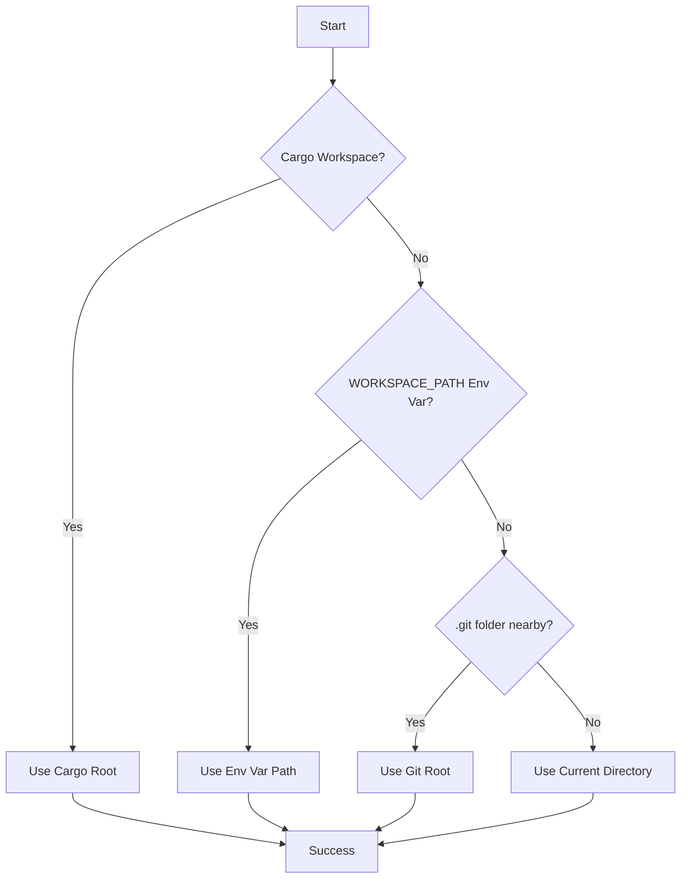

# workspace_tools

[](https://crates.io/crates/workspace_tools)
[](https://docs.rs/workspace_tools)
[](https://opensource.org/licenses/MIT)
[](#-testing)

**Stop fighting with file paths in Rust. `workspace_tools` provides foolproof, workspace-relative path resolution that works everywhere: in your tests, binaries, and examples, regardless of the execution context.**

It's the missing piece of the Rust development workflow that lets you focus on building, not on debugging broken paths.

## 🎯 The Problem: Brittle File Paths

Every Rust developer has faced this. Your code works on your machine, but breaks in CI or when run from a different directory.

```rust
// ❌ Brittle: This breaks if you run `cargo test` or execute the binary from a subdirectory.
let config = std::fs::read_to_string( "../../config/app.toml" )?;

// ❌ Inconsistent: This relies on the current working directory, which is unpredictable.
let data = Path::new( "./data/cache.db" );
```

## ✅ The Solution: A Reliable Workspace Anchor

`workspace_tools` gives you a stable anchor to your project's root, making all file operations simple and predictable.

```rust
use workspace_tools::workspace;

// ✅ Reliable: This works from anywhere.
let ws = workspace()?; // Automatically finds your project root!
let config = std::fs::read_to_string( ws.join( "config/app.toml" ) )?;
let data = ws.data_dir().join( "cache.db" ); // Use standard, predictable directories.
```

---

## 🚀 Quick Start in 60 Seconds

Get up and running with a complete, working example in less than a minute.

**1. Add the Dependency**

In your project's root directory, run:
```bash
cargo add workspace_tools
```

**2. Use it in Your Code**

`workspace_tools` automatically finds your project root by looking for the `Cargo.toml` file that contains your `[workspace]` definition. **No configuration is required.**

<details>
<summary><strong>Click to see a complete `main.rs` example</strong></summary>

```rust
use workspace_tools::workspace;
use std::fs;
use std::path::Path;

fn main() -> Result< (), Box< dyn std::error::Error > >
{
  // 1. Get the workspace instance. It just works!
  let ws = workspace()?;
  println!( "✅ Workspace Root Found: {}", ws.root().display() );

  // 2. Create a path to a config file in the standard `/config` directory.
  let config_path = ws.config_dir().join( "app.toml" );
  println!( "⚙️  Attempting to read config from: {}", config_path.display() );

  // 3. Let's create a dummy config file to read.
  // In a real project, this file would already exist.
  setup_dummy_config( &config_path )?;

  // 4. Now, reliably read the file. This works from anywhere!
  let config_content = fs::read_to_string( &config_path )?;
  println!( "\n🎉 Successfully read config file! Content:\n---" );
  println!( "{}", config_content.trim() );
  println!( "---" );

  Ok( () )
}

// Helper function to create a dummy config file for the example.
fn setup_dummy_config( path : &Path ) -> Result< (), std::io::Error >
{
  if let Some( parent ) = path.parent()
  {
    fs::create_dir_all( parent )?;
  }
  fs::write( path, "[server]\nhost = \"127.0.0.1\"\nport = 8080\n" )?;
  Ok( () )
}
```
</details>

**3. Run Your Application**

Run your code from different directories to see `workspace_tools` in action:

```bash
# Run from the project root (this will work)
cargo run

# Run from a subdirectory (this will also work!)
cd src
cargo run
```
You have now eliminated brittle, context-dependent file paths from your project!

---

## 📁 A Standard for Project Structure

`workspace_tools` helps standardize your projects, making them instantly familiar to you, your team, and your tools.

```
your-project/
├── .cargo/
├── secret/             # (Optional) Securely manage secrets
├── .workspace/          # Internal workspace metadata
├── Cargo.toml           # Your workspace root
├── config/              # ( ws.config_dir() ) Application configuration
├── data/                # ( ws.data_dir() )   Databases, caches, user data
├── docs/                # ( ws.docs_dir() )   Project documentation
├── logs/                # ( ws.logs_dir() )   Runtime log files
├── src/
└── tests/               # ( ws.tests_dir() )  Integration tests & fixtures
```

---

## 🔧 Optional Features

Enable additional functionality as needed in your `Cargo.toml`:

**Serde Integration** (`serde`) - *enabled by default*
Load `.toml`, `.json`, and `.yaml` files directly into structs.

```rust
#[ derive( Deserialize ) ]
struct AppConfig { name: String, port: u16 }

let config: AppConfig = workspace()?.load_config( "app" )?; // Supports .toml, .json, .yaml
```

**Resource Discovery** (`glob`)
Find files with glob patterns like `src/**/*.rs`.

```rust
let rust_files = workspace()?.find_resources( "src/**/*.rs" )?;
```

**Secret Management** (`secrets`)
Load secrets from `secret/` directory with environment fallbacks. Supports both `KEY=VALUE` format and shell `export KEY=VALUE` statements.

```rust
let api_key = workspace()?.load_secret_key( "API_KEY", "-secrets.sh" )?;
```

**Memory-Safe Secret Handling** (`secure`)
Advanced secret management with memory-safe `SecretString` types and automatic injection.

```rust
use secrecy::ExposeSecret;

// Memory-safe secret loading
let secrets = workspace()?.load_secrets_secure( "-secrets.sh" )?;
let api_key = secrets.get( "API_KEY" ).unwrap();
println!( "API Key: {}", api_key.expose_secret() );

// Template-based secret injection into configuration files
let config = workspace()?.load_config_with_secret_injection( "config.toml", "-secrets.sh" )?;

// Secret strength validation
workspace()?.validate_secret( "weak123" )?; // Returns error for weak secrets
```

**Config Validation** (`validation`)
Schema-based validation for configuration files.

```rust
let config: AppConfig = workspace()?.load_config_with_validation( "app" )?;
```

---

## 🔐 Advanced Security Features

### Type-Safe Secret Injection

The `SecretInjectable` trait allows automatic injection of secrets into configuration types with compile-time safety:

```rust
use workspace_tools::{ workspace, SecretInjectable };

#[derive(Debug)]
struct AppConfig 
{
    database_url: String,
    api_key: String,
}

impl SecretInjectable for AppConfig 
{
    fn inject_secret(&mut self, key: &str, value: String) -> workspace_tools::Result<()> 
{
        match key {
            "DATABASE_URL" => self.database_url = value,
            "API_KEY" => self.api_key = value,
            _ => return Err(workspace_tools::WorkspaceError::SecretInjectionError(
                format!("unknown secret key: {}", key)
            )),
        }
        Ok(())
    }

    fn validate_secrets(&self) -> workspace_tools::Result<()> 
{
        if self.api_key.is_empty() {
            return Err(workspace_tools::WorkspaceError::SecretValidationError(
                "api_key cannot be empty".to_string()
            ));
        }
        Ok(())
    }
}

let ws = workspace()?;
let mut config = AppConfig { database_url: String::new(), api_key: String::new() };
config = ws.load_config_with_secrets(config, "-secrets.sh")?; // Automatically validates
```

### Security Best Practices

- **Memory Safety**: All secrets wrapped in `SecretString` types that prevent accidental exposure
- **Debug Protection**: Secrets are automatically redacted from debug output
- **Explicit Access**: Secrets require explicit `expose_secret()` calls for access
- **Validation**: Built-in secret strength validation rejects weak passwords
- **Zeroization**: Secrets are automatically cleared from memory when dropped

---

## 🛠️ Built for the Real World

`workspace_tools` is designed for production use, with features that support robust testing and flexible deployment.

### Testing with Confidence

Create clean, isolated environments for your tests.

```rust
// In tests/my_test.rs
#![ cfg( feature = "integration" ) ]
use workspace_tools::testing::create_test_workspace_with_structure;
use std::fs;

#[ test ]
fn my_feature_test()
{
  // Creates a temporary, isolated workspace that is automatically cleaned up.
  let ( _temp_dir, ws ) = create_test_workspace_with_structure();

  // Write test-specific files without polluting your project.
  let config_path = ws.config_dir().join( "test_config.toml" );
  fs::write( &config_path, "[settings]\nenabled = true" ).unwrap();

  // ... your test logic here ...
}
```

### Flexible Deployment

Because `workspace_tools` can be configured via `WORKSPACE_PATH`, it adapts effortlessly to any environment.

**Dockerfile:**
```dockerfile
# Your build stages...

# Final stage
FROM debian:bookworm-slim
WORKDIR /app
ENV WORKSPACE_PATH=/app # Set the workspace root inside the container.

COPY --from=builder /app/target/release/my-app .
COPY config/ ./config/
COPY assets/ ./assets/

CMD ["./my-app"] # Your app now runs with the correct workspace context.
```

### Resilient by Design

`workspace_tools` has a smart fallback strategy to find your workspace root, ensuring it always finds a sensible path.



---

## 📚 API Reference

### Core Methods

```rust
// Workspace creation and path operations
let ws = workspace()?;                    // Auto-detect workspace root
let ws = Workspace::new( "/path/to/root" ); // Explicit path
let path = ws.join( "relative/path" );    // Join paths safely
let root = ws.root();                     // Get workspace root

// Standard directories
let config = ws.config_dir();             // ./config/
let data = ws.data_dir();                 // ./data/
let logs = ws.logs_dir();                 // ./logs/
let docs = ws.docs_dir();                 // ./docs/
```

### Configuration Loading

```rust
// Load configuration files (supports .toml, .json, .yaml)
let config: MyConfig = ws.load_config( "app" )?;
let config: MyConfig = ws.load_config_from( "config/app.toml" )?;

// Layered configuration (loads multiple files and merges)
let config: MyConfig = ws.load_config_layered( &[ "base", "dev" ] )?;

// Configuration with validation
let config: MyConfig = ws.load_config_with_validation( "app" )?;
```

### Secret Management

```rust
// Basic secret loading
let secrets = ws.load_secrets_from_file( "-secrets.sh" )?;
let api_key = ws.load_secret_key( "API_KEY", "-secrets.sh" )?;

// Memory-safe secret handling (requires 'secure' feature)
let secrets = ws.load_secrets_secure( "-secrets.sh" )?;
let api_key = ws.load_secret_key_secure( "API_KEY", "-secrets.sh" )?;
let token = ws.env_secret( "GITHUB_TOKEN" );

// Secret validation and injection
ws.validate_secret( "password123" )?; // Validates strength
let config_text = ws.load_config_with_secret_injection( "app.toml", "-secrets.sh" )?;
let config: MyConfig = ws.load_config_with_secrets( my_config, "-secrets.sh" )?;
```

### Resource Discovery

```rust
// Find files with glob patterns (requires 'glob' feature)  
let rust_files = ws.find_resources( "src/**/*.rs" )?;
let configs = ws.find_resources( "config/**/*.{toml,json,yaml}" )?;

// Find configuration files with priority ordering
let config_path = ws.find_config( "app" )?; // Looks for app.toml, app.json, app.yaml
```

---

## 🤝 Contributing

This project thrives on community contributions. Whether it's reporting a bug, suggesting a feature, or writing code, your help is welcome! Please see our task list and contribution guidelines.

## ⚖️ License

This project is licensed under the **MIT License**.
