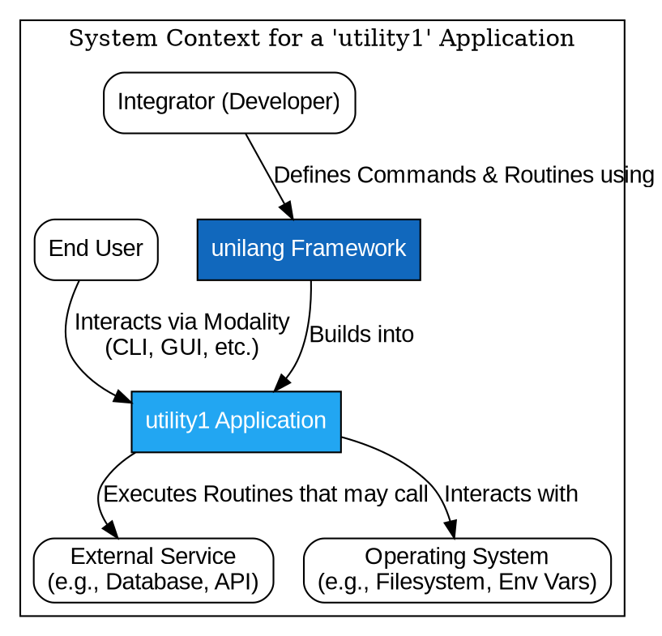

# spec

- **Name:** Unilang Framework
- **Version:** 2.1.0
- **Date:** 2025-07-31

### Table of Contents
*   **Part I: Public Contract (Mandatory Requirements)**
    *   1. Introduction & Core Concepts
    *   2. Quick Start Example
    *   3. Language Syntax & Processing (CLI)
    *   4. Core Data Structures & Usage Examples
    *   5. Non-Functional Requirements
    *   6. Interaction Modalities (CLI, Web API)
    *   7. Global Arguments & Configuration
    *   8. Cross-Cutting Concerns (Error Handling, Security)
*   **Part II: Internal Design (Design Recommendations)**
    *   9. Architectural Mandates & Design Principles
    *   10. Architectural Diagrams
    *   11. Interpreter / Execution Engine
    *   12. Crate-Specific Responsibilities
*   **Part III: Project & Process Governance**
    *   13. Project Management (Goals, Scope, Metrics)
    *   14. Deliverables
    *   15. Core Principles of Development
    *   16. Appendices
*   **Appendix: Addendum**
    *   Conformance Checklist
    *   Finalized Internal Design Decisions
    *   Finalized Internal Data Models
    *   Environment Variables
    *   Finalized Library & Tool Versions
    *   Deployment Checklist

---
## Part I: Public Contract (Mandatory Requirements)
*This part of the specification defines the stable, externally visible promises of the `unilang` framework. All requirements in this section are mandatory.*

### 1. Introduction & Core Concepts

This document is the single source of truth for the `unilang` framework. It defines the language, its components, and the responsibilities of its constituent crates.

#### 1.1. Vision: Define Once, Use Everywhere

`unilang` provides a unified way to define command-line utility interfaces once, automatically enabling consistent interaction across multiple modalities such as CLI, GUI, TUI, and Web APIs. The core goals are:

1.  **Consistency:** A single way to define commands and their arguments, regardless of how they are presented or invoked.
2.  **Discoverability:** Easy ways for users and systems to find available commands and understand their usage.
3.  **Flexibility:** Support for various methods of command definition (compile-time, run-time, declarative, procedural).
4.  **Extensibility:** Provide structures that enable an integrator to build an extensible system with compile-time `Extension Module`s and run-time command registration.
5.  **Efficiency:** Support for efficient parsing and command dispatch. The architecture **must** support near-instantaneous lookup for large sets (100,000+) of statically defined commands by performing maximum work at compile time.
6.  **Interoperability:** Standardized representation for commands, enabling integration with other tools or web services, including auto-generation of WEB endpoints.
7.  **Robustness:** Clear error handling and validation mechanisms.
8.  **Security:** Provide a framework for defining and enforcing secure command execution.

#### 1.2. Scope: A Multi-Crate Framework

The Unilang specification governs a suite of related crates that work together to provide the full framework functionality. The primary crates **must** be:

*   **`unilang`**: The core framework crate that orchestrates parsing, semantic analysis, execution, and modality management.
*   **`unilang_parser`**: A dedicated, low-level crate responsible for the lexical and syntactic analysis of the `unilang` command language.
*   **`unilang_meta`**: A companion crate providing procedural macros to simplify compile-time command definition.

#### 1.3. System Actors

*   **`Integrator (Developer)`**: The primary human actor who uses the `unilang` framework to build a `utility1` application.
*   **`End User`**: A human actor who interacts with the compiled `utility1` application through one of its exposed `Modalities`.
*   **`Operating System`**: A system actor that provides the execution environment (CLI shell, file system, environment variables).
*   **`External Service`**: Any external system (e.g., a database, a web API) that a command `Routine` might interact with.

#### 1.4. Ubiquitous Language (Vocabulary)

*   **`unilang`**: This specification and the core framework crate.
*   **`utility1`**: A generic placeholder for the primary application that implements `unilang`.
*   **`Command Lexicon`**: The complete set of all commands available to `utility1`.
*   **`Command Registry`**: The runtime data structure that implements the `Command Lexicon`.
*   **`Command Manifest`**: An external file (e.g., YAML/JSON) that declares `CommandDefinition`s for runtime loading.
*   **`Command`**: A specific action identified by its `FullName`.
*   **`FullName`**: The complete, unique, dot-separated path identifying a command (e.g., `.files.copy`).
*   **`Namespace`**: A logical grouping for commands.
*   **`CommandDefinition` / `ArgumentDefinition`**: The canonical metadata for a command or argument.
*   **`Routine`**: The executable code associated with a command.
*   **`Modality`**: A specific way of interacting with `utility1` (e.g., CLI, GUI).
*   **`GenericInstruction`**: The output of the `unilang_parser`.
*   **`VerifiedCommand`**: A command that has passed semantic analysis and is ready for execution.
*   **`ExecutionContext`**: An object providing routines with access to global settings and services.
*   **`OutputData` / `ErrorData`**: Standardized structures for returning results.

### 2. Quick Start Example

This example shows the complete flow from command definition to execution in the simplest possible way.

```rust
// Source: examples/00_quick_start.rs
use unilang::prelude::*;

fn main() -> Result<(), unilang::Error> {
    // Create a command registry
    let mut registry = CommandRegistry::new();

    // Define a simple greeting command
    let greet_cmd = CommandDefinition {
        name: "greet".to_string(),
        namespace: String::new(),  // Global namespace
        description: "A friendly greeting command".to_string(),
        hint: "Says hello to someone".to_string(),
        arguments: vec![
            ArgumentDefinition {
                name: "name".to_string(),
                description: "Name of the person to greet".to_string(),
                kind: Kind::String,
                hint: "Your name".to_string(),
                attributes: ArgumentAttributes {
                    optional: true,
                    default: Some("World".to_string()),
                    ..Default::default()
                },
                validation_rules: vec![],
                aliases: vec!["n".to_string()],
                tags: vec![],
            }
        ],
        aliases: vec!["hello".to_string()],
        status: "stable".to_string(),
        version: "1.0.0".to_string(),
        tags: vec![],
        permissions: vec![],
        idempotent: true,
        deprecation_message: String::new(),
        http_method_hint: String::new(),
        examples: vec![],
        routine_link: None,
    };

    // Define the command's execution logic
    let greet_routine = Box::new(|cmd: VerifiedCommand, _ctx: ExecutionContext| {
        let name = match cmd.arguments.get("name") {
            Some(Value::String(s)) => s.clone(),
            _ => "World".to_string(),
        };

        println!("Hello, {}!", name);

        Ok(OutputData {
            content: format!("Hello, {}!", name),
            format: "text".to_string(),
        })
    });

    // Register the command
    registry.command_add_runtime(&greet_cmd, greet_routine)?;

    // Use the Pipeline API to execute commands
    let pipeline = Pipeline::new(registry);

    // Execute a command
    let result = pipeline.process_command_simple("greet name::Alice");
    println!("Success: {}", result.success);
    println!("Output: {}", result.outputs.content);

    Ok(())
}
```

### 3. Language Syntax & Processing (CLI)

This section defines the public contract for the CLI modality's syntax. The `unilang_parser` crate **must** be the reference implementation for this section.

#### 3.1. Unified Processing Pipeline

The interpretation of a `unilang` CLI string **must** proceed through the following phases:

1.  **Phase 1: Syntactic Analysis (String to `GenericInstruction`)**: The `unilang_parser` crate consumes the input string and produces a `Vec<unilang_parser::GenericInstruction>`. This phase has no knowledge of command definitions.
2.  **Phase 2: Semantic Analysis (`GenericInstruction` to `VerifiedCommand`)**: The `unilang` crate validates each `GenericInstruction` against the `CommandRegistry`. The command name is resolved, arguments are bound, types are checked, and validation rules are applied.
3.  **Phase 3: Execution**: The `unilang` crate's Interpreter invokes the `Routine` for each `VerifiedCommand`.

#### 3.2. Naming Conventions

*   **Command & Namespace Segments:** **Must** consist of lowercase alphanumeric characters (`a-z`, `0-9`) and underscores (`_`). Dots (`.`) are used exclusively as separators.
*   **Argument Names & Aliases:** **Must** consist of lowercase alphanumeric characters and may use `kebab-case`.

#### 3.3. Parsing Rules and Precedence

The parser **must** adhere to the following rules in order:

*   **Rule 0: Whitespace Separation**: Whitespace separates tokens and is not part of a token's value unless inside a quoted string.
*   **Rule 1: Command Path Identification**: The command path is the longest possible sequence of dot-separated identifiers at the beginning of an expression.
*   **Rule 2: Transition to Arguments**: The command path ends upon encountering the first token that is not a valid, dot-separated identifier segment (e.g., `::`, a quoted string, `?`).
*   **Rule 3: Dot (`.`) Operator Rules**: A single leading dot is permitted and ignored. A trailing dot is a syntax error.
*   **Rule 4: Help Operator (`?`)**: The `?` operator marks the instruction for help generation and **must** be the final token.
*   **Rule 5: Argument Types**: Any token after the command path that is not a named argument is a positional argument. A named argument **must** use the `name::value` syntax.

### 4. Core Data Structures & Usage Examples

These structures form the primary API surface for an `Integrator`. The fields listed here are definitive and reflect the final implementation in `unilang/src/data.rs`.

#### 4.1. `CommandDefinition` Anatomy

| Field | Type | Mandatory | Description |
| :--- | :--- | :--- | :--- |
| `name` | `String` | Yes | The final segment of the command's name (e.g., `copy`). |
| `namespace` | `String` | Yes | The `FullName` of the parent namespace (e.g., `.files`). An empty string signifies the root namespace. |
| `description` | `String` | Yes | A brief, one-line description of what the command does. |
| `hint` | `String` | No | A human-readable explanation of the command's purpose. |
| `arguments` | `Vec<ArgumentDefinition>` | No | A list of arguments the command accepts. |
| `routine_link` | `Option<String>` | No | For manifest-loaded commands, a string linking to a pre-compiled routine. |
| `permissions` | `Vec<String>` | No | A list of permission identifiers required for execution. |
| `status` | `String` | No (Default: `stable`) | Lifecycle state: `experimental`, `stable`, `deprecated`. |
| `version` | `String` | No | The SemVer version of the individual command (e.g., "1.0.2"). |
| `deprecation_message` | `String` | No | If `status` is `deprecated`, explains the reason and suggests alternatives. |
| `http_method_hint`| `String` | No | A suggested HTTP method (`GET`, `POST`, etc.) for the Web API modality. |
| `idempotent` | `bool` | No (Default: `false`) | If `true`, the command can be safely executed multiple times. |
| `examples` | `Vec<String>` | No | Illustrative usage examples for help text. |
| `aliases` | `Vec<String>` | No | A list of alternative names for the command. |
| `tags` | `Vec<String>` | No | Keywords for grouping or filtering commands. |

#### 4.2. `ArgumentDefinition` Anatomy

| Field | Type | Mandatory | Description |
| :--- | :--- | :--- | :--- |
| `name` | `String` | Yes | The unique (within the command) identifier. |
| `kind` | `Kind` | Yes | The data type of the argument's value. |
| `description` | `String` | No | A human-readable description of the argument's purpose. |
| `hint` | `String` | No | A short hint for the argument. |
| `attributes` | `ArgumentAttributes` | Yes | A struct containing behavioral flags. |
| `validation_rules`| `Vec<ValidationRule>` | No | Custom validation logic (e.g., `Min(10.0)`). |
| `aliases` | `Vec<String>` | No | A list of alternative short names (e.g., `s` for `source`). |
| `tags` | `Vec<String>` | No | Keywords for UI grouping (e.g., "Basic", "Advanced"). |

#### 4.3. `ArgumentAttributes` Anatomy

| Field | Type | Mandatory | Description |
| :--- | :--- | :--- | :--- |
| `optional` | `bool` | No (Default: `false`) | If `true`, the argument may be omitted. |
| `multiple` | `bool` | No (Default: `false`) | If `true`, the argument can be specified multiple times. |
| `default` | `Option<String>` | No | A string representation of the value to use if an optional argument is not provided. |
| `interactive` | `bool` | No (Default: `false`) | If `true`, modalities may prompt for input if the value is missing. |
| `sensitive` | `bool` | No (Default: `false`) | If `true`, the value **must** be protected (masked in UIs, redacted in logs). |

#### 4.4. Example: Basic Command Registration

This example demonstrates the fundamental concepts: creating a registry, defining a command with arguments, creating a routine, and registering the command.

```rust
// Source: examples/01_basic_command_registration.rs
use unilang::data::{ ArgumentAttributes, ArgumentDefinition, CommandDefinition, Kind, OutputData, ValidationRule };
use unilang::registry::CommandRegistry;
use unilang::types::Value;

// Step 1: Create the Command Registry
let mut registry = CommandRegistry::new();

// Step 2: Define a Command
let greet_command = CommandDefinition::former()
  .name( "greet" )
  .namespace( "".to_string() )
  .description( "A simple greeting command".to_string() )
  .arguments( vec![
    ArgumentDefinition {
      name: "name".to_string(),
      description: "Name of the person to greet".to_string(),
      kind: Kind::String,
      hint: "Person's name".to_string(),
      attributes: ArgumentAttributes {
        optional: true,
        default: Some("World".to_string()),
        ..Default::default()
      },
      validation_rules: vec![ ValidationRule::MinLength(1) ],
      aliases: vec![ "n".to_string() ],
      tags: vec![ "input".to_string() ],
    }
  ])
  .end();

// Step 3: Define the Execution Logic
let greet_routine = Box::new( | cmd : unilang::semantic::VerifiedCommand, _ctx |
{
    let name = match cmd.arguments.get( "name" )
    {
      Some( Value::String( n ) ) => n.clone(),
      _ => "World".to_string(),
    };
    let greeting = format!( "Hello, {}!", name );
    println!( "{}", greeting );
    Ok( OutputData { content : greeting, format : "text".to_string() })
});

// Step 4: Register the Command
registry.command_add_runtime( &greet_command, greet_routine )?;
```

#### 4.5. Example: Argument Types

The framework supports a rich set of argument types, each with automatic parsing.

*   **Basic Types**: `String`, `Integer`, `Float`, `Boolean`
*   **Path Types**: `Path`, `File`, `Directory`
*   **Complex Types**: `Url`, `DateTime`, `Pattern` (regex)
*   **Collections**: `List<T>`, `Map<K,V>`
*   **Special Types**: `Enum` (choices), `JsonString`, `Object`

```rust
// Source: examples/02_argument_types.rs
let types_demo = CommandDefinition::former()
  .name( "types_demo" )
  .arguments( vec![
    // String argument
    ArgumentDefinition {
      name: "text".to_string(),
      kind: Kind::String,
      validation_rules: vec![ ValidationRule::MinLength(3) ],
      ..Default::default()
    },
    // Integer argument
    ArgumentDefinition {
      name: "number".to_string(),
      kind: Kind::Integer,
      validation_rules: vec![ ValidationRule::Min(0.0), ValidationRule::Max(100.0) ],
      ..Default::default()
    },
    // Enum argument
    ArgumentDefinition {
      name: "level".to_string(),
      kind: Kind::Enum( vec![ "debug".to_string(), "info".to_string(), "warn".to_string(), "error".to_string() ] ),
      ..Default::default()
    },
  ])
  .end();
```

#### 4.6. Example: Collection Types

Lists and Maps can be defined with custom delimiters for flexible parsing.

```rust
// Source: examples/03_collection_types.rs
let collection_demo = CommandDefinition::former()
  .name( "collections.demo" )
  .arguments( vec![
    // List of integers with comma delimiter
    ArgumentDefinition {
      name: "numbers".to_string(),
      description: "A list of numbers separated by commas".to_string(),
      kind: Kind::List( Box::new( Kind::Integer ), Some( ',' ) ),
      ..Default::default()
    },
    // Map with custom delimiters
    ArgumentDefinition {
      name: "config".to_string(),
      description: "Configuration key-value pairs".to_string(),
      kind: Kind::Map (
        Box::new( Kind::String ),
        Box::new( Kind::String ),
        Some( ',' ), // entry delimiter
        Some( '=' )  // key-value delimiter
      ),
      ..Default::default()
    },
  ])
  .end();
```

#### 4.7. Example: Validation Rules

Built-in validators ensure arguments meet specified requirements before the routine is ever called.

```rust
// Source: examples/04_validation_rules.rs
let validation_demo = CommandDefinition::former()
  .name( "validation.demo" )
  .arguments( vec![
    // Numeric Range Validation
    ArgumentDefinition {
      name: "age".to_string(),
      description: "Person's age (must be 0-120)".to_string(),
      kind: Kind::Integer,
      validation_rules: vec![
        ValidationRule::Min(0.0),
        ValidationRule::Max(120.0)
      ],
      ..Default::default()
    },
    // Regex Pattern Validation
    ArgumentDefinition {
      name: "email".to_string(),
      description: "Email address (must match email pattern)".to_string(),
      kind: Kind::String,
      validation_rules: vec![
        ValidationRule::Pattern("^[a-zA-Z0-9._%+-]+@[a-zA-Z0-9.-]+\\.[a-zA-Z]{2,}$".to_string())
      ],
      ..Default::default()
    },
  ])
  .end();
```

### 5. Non-Functional Requirements

This section defines the system-wide quality attributes that the framework **must** adhere to.

1.  **Performance:** For a `utility1` application with 100,000 statically compiled commands, the p99 latency for resolving a command `FullName` in the `CommandRegistry` **must** be less than 1 millisecond on commodity hardware.
2.  **Security:** The framework **must** provide a mechanism to handle sensitive data via the `sensitive: true` attribute. Any modality or logging system using the framework **must** respect this flag by redacting the argument's value from logs and masking it in user interfaces.
3.  **Robustness:** The framework **must** provide clear, structured error handling (`ErrorData`) for all phases of command processing, using the standard error codes defined in this specification.
4.  **Extensibility:** The framework **must** support both compile-time (procedural) and run-time (declarative from manifests) registration of commands.
5.  **Consistency:** The framework **must** ensure that a command, once defined, behaves consistently across all supported modalities (CLI, Web API, etc.).

### 6. Interaction Modalities (CLI, Web API)

`unilang` definitions **must** be usable to drive various interaction modalities, ensuring consistent behavior regardless of the interface.

*   **6.1. CLI (Command Line Interface):** The primary modality. Its syntax and processing pipeline **must** adhere to the rules defined in Section 3.
*   **6.2. WEB Endpoints:**
    *   **Goal:** The framework **must** provide utilities to automatically generate a web API from `unilang` command specifications.
    *   **Mapping:** A command `.namespace.command` **must** map to an HTTP path (e.g., `/api/v1/namespace/command`).
    *   **Serialization:** Arguments **must** be passable as URL query parameters (`GET`) or a JSON body (`POST`/`PUT`). `OutputData` and `ErrorData` **must** be returned as JSON.
    *   **Discoverability:** An endpoint (e.g., `/openapi.json`) **must** be available to generate an OpenAPI v3+ specification. The content of this specification **must** be derived directly from the `CommandDefinition`, `ArgumentDefinition`, and `Namespace` metadata.

### 7. Global Arguments & Configuration

#### 7.1. `GlobalArgumentDefinition` Anatomy

The `Integrator` **must** define their global arguments using a structure containing the following information:

| Field | Type | Mandatory | Description |
| :--- | :--- | :--- | :--- |
| `name` | `String` | Yes | The unique name of the global argument (e.g., `output-format`). |
| `hint` | `String` | No | A human-readable description. |
| `kind` | `Kind` | Yes | The data type of the argument's value. |
| `env_var` | `String` | No | The name of an environment variable that can set this value. |

#### 7.2. Configuration Precedence

Configuration values **must** be resolved in the following order of precedence, where later sources override earlier ones:
1.  Default built-in values.
2.  System-wide configuration file.
3.  User-specific configuration file.
4.  Project-specific configuration file.
5.  Environment variables.
6.  CLI Global Arguments provided at invocation.

### 8. Cross-Cutting Concerns (Error Handling, Security)

#### 8.1. Error Handling (`ErrorData`)

Routines that fail **must** return an `ErrorData` object. The `code` field **must** use a standard identifier where possible.

*   **Standard Codes:** `UNILANG_COMMAND_NOT_FOUND`, `UNILANG_ARGUMENT_INVALID`, `UNILANG_ARGUMENT_MISSING`, `UNILANG_TYPE_MISMATCH`, `UNILANG_VALIDATION_RULE_FAILED`, `UNILANG_PERMISSION_DENIED`, `UNILANG_EXECUTION_ERROR`, `UNILANG_IO_ERROR`, `UNILANG_INTERNAL_ERROR`, `UNILANG_EXTERNAL_DEPENDENCY_ERROR`.

#### 8.2. Standard Output (`OutputData`)

Successful routines **must** return an `OutputData` object containing the `content` and a `format` hint.

#### 8.3. Security

*   **Permissions:** The `permissions` field on a `CommandDefinition` declares the rights needed for execution. The `utility1` `Interpreter` is responsible for checking these permissions before invoking a `Routine`.
*   **Sensitive Data:** Arguments marked `sensitive: true` **must** be protected. Their values **must not** be displayed in logs or user interfaces unless explicitly required by a secure context.

---
## Part II: Internal Design (Design Recommendations)
*This part of the specification describes the recommended internal architecture and implementation strategies. These are best-practice starting points, and the development team has the flexibility to modify them as needed.*

### 9. Architectural Mandates & Design Principles

It is recommended that the `unilang` ecosystem adhere to the following architectural rules to ensure consistency and maintainability.

#### 9.1. Parser Implementation (`unilang_parser`)

*   **Mandate:** The `unilang_parser` crate **should not** implement low-level string tokenization (splitting) logic from scratch. It **should** use the `strs_tools` crate as its core tokenization engine.
*   **Rationale:** This enforces a clean separation of concerns. `strs_tools` is a dedicated, specialized tool for string manipulation. By relying on it, `unilang_parser` can focus on its primary responsibility: syntactic analysis of the token stream, not the raw tokenization itself.

#### 9.2. Macro Implementation (`unilang_meta`)

*   **Mandate:** The `unilang_meta` crate **should** prefer using the `macro_tools` crate as its primary dependency for all procedural macro development.
*   **Rationale:** `macro_tools` not only re-exports `syn`, `quote`, and `proc-macro2`, but also provides a rich set of higher-level abstractions and utilities that simplify parsing, reduce boilerplate, and improve error handling.

#### 9.3. Framework Parsing (`unilang`)

*   **Mandate:** The `unilang` core framework **should** delegate all command expression parsing to the `unilang_parser` crate. It **should not** contain any of its own CLI string parsing logic.
*   **Rationale:** This enforces the architectural separation between syntactic analysis (the responsibility of `unilang_parser`) and semantic analysis (the responsibility of `unilang`).

### 10. Architectural Diagrams

#### 10.1. System Context Diagram


#### 10.2. High-Level Architecture Diagram
```dot
digraph {
    graph [rankdir="TB", bgcolor="transparent"];
    node [shape=box, style=rounded, fontname="Arial"];
    edge [fontname="Arial"];
    subgraph cluster_Ecosystem {
        label="unilang Ecosystem";
        Meta [label="unilang_meta"];
        Build [label="build.rs / Static Initializers"];
        StaticRegistry [label="Static Registry (PHF)"];
        Parser [label="unilang_parser"];
        Unilang [label="unilang Crate"];
        Manifest [label="Command Manifest (YAML/JSON)"];
        DynamicRegistry [label="Dynamic Registry (HashMap)"];

        subgraph cluster_Unilang {
            label="";
            rankdir=LR;
            node[shape=ellipse];
            SemanticAnalyzer [label="Semantic Analyzer"];
            Interpreter [label="Interpreter"];
            HybridRegistry [label="Hybrid Command Registry"];
            SemanticAnalyzer -> Interpreter;
            Interpreter -> HybridRegistry;
        }

        Meta -> Build [label="Generates Definitions at Compile Time"];
        Build -> StaticRegistry [label="Populates"];
        Parser -> Unilang [label="Produces GenericInstruction"];
        HybridRegistry -> StaticRegistry [label="Contains"];
        HybridRegistry -> DynamicRegistry [label="Contains"];
        Manifest -> Unilang [label="Loaded at Runtime by"];
        Unilang -> DynamicRegistry [label="Populates"];
    }
}
```

#### 10.3. Sequence Diagram: Unified Processing Pipeline
```dot
sequenceDiagram
    participant User
    participant CLI
    participant Parser as unilang_parser
    participant SemanticAnalyzer as unilang::SemanticAnalyzer
    participant Interpreter as unilang::Interpreter
    participant Routine

    User->>CLI: Enters "utility1 .files.copy src::a.txt"
    CLI->>Parser: parse_single_instruction("...")
    activate Parser
    Parser-->>CLI: Returns Vec<GenericInstruction>
    deactivate Parser
    CLI->>SemanticAnalyzer: analyze(instructions)
    activate SemanticAnalyzer
    SemanticAnalyzer-->>CLI: Returns Vec<VerifiedCommand>
    deactivate SemanticAnalyzer
    CLI->>Interpreter: run(verified_commands)
    activate Interpreter
    Interpreter->>Routine: execute(command, context)
    activate Routine
    Routine-->>Interpreter: Returns Result<OutputData, ErrorData>
    deactivate Routine
    Interpreter-->>CLI: Returns final Result
    deactivate Interpreter
    CLI->>User: Displays formatted output or error
```

### 11. Interpreter / Execution Engine

It is recommended that the Interpreter, an internal `unilang` component, be responsible for:
1.  **Routine Invocation:** Retrieving and calling the `Routine` linked to a `VerifiedCommand`.
2.  **Context Preparation:** Preparing and passing the `ExecutionContext` to the `Routine`.
3.  **Result Handling:** Receiving the `Result` from the `Routine` and passing it to the active `Modality`.
4.  **Sequential Execution:** Executing commands from a `;;` sequence in order.

### 12. Crate-Specific Responsibilities

*   **`unilang` (Core Framework):** Recommended to be the central orchestrator, implementing the `CommandRegistry`, `SemanticAnalyzer`, `Interpreter`, and all core data structures.
*   **`unilang_parser` (Parser):** Recommended to be the dedicated lexical and syntactic analyzer, implementing Section 3 of this specification.
*   **`unilang_meta` (Macros):** Recommended to provide procedural macros for a simplified developer experience at compile-time.

---
## Part III: Project & Process Governance
*This part of the specification defines the project's goals, scope, and the rules governing its development process.*

### 13. Project Management (Goals, Scope, Metrics)

#### 13.1. Goals
The core goals of `unilang` are to provide a framework for command-line utilities that is Consistent, Discoverable, Flexible, Extensible, Efficient, Interoperable, Robust, and Secure.

#### 13.2. Out of Scope
The `unilang` framework is responsible for the command interface, not the business logic itself. The following are explicitly out of scope:
*   Transactional Guarantees for command sequences.
*   Inter-command state management beyond the `ExecutionContext`.
*   The business logic implementation inside a `Routine`.

#### 13.3. Success Metrics
*   **Performance:** The p99 latency for resolving a command `FullName` in a registry of 100,000 static commands **must** be less than 1 millisecond.
*   **Adoption:** The framework is considered successful if it is used to build at least three distinct `utility1` applications with different modalities.

#### 13.4. Open Questions
1.  **Custom Type Registration:** What is the API and process for an `Integrator` to define a new custom `Kind` and register its associated parsing and validation logic with the framework?

### 14. Deliverables

Upon completion, the project will deliver the following artifacts:
1.  The published `unilang` Rust crate on crates.io.
2.  The published `unilang_parser` Rust crate on crates.io.
3.  The published `unilang_meta` Rust crate on crates.io.
4.  A comprehensive set of examples in the source code repository.
5.  Generated API documentation hosted on docs.rs.

### 15. Core Principles of Development

#### 15.1. Single Source of Truth
The project's Git repository **must** be the absolute single source of truth for all project-related information, including specifications, documentation, and source code.

#### 15.2. Documentation-First Development
All changes to the system's functionality or architecture **must** be documented in the relevant specification files *before* implementation begins.

#### 15.3. Review-Driven Change Control
All modifications to the repository, without exception, **must** go through a formal Pull Request review.

#### 15.4. Radical Transparency and Auditability
All significant decisions and discussions **must** be captured in writing within the relevant Pull Request or a linked issue tracker.

#### 15.5. File Naming Conventions
All file names within the project repository **must** use lowercase `snake_case`.

### 16. Appendices

#### 16.1. Formal Grammar for CLI Syntax (Simplified)
```bnf
<invocation> ::= <utility_name> <global_args_opt> <command_sequence>
<command_sequence> ::= <command_expression> (";;" <command_sequence>)?
<command_expression> ::= <command_path> (<argument_list>)? ("?")?
<command_path> ::= ("."?) <segment> ("." <segment>)*
<argument_list> ::= (<named_arg> | <positional_arg>)+
<named_arg> ::= <IDENTIFIER> "::" <value>
<positional_arg> ::= <value>
<value> ::= <IDENTIFIER> | <QUOTED_STRING>
```

#### 16.2. Command Syntax Cookbook

*   **Basic Commands:**
    ```sh
    utility1 .ping
    utility1 .network.diagnostics.ping
    ```
*   **Positional vs. Named Arguments:**
    ```sh
    # Positional (assumes 'message' is a default argument)
    utility1 .log "This is a log message"
    # Named (standard)
    utility1 .files.copy from::/src/file.txt to::/dest/file.txt
    # Named with Aliases
    utility1 .files.copy f::/src/file.txt t::/dest/file.txt
    ```
*   **Quoting and Escaping:**
    ```sh
    # Value with spaces
    utility1 .files.create path::"/home/user/My Documents/report.txt"
    ```
*   **Collections:**
    ```sh
    # List of strings
    utility1 .posts.create tags::dev,rust,unilang
    # Map of strings
    utility1 .network.request headers::Content-Type=application/json,Auth-Token=xyz
    ```
*   **Command Sequences and Help:**
    ```sh
    # Sequence
    utility1 .archive.create name::backup.zip ;; .cloud.upload file::backup.zip
    # Help for a command
    utility1 .archive.create ?
    ```

---
### Appendix: Addendum
*This appendix is intended for developer use during implementation. It captures as-built details and serves as a living document during the development cycle.*

#### Purpose
This document is intended to be completed by the **Developer** during the implementation phase. It is used to capture the final, as-built details of the **Internal Design**, especially where the implementation differs from the initial `Design Recommendations` in `specification.md`.

#### Instructions for the Developer
As you build the system, please use this document to log your key implementation decisions, the final data models, environment variables, and other details. This creates a crucial record for future maintenance, debugging, and onboarding.

---

#### Conformance Checklist
*This checklist is the definitive list of acceptance criteria for the project. Before final delivery, each item must be verified as complete and marked with `✅`. Use the 'Verification Notes' column to link to evidence (e.g., test results, screen recordings).*

| Status | Requirement | Verification Notes |
| :--- | :--- | :--- |
| ❌ | *(No Functional Requirements or User Stories have been defined yet)* | |

#### Finalized Internal Design Decisions
*A space for the developer to document key implementation choices for the system's internal design, especially where they differ from the initial recommendations in `specification.md`.*

-   **Decision 1 (Routine Linking):** The `routine_link` mechanism will be implemented using a `HashMap<String, Routine>`. `utility1` integrators will be responsible for registering their linkable functions into this map at startup. Dynamic library loading was deemed too complex for v1.0.
-   **Decision 2 (PHF Crate Selection):** The `phf` crate (version `0.11.2`) was chosen for the static registry implementation due to its robust build-time code generation and minimal runtime overhead.

#### Finalized Internal Data Models
*The definitive, as-built schema for all databases, data structures, and objects used internally by the system.*

-   **`CommandRegistry` Struct:**
    ```rust
    pub struct CommandRegistry {
        // Using a single HashMap for simplicity in v1, as PHF generation
        // requires a more complex build process. The performance NFR
        // will be met by this for a moderate number of commands.
        commands: HashMap<String, CommandDefinition>,
        routines: HashMap<String, CommandRoutine>,
    }
    ```

#### Environment Variables
*List all environment variables required to run the application. Include the variable name, a brief description of its purpose, and an example value (use placeholders for secrets).*

| Variable | Description | Example |
| :--- | :--- | :--- |
| `UTILITY1_CONFIG_PATH` | Overrides the default search path for the user-specific configuration file. | `/etc/utility1/main.toml` |
| `UTILITY1_LOG_LEVEL` | Sets the logging verbosity for the current invocation. | `debug` |

#### Finalized Library & Tool Versions
*List the critical libraries, frameworks, or tools used and their exact locked versions (e.g., from `Cargo.lock`).*

-   `rustc`: `1.78.0`
-   `serde`: `1.0.203`
-   `serde_yaml`: `0.9.34`
-   `strs_tools`: `0.19.0`
-   `macro_tools`: `0.57.0`

#### Deployment Checklist
*A step-by-step guide for deploying the application from scratch. This is not applicable for a library, but would be used by an `Integrator`.*

1.  Set up the `.env` file using the template above.
2.  Run `cargo build --release`.
3.  Place the compiled binary in `/usr/local/bin`.
