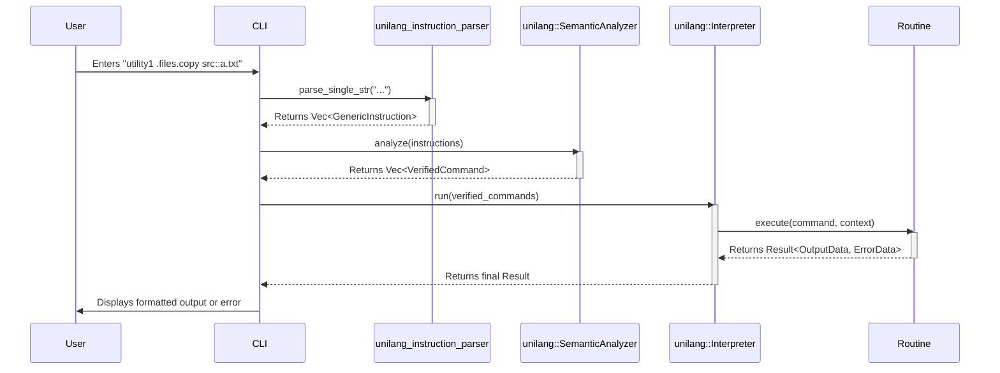

# Unilang Framework Specification

**Version:** 2.0.0
**Status:** Final

---

### 0. Introduction & Core Concepts

**Design Focus: `Strategic Context`**

This document is the single source of truth for the `unilang` framework. It defines the language, its components, and the responsibilities of its constituent crates.

#### 0.1. Scope: A Multi-Crate Framework

The Unilang specification governs a suite of related crates that work together to provide the full framework functionality. This document is the canonical specification for all of them. The primary crates are:

*   **`unilang`**: The core framework crate that orchestrates parsing, semantic analysis, execution, and modality management.
*   **`unilang_instruction_parser`**: A dedicated, low-level crate responsible for the lexical and syntactic analysis of the `unilang` command language (implements Section 2 of this spec).
*   **`unilang_meta`**: A companion crate providing procedural macros to simplify compile-time command definition (implements parts of Section 3.4).

#### 0.2. Goals of `unilang`

`unilang` provides a unified way to define command-line utility interfaces once, automatically enabling consistent interaction across multiple modalities such as CLI, GUI, TUI, and Web APIs. The core goals are:

1.  **Consistency:** A single way to define commands and their arguments, regardless of how they are presented or invoked.
2.  **Discoverability:** Easy ways for users and systems to find available commands and understand their usage.
3.  **Flexibility:** Support for various methods of command definition (compile-time, run-time, declarative, procedural).
4.  **Extensibility:** Provide structures that enable an integrator to build an extensible system with compile-time `Extension Module`s and run-time command registration.
5.  **Efficiency:** Support for efficient parsing and command dispatch. The architecture **must** support near-instantaneous lookup for large sets (100,000+) of statically defined commands by performing maximum work at compile time.
6.  **Interoperability:** Standardized representation for commands, enabling integration with other tools or web services, including auto-generation of WEB endpoints.
7.  **Robustness:** Clear error handling and validation mechanisms.
8.  **Security:** Provide a framework for defining and enforcing secure command execution.

#### 0.3. System Actors

*   **`Integrator (Developer)`**: The primary human actor who uses the `unilang` framework to build a `utility1` application. They define commands, write routines, and configure the system.
*   **`End User`**: A human actor who interacts with the compiled `utility1` application through one of its exposed `Modalities` (e.g., CLI, GUI).
*   **`Operating System`**: A system actor that provides the execution environment, including the CLI shell, file system, and environment variables that `utility1` consumes for configuration.
*   **`External Service`**: Any external system (e.g., a database, a web API, another process) that a command `Routine` might interact with.

#### 0.4. Key Terminology (Ubiquitous Language)

*   **`unilang`**: This specification and the core framework crate.
*   **`utility1`**: A generic placeholder for the primary application that implements and interprets `unilang`.
*   **`Command Lexicon`**: The complete set of all commands available to `utility1` at any given moment.
*   **`Command Registry`**: The runtime data structure that implements the `Command Lexicon`.
*   **`Command Manifest`**: An external file (e.g., in YAML or JSON format) that declares `CommandDefinition`s for runtime loading.
*   **`Command`**: A specific action that can be invoked, identified by its `FullName`.
*   **`FullName`**: The complete, unique, dot-separated path identifying a command (e.g., `.files.copy`).
*   **`Namespace`**: A logical grouping for commands and other namespaces.
*   **`CommandDefinition` / `ArgumentDefinition`**: The canonical metadata for a command or argument.
*   **`Routine`**: The executable code (handler function) associated with a command. Its signature is `fn(VerifiedCommand, ExecutionContext) -> Result<OutputData, ErrorData>`.
*   **`Modality`**: A specific way of interacting with `utility1` (e.g., CLI, GUI).
*   **`parser::GenericInstruction`**: The output of the `unilang_instruction_parser`.
*   **`VerifiedCommand`**: A command that has passed semantic analysis and is ready for execution.
*   **`ExecutionContext`**: An object providing routines with access to global settings and services.
*   **`OutputData` / `ErrorData`**: Standardized structures for returning success or failure results.

---

### 1. Architectural Mandates & Design Principles

This section outlines the non-negotiable architectural rules and mandatory dependencies for the `unilang` ecosystem. Adherence to these principles is required to ensure consistency, maintainability, and correctness across the framework.

#### 1.1. Parser Implementation (`unilang_instruction_parser`)

*   **Mandate:** The `unilang_instruction_parser` crate **must not** implement low-level string tokenization (splitting) logic from scratch. It **must** use the `strs_tools` crate as its core tokenization engine.
*   **Rationale:** This enforces a clean separation of concerns. `strs_tools` is a dedicated, specialized tool for string manipulation. By relying on it, `unilang_instruction_parser` can focus on its primary responsibility: syntactic analysis of the token stream, not the raw tokenization itself.

##### Overview of `strs_tools`

`strs_tools` is a utility library for advanced string splitting and tokenization. Its core philosophy is to provide a highly configurable, non-allocating iterator over a string, giving the consumer fine-grained control over how the string is divided.

*   **Key Principle:** The library intentionally does **not** interpret escape sequences (e.g., `\"`). It provides raw string slices, leaving the responsibility of unescaping to the consumer (`unilang_instruction_parser`).
*   **Usage Flow:** The typical workflow involves using a fluent builder pattern:
    1.  Call `strs_tools::string::split::split()` to get a builder (`SplitOptionsFormer`).
    2.  Configure it with methods like `.delimeter()`, `.quoting(true)`, etc.
    3.  Call `.perform()` to get a `SplitIterator`.
    4.  Iterate over the `Split` items, which contain the string slice and metadata about the token.

*   **Recommended Components:**
    *   **`strs_tools::string::split::split()`**: The main entry point function that returns the builder.
    *   **`SplitOptionsFormer`**: The builder for setting options. Key methods include:
        *   `.delimeter( &[" ", "::", ";;"] )`: To define what separates tokens.
        *   `.quoting( true )`: To make the tokenizer treat quoted sections as single tokens.
        *   `.preserving_empty( false )`: To ignore empty segments resulting from consecutive delimiters.
    *   **`SplitIterator`**: The iterator produced by the builder.
    *   **`Split`**: The struct yielded by the iterator, containing the `string` slice, its `typ` (`Delimiter` or `Delimited`), and its `start`/`end` byte positions in the original source.

#### 1.2. Macro Implementation (`unilang_meta`)

*   **Mandate:** The `unilang_meta` crate **must** prefer using the `macro_tools` crate as its primary dependency for all procedural macro development. Direct dependencies on `syn`, `quote`, or `proc-macro2` should be avoided.
*   **Rationale:** `macro_tools` not only re-exports these three essential crates but also provides a rich set of higher-level abstractions and utilities. Using it simplifies parsing, reduces boilerplate code, improves error handling, and leads to more readable and maintainable procedural macros.

    > ❌ **Bad** (`Cargo.toml` with direct dependencies)
    > ```toml
    > [dependencies]
    > syn = { version = "2.0", features = ["full"] }
    > quote = "1.0"
    > proc-macro2 = "1.0"
    > ```

    > ✅ **Good** (`Cargo.toml` with `macro_tools`)
    > ```toml
    > [dependencies]
    > macro_tools = "0.57"
    > ```

##### Recommended `macro_tools` Components

To effectively implement `unilang_meta`, the following components from `macro_tools` are recommended:

*   **Core Re-exports (`syn`, `quote`, `proc-macro2`):** Use the versions re-exported by `macro_tools` for guaranteed compatibility.
*   **Diagnostics (`diag` module):** Essential for providing clear, professional-grade error messages to the `Integrator`.
    *   **`syn_err!( span, "message" )`**: The primary tool for creating `syn::Error` instances with proper location information.
    *   **`return_syn_err!(...)`**: A convenient macro to exit a parsing function with an error.
*   **Attribute Parsing (`attr` and `attr_prop` modules):** The main task of `unilang_meta` is to parse attributes like `#[unilang::command(...)]`. These modules provide reusable components for this purpose.
    *   **`AttributeComponent`**: A trait for defining a parsable attribute (e.g., `unilang::command`).
    *   **`AttributePropertyComponent`**: A trait for defining a property within an attribute (e.g., `name = "..."`).
    *   **`AttributePropertySyn` / `AttributePropertyBoolean`**: Reusable structs for parsing properties that are `syn` types (like `LitStr`) or booleans.
*   **Item & Struct Parsing (`struct_like`, `item_struct` modules):** Needed to analyze the Rust code (struct or function) to which the macro is attached.
    *   **`StructLike`**: A powerful enum that can represent a `struct`, `enum`, or `unit` struct, simplifying the analysis logic.
*   **Generics Handling (`generic_params` module):** If commands can be generic, this module is indispensable.
    *   **`GenericsRef`**: A wrapper that provides convenient methods for splitting generics into parts needed for `impl` blocks and type definitions.
*   **General Utilities:**
    *   **`punctuated`**: Helpers for working with `syn::punctuated::Punctuated` collections.
    *   **`ident`**: Utilities for creating and manipulating identifiers, including handling of Rust keywords.

#### 1.3. Framework Parsing (`unilang`)

*   **Mandate:** The `unilang` core framework **must** delegate all command expression parsing to the `unilang_instruction_parser` crate. It **must not** contain any of its own CLI string parsing logic.
*   **Rationale:** This enforces the architectural separation between syntactic analysis (the responsibility of `unilang_instruction_parser`) and semantic analysis (the responsibility of `unilang`). This modularity makes the system easier to test, maintain, and reason about.

---

### 2. Language Syntax & Processing (CLI)

**Design Focus: `Public Contract`**
**Primary Implementor: `unilang_instruction_parser` crate**

This section defines the public contract for the CLI modality's syntax. The `unilang_instruction_parser` crate is the reference implementation for this section.

#### 2.1. Unified Processing Pipeline

The interpretation of a `unilang` CLI string by `utility1` **must** proceed through the following conceptual phases:

1.  **Phase 1: Syntactic Analysis (String to `GenericInstruction`)**
    *   **Responsibility:** `unilang_instruction_parser` crate.
    *   **Process:** The parser consumes the input and, based on the `unilang` grammar (Appendix A.2), identifies command paths, positional arguments, named arguments (`key::value`), and operators (`;;`, `?`).
    *   **Output:** A `Vec<parser::GenericInstruction>`. This phase has no knowledge of command definitions; it is purely syntactic.

2.  **Phase 2: Semantic Analysis (`GenericInstruction` to `VerifiedCommand`)**
    *   **Responsibility:** `unilang` crate.
    *   **Process:** Each `GenericInstruction` is validated against the `CommandRegistry`. The command name is resolved, arguments are bound to their definitions, types are checked, and validation rules are applied.
    *   **Output:** A `Vec<VerifiedCommand>`.

3.  **Phase 3: Execution**
    *   **Responsibility:** `unilang` crate's Interpreter.
    *   **Process:** The interpreter invokes the `Routine` for each `VerifiedCommand`, passing it the validated arguments and execution context.
    *   **Output:** A `Result<OutputData, ErrorData>` for each command, which is then handled by the active `Modality`.

#### 2.2. Naming Conventions

To ensure consistency across all `unilang`-based utilities, the following naming conventions **must** be followed:

*   **Command & Namespace Segments:** Must consist of lowercase alphanumeric characters (`a-z`, `0-9`) and underscores (`_`). Dots (`.`) are used exclusively as separators. Example: `.system.info`, `.file_utils.read_all`.
*   **Argument Names & Aliases:** Must consist of lowercase alphanumeric characters and may use `kebab-case` for readability. Example: `input-file`, `force`, `user-name`.

#### 2.3. Command Expression

A `command_expression` can be one of the following:
*   **Full Invocation:** `[namespace_path.]command_name [argument_value...] [named_argument...]`
*   **Help Request:** `[namespace_path.][command_name] ?` or `[namespace_path.]?`

#### 2.4. Parsing Rules and Precedence

To eliminate ambiguity, the parser **must** adhere to the following rules in order.

*   **Rule 0: Whitespace Separation**
    *   Whitespace characters (spaces, tabs) serve only to separate tokens. Multiple consecutive whitespace characters are treated as a single separator. Whitespace is not part of a token's value unless it is inside a quoted string.

*   **Rule 1: Command Path Identification**
    *   The **Command Path** is the initial sequence of tokens that identifies the command to be executed.
    *   A command path consists of one or more **segments**.
    *   Segments **must** be separated by a dot (`.`). Whitespace around the dot is ignored.
    *   A segment **must** be a valid identifier according to the `Naming Conventions` (Section 2.2).
    *   The command path is the longest possible sequence of dot-separated identifiers at the beginning of an expression.

*   **Rule 2: End of Command Path & Transition to Arguments**
    *   The command path definitively ends, and argument parsing begins, upon encountering the **first token** that is not a valid, dot-separated identifier segment.
    *   This transition is triggered by:
        *   A named argument separator (`::`).
        *   A quoted string (`"..."` or `'...'`).
        *   The help operator (`?`).
        *   Any other token that does not conform to the identifier naming convention.
    *   **Example:** In `utility1 .files.copy --force`, the command path is `.files.copy`. The token `--force` is not a valid segment, so it becomes the first positional argument.

*   **Rule 3: Dot (`.`) Operator Rules**
    *   **Leading Dot:** A single leading dot at the beginning of a command path (e.g., `.files.copy`) is permitted and has no semantic meaning. It is consumed by the parser and does not form part of the command path's segments.
    *   **Trailing Dot:** A trailing dot after the final command segment (e.g., `.files.copy.`) is a **syntax error**.

*   **Rule 4: Help Operator (`?`)**
    *   The `?` operator marks the entire instruction for help generation.
    *   It **must** be the final token in a command expression.
    *   It **may** be preceded by arguments. If it is, this implies a request for contextual help. The `unilang` framework (not the parser) is responsible for interpreting this context.
    *   **Valid:** `.files.copy ?`
    *   **Valid:** `.files.copy from::/src ?`
    *   **Invalid:** `.files.copy ? from::/src`

*   **Rule 5: Argument Types**
    *   **Positional Arguments:** Any token that follows the command path and is not a named argument is a positional argument.
    *   **Named Arguments:** Any pair of tokens matching the `name::value` syntax is a named argument. The `value` can be a single token or a quoted string.

---

### 3. Core Definitions

**Design Focus: `Public Contract`**
**Primary Implementor: `unilang` crate**

This section defines the core data structures that represent commands, arguments, and namespaces. These structures form the primary API surface for an `Integrator`.

#### 3.1. `NamespaceDefinition` Anatomy

A namespace is a first-class entity to improve discoverability and help generation.

| Field | Type | Mandatory | Description |
| :--- | :--- | :--- | :--- |
| `name` | `String` | Yes | The unique, dot-separated `FullName` of the namespace (e.g., `.files`, `.system.internal`). |
| `hint` | `String` | No | A human-readable explanation of the namespace's purpose. |

#### 3.2. `CommandDefinition` Anatomy

| Field | Type | Mandatory | Description |
| :--- | :--- | :--- | :--- |
| `name` | `String` | Yes | The final segment of the command's name (e.g., `copy`). The full path is derived from its registered namespace. |
| `namespace` | `String` | Yes | The `FullName` of the parent namespace this command belongs to (e.g., `.files`). |
| `hint` | `String` | No | A human-readable explanation of the command's purpose. |
| `arguments` | `Vec<ArgumentDefinition>` | No | A list of arguments the command accepts. |
| `routine` | `Routine` | Yes (for static) | A direct reference to the executable code (e.g., a function pointer). |
| `routine_link` | `String` | No | For commands loaded from a `Command Manifest`, this is a string that links to a pre-compiled, registered routine. |
| `permissions` | `Vec<String>` | No | A list of permission identifiers required for execution. |
| `status` | `Enum` | No (Default: `Stable`) | Lifecycle state: `Experimental`, `Stable`, `Deprecated`. |
| `deprecation_message` | `String` | No | If `status` is `Deprecated`, explains the reason and suggests alternatives. |
| `http_method_hint`| `String` | No | A suggested HTTP method (`GET`, `POST`, etc.) for the Web API modality. |
| `idempotent` | `bool` | No (Default: `false`) | If `true`, the command can be safely executed multiple times. |
| `examples` | `Vec<String>` | No | Illustrative usage examples for help text. |
| `version` | `String` | No | The SemVer version of the individual command (e.g., "1.0.2"). |
| `tags` | `Vec<String>` | No | Keywords for grouping or filtering commands (e.g., "filesystem", "networking"). |

#### 3.3. `ArgumentDefinition` Anatomy

| Field | Type | Mandatory | Description |
| :--- | :--- | :--- | :--- |
| `name` | `String` | Yes | The unique (within the command), case-sensitive identifier (e.g., `src`). |
| `hint` | `String` | No | A human-readable description of the argument's purpose. |
| `kind` | `Kind` | Yes | The data type of the argument's value. |
| `optional` | `bool` | No (Default: `false`) | If `true`, the argument may be omitted. |
| `default_value` | `Option<String>` | No | A string representation of the value to use if an optional argument is not provided. It will be parsed on-demand. |
| `is_default_arg`| `bool` | No (Default: `false`) | If `true`, its value can be provided positionally in the CLI. |
| `multiple` | `bool` | No (Default: `false`) | If `true`, the argument can be specified multiple times. |
| `sensitive` | `bool` | No (Default: `false`) | If `true`, the value must be protected (masked in UIs, redacted in logs). |
| `validation_rules`| `Vec<String>` | No | Custom validation logic (e.g., `"min:0"`, `"regex:^.+$"`). |
| `aliases` | `Vec<String>` | No | A list of alternative short names (e.g., `s` for `source`). |
| `tags` | `Vec<String>` | No | Keywords for UI grouping (e.g., "Basic", "Advanced"). |
| `interactive` | `bool` | No (Default: `false`) | If `true`, modalities may prompt for input if the value is missing. |

#### 3.4. Methods of Command Specification

The methods for defining commands. The "Compile-Time Declarative" method is primarily implemented by the `unilang_meta` crate.

1.  **Compile-Time Declarative (via `unilang_meta`):** Using procedural macros on Rust functions or structs to generate `CommandDefinition`s at compile time.
2.  **Run-Time Procedural:** Using a builder API within `utility1` to construct and register commands dynamically.
3.  **External Definition:** Loading `CommandDefinition`s from external files (e.g., YAML, JSON) at compile-time or run-time.

#### 3.5. The Command Registry

**Design Focus: `Internal Design`**
**Primary Implementor: `unilang` crate**

The `CommandRegistry` is the runtime data structure that stores the entire `Command Lexicon`. To meet the high-performance requirement for static commands while allowing for dynamic extension, it **must** be implemented using a **Hybrid Model**.

*   **Static Registry:**
    *   **Implementation:** A **Perfect Hash Function (PHF)** data structure.
    *   **Content:** Contains all commands, namespaces, and routines that are known at compile-time.
    *   **Generation:** The PHF **must** be generated by `utility1`'s build process (e.g., in `build.rs`) from all compile-time command definitions. This ensures that the cost of building the lookup table is paid during compilation, not at application startup.
*   **Dynamic Registry:**
    *   **Implementation:** A standard `HashMap`.
    *   **Content:** Contains commands and namespaces that are added at runtime (e.g., from a `Command Manifest`).
*   **Lookup Precedence:** When resolving a command `FullName`, the `CommandRegistry` **must** first query the static PHF. If the command is not found, it must then query the dynamic `HashMap`.

---

### 4. Global Arguments & Configuration

**Design Focus: `Public Contract`**
**Primary Implementor: `unilang` crate**

This section defines how an `Integrator` configures `utility1` and how an `End User` can override that configuration.

#### 4.1. `GlobalArgumentDefinition` Anatomy

The `Integrator` **must** define their global arguments using this structure, which can then be registered with `utility1`.

| Field | Type | Mandatory | Description |
| :--- | :--- | :--- | :--- |
| `name` | `String` | Yes | The unique name of the global argument (e.g., `output-format`). |
| `hint` | `String` | No | A human-readable description. |
| `kind` | `Kind` | Yes | The data type of the argument's value. |
| `env_var` | `String` | No | The name of an environment variable that can set this value. |

#### 4.2. Configuration Precedence

Configuration values **must** be resolved in the following order of precedence (last one wins):
1.  Default built-in values.
2.  System-wide configuration file (e.g., `/etc/utility1/config.toml`).
3.  User-specific configuration file (e.g., `~/.config/utility1/config.toml`).
4.  Project-specific configuration file (e.g., `./.utility1.toml`).
5.  Environment variables (as defined in `GlobalArgumentDefinition.env_var`).
6.  CLI Global Arguments provided at invocation.

---

### 5. Architectural Diagrams

**Design Focus: `Strategic Context`**

These diagrams provide a high-level, visual overview of the system's architecture and flow.

#### 5.1. System Context Diagram

This C4 diagram shows the `unilang` framework in the context of its users and the systems it interacts with.

```mermaid
graph TD
    subgraph "System Context for a 'utility1' Application"
        A[Integrator (Developer)] -- Defines Commands & Routines using --> B{unilang Framework};
        B -- Builds into --> C[utility1 Application];
        D[End User] -- Interacts via Modality (CLI, GUI, etc.) --> C;
        C -- Executes Routines that may call --> E[External Service e.g., Database, API];
        C -- Interacts with --> F[Operating System e.g., Filesystem, Env Vars];
    end
    style B fill:#1168bd,stroke:#fff,stroke-width:2px,color:#fff
    style C fill:#22a6f2,stroke:#fff,stroke-width:2px,color:#fff
```

#### 5.2. High-Level Architecture Diagram

This diagram shows the internal components of the `unilang` ecosystem and their relationships.

```mermaid
graph TD
    subgraph "unilang Ecosystem"
        A[unilang_meta] -- Generates Definitions at Compile Time --> B(build.rs / Static Initializers);
        B -- Populates --> C{Static Registry (PHF)};
        D[unilang_instruction_parser] -- Produces GenericInstruction --> E[unilang Crate];
        subgraph E
            direction LR
            F[Semantic Analyzer] --> G[Interpreter];
            G -- Uses --> H[Hybrid Command Registry];
        end
        H -- Contains --> C;
        H -- Contains --> I{Dynamic Registry (HashMap)};
        J[Command Manifest (YAML/JSON)] -- Loaded at Runtime by --> E;
        E -- Populates --> I;
    end
```

#### 5.3. Sequence Diagram: Unified Processing Pipeline

This diagram illustrates the flow of data and control during a typical CLI command execution.



---

### 6. Interaction Modalities

**Design Focus: `Public Contract`**
**Primary Implementor: `unilang` crate (provides the framework)**

`unilang` definitions are designed to drive various interaction modalities.

*   **6.1. CLI (Command Line Interface):** The primary modality, defined in Section 2.
*   **6.2. TUI (Textual User Interface):** An interactive terminal interface built from command definitions.
*   **6.3. GUI (Graphical User Interface):** A graphical interface with forms and widgets generated from command definitions.
*   **6.4. WEB Endpoints:**
    *   **Goal:** Automatically generate a web API from `unilang` command specifications.
    *   **Mapping:** A command `.namespace.command` maps to an HTTP path like `/api/v1/namespace/command`.
    *   **Serialization:** Arguments are passed as URL query parameters (`GET`) or a JSON body (`POST`/`PUT`). `OutputData` and `ErrorData` are returned as JSON.
    *   **Discoverability:** An endpoint (e.g., `/openapi.json`) **must** be available to generate an OpenAPI v3+ specification. The content of this specification is derived directly from the `CommandDefinition`, `ArgumentDefinition`, and `NamespaceDefinition` metadata.

---

### 7. Cross-Cutting Concerns

**Design Focus: `Public Contract`**
**Primary Implementor: `unilang` crate**

This section defines framework-wide contracts for handling common concerns like errors and security.

#### 7.1. Error Handling (`ErrorData`)

Routines that fail **must** return an `ErrorData` object. The `code` field should use a standard identifier where possible.

*   **Standard Codes:** `UNILANG_COMMAND_NOT_FOUND`, `UNILANG_ARGUMENT_INVALID`, `UNILANG_ARGUMENT_MISSING`, `UNILANG_TYPE_MISMATCH`, `UNILANG_VALIDATION_RULE_FAILED`, `UNILANG_PERMISSION_DENIED`, `UNILANG_EXECUTION_ERROR`, `UNILANG_IO_ERROR`, `UNILANG_INTERNAL_ERROR`.
*   **New Code for External Failures:** `UNILANG_EXTERNAL_DEPENDENCY_ERROR` - To be used when a routine fails due to an error from an external service (e.g., network timeout, API error response).

```json
{
  "code": "ErrorCodeIdentifier",
  "message": "Human-readable error message.",
  "details": {
    "argument_name": "src",
    "location_in_input": { "source_type": "single_string", "start_offset": 15, "end_offset": 20 }
  },
  "origin_command": ".files.copy"
}
```

#### 7.2. Standard Output (`OutputData`)

Successful routines **must** return an `OutputData` object.

```json
{
  "payload": "Any",
  "metadata": { "count": 10, "warnings": [] },
  "output_type_hint": "application/json"
}
```

#### 7.3. Security

*   **Permissions:** The `permissions` field on a `CommandDefinition` declares the rights needed for execution. The `utility1` `Interpreter` is responsible for checking these.
*   **Sensitive Data:** Arguments marked `sensitive: true` **must** be masked in UIs and redacted from logs.

#### 7.4. Extensibility Model

*   **Compile-Time `Extension Module`s:** Rust crates that can provide a suite of components to `utility1`. An extension module **should** include a manifest file (e.g., `unilang-module.toml`) to declare the components it provides. These components are compiled into the **Static Registry (PHF)**.
*   **Run-Time `Command Manifest`s:** `utility1` **must** provide a mechanism to load `CommandDefinition`s from external `Command Manifest` files (e.g., YAML or JSON) at runtime. These commands are registered into the **Dynamic Registry (HashMap)**. The `routine_link` field in their definitions is used to associate them with pre-compiled functions.

---

### 8. Project Management

**Design Focus: `Strategic Context`**

This section contains meta-information about the project itself.

#### 8.1. Success Metrics

*   **Performance:** For a `utility1` application with 100,000 statically compiled commands, the p99 latency for resolving a command `FullName` in the `CommandRegistry` **must** be less than 1 millisecond on commodity hardware.
*   **Adoption:** The framework is considered successful if it is used to build at least three distinct `utility1` applications with different modalities.

#### 8.2. Out of Scope

The `unilang` framework is responsible for the command interface, not the business logic itself. The following are explicitly out of scope:

*   **Transactional Guarantees:** The framework does not provide built-in transactional logic for command sequences. If a command in a `;;` sequence fails, the framework will not automatically roll back the effects of previous commands.
*   **Inter-Command State Management:** The framework does not provide a mechanism for one command to pass complex state to the next, other than through external means (e.g., environment variables, files) managed by the `Integrator`.
*   **Business Logic Implementation:** The framework provides the `Routine` execution shell, but the logic inside the routine is entirely the `Integrator`'s responsibility.

#### 8.3. Open Questions

This section tracks critical design decisions that are not yet finalized.

1.  **Runtime Routine Linking:** What is the precise mechanism for resolving a `routine_link` string from a `Command Manifest` to a callable function pointer at runtime? Options include a name-based registry populated at startup or dynamic library loading (e.g., via `libloading`). This needs to be defined.
2.  **Custom Type Registration:** What is the API and process for an `Integrator` to define a new custom `Kind` and register its associated parsing and validation logic with the framework?

---

### 9. Interpreter / Execution Engine

**Design Focus: `Internal Design`**
**Primary Implementor: `unilang` crate**

The Interpreter is the internal `unilang` component responsible for orchestrating command execution. Its existence and function are critical, but its specific implementation details are not part of the public API.

1.  **Routine Invocation:** For each `VerifiedCommand`, the Interpreter retrieves the linked `Routine` from the `CommandRegistry`.
2.  **Context Preparation:** It prepares and passes the `VerifiedCommand` object and the `ExecutionContext` object to the `Routine`.
3.  **Result Handling:** It receives the `Result<OutputData, ErrorData>` from the `Routine` and passes it to the active `Modality` for presentation.
4.  **Sequential Execution:** It executes commands from a `;;` sequence in order, respecting the `on_error` global argument policy.

---

### 10. Crate-Specific Responsibilities

**Design Focus: `Strategic Context`**

This section clarifies the role of each crate in implementing this specification.

#### 10.1. `unilang` (Core Framework)

*   **Role:** The central orchestrator.
*   **Responsibilities:**
    *   **Mandate:** Must use `unilang_instruction_parser` for all syntactic analysis.
    *   Implements the **Hybrid `CommandRegistry`** (PHF for static, HashMap for dynamic).
    *   Provides the build-time logic for generating the PHF from compile-time definitions.
    *   Implements the `SemanticAnalyzer` (Phase 2) and `Interpreter` (Phase 3).
    *   Defines all core data structures (`CommandDefinition`, `ArgumentDefinition`, etc.).
    *   Implements the Configuration Management system.

#### 10.2. `unilang_instruction_parser` (Parser)

*   **Role:** The dedicated lexical and syntactic analyzer.
*   **Responsibilities:**
    *   **Mandate:** Must use the `strs_tools` crate for tokenization.
    *   Provides the reference implementation for **Section 2: Language Syntax & Processing**.
    *   Parses a raw string or slice of strings into a `Vec<parser::GenericInstruction>`.
    *   **It has no knowledge of command definitions, types, or semantics.**

#### 10.3. `unilang_meta` (Macros)

*   **Role:** A developer-experience enhancement for compile-time definitions.
*   **Responsibilities:**
    *   **Mandate:** Must use the `macro_tools` crate for procedural macro implementation.
    *   Provides procedural macros (e.g., `#[unilang::command]`) that generate `CommandDefinition` structures.
    *   These generated definitions are the primary input for the **PHF generation** step in `utility1`'s build process.

---

### 11. Appendices

#### Appendix A: Formal Grammar & Definitions

##### A.1. Example `unilang` Command Library (YAML)

```yaml
# commands.yaml - Example Unilang Command Definitions
commands:
  - name: echo
    namespace: .string
    hint: Prints the input string to the output.
    status: Stable
    version: "1.0.0"
    idempotent: true
    arguments:
      - name: input-string
        kind: String
        is_default_arg: true
        optional: false
        hint: The string to be echoed.
        aliases: [ "i", "input" ]
      - name: times
        kind: Integer
        optional: true
        default_value: "1"
        validation_rules: [ "min:1" ]
    examples:
      - "utility1 .string.echo \"Hello, Unilang!\""
```

##### A.2. BNF or Formal Grammar for CLI Syntax (Simplified & Revised)

This grammar reflects the strict parsing rules defined in Section 2.5.

```bnf
<invocation> ::= <utility_name> <global_args_opt> <command_sequence>

<command_sequence> ::= <command_expression> <command_separator_opt>
<command_separator_opt> ::= ";;" <command_sequence> | ""

<command_expression> ::= <command_path> <arguments_and_help_opt>
                       | <arguments_and_help>

<command_path> ::= <dot_opt> <segment> <path_tail_opt>
<path_tail_opt> ::= "." <segment> <path_tail_opt> | ""
<segment> ::= <IDENTIFIER>
<dot_opt> ::= "." | ""

<arguments_and_help_opt> ::= <arguments_and_help> | ""
<arguments_and_help> ::= <argument_list> <help_operator_opt> | <help_operator>

<argument_list> ::= <argument> <argument_list_opt>
<argument_list_opt> ::= <argument_list> | ""
<argument> ::= <named_arg> | <positional_arg>

<positional_arg> ::= <value>
<named_arg> ::= <IDENTIFIER> "::" <value>
<value> ::= <IDENTIFIER> | <QUOTED_STRING>

<help_operator_opt> ::= <help_operator> | ""
<help_operator> ::= "?"
```

#### Appendix B: Command Syntax Cookbook

This appendix provides a comprehensive set of practical examples for the `unilang` CLI syntax.

##### B.1. Basic Commands

*   **Command in Root Namespace:**
    ```sh
    utility1 .ping
    ```
*   **Command in a Nested Namespace:**
    ```sh
    utility1 .network.diagnostics.ping
    ```

##### B.2. Positional vs. Named Arguments

*   **Using a Positional (Default) Argument:**
    *   Assumes `.log` defines its `message` argument with `is_default_arg: true`.
    ```sh
    utility1 .log "This is a log message"
    ```
*   **Using Named Arguments (Standard):**
    ```sh
    utility1 .files.copy from::/path/to/source.txt to::/path/to/destination.txt
    ```
*   **Using Aliases for Named Arguments:**
    *   Assumes `from` has an alias `f` and `to` has an alias `t`.
    ```sh
    utility1 .files.copy f::/path/to/source.txt t::/path/to/destination.txt
    ```

##### B.3. Quoting and Escaping

*   **Value with Spaces:** Quotes are required.
    ```sh
    utility1 .files.create path::"/home/user/My Documents/report.txt"
    ```
*   **Value Containing the Key-Value Separator (`::`):** Quotes are required.
    ```sh
    utility1 .log message::"DEPRECATED::This function will be removed."
    ```
*   **Value Containing Commas for a Non-List Argument:** Quotes are required.
    ```sh
    utility1 .set.property name::"greeting" value::"Hello, world"
    ```

##### B.4. Handling Multiple Values and Collections

*   **Argument with `multiple: true`:** The argument name is repeated.
    *   Assumes `.service.start` defines `instance` with `multiple: true`.
    ```sh
    utility1 .service.start instance::api instance::worker instance::db
    ```
*   **Argument of `Kind: List<String>`:** Values are comma-separated.
    *   Assumes `.posts.create` defines `tags` as `List<String>`.
    ```sh
    utility1 .posts.create title::"New Post" tags::dev,rust,unilang
    ```
*   **Argument of `Kind: Map<String,String>`:** Entries are comma-separated, key/value pairs use `=`.
    *   Assumes `.network.request` defines `headers` as `Map<String,String>`.
    ```sh
    utility1 .network.request url::https://api.example.com headers::Content-Type=application/json,Auth-Token=xyz
    ```

##### B.5. Command Sequences and Help

*   **Command Sequence:** Multiple commands are executed in order.
    ```sh
    utility1 .archive.create name::backup.zip ;; .cloud.upload file::backup.zip
    ```
*   **Help for a Specific Command:**
    ```sh
    utility1 .archive.create ?
    ```
*   **Listing Contents of a Namespace:**
    ```sh
    utility1 .archive ?
    ```
